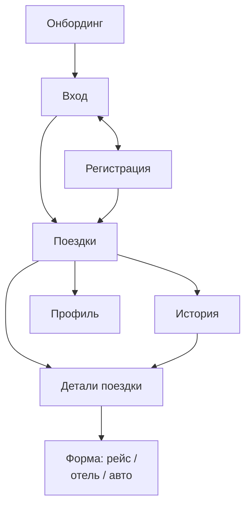

# Трекер путешествий — проект

2026-09-18 · @Someone

## Идея и позиционирование

Приложение — цифровой кошелёк путешественника: одно место, где лежит вся фактура уже забронированной поездки. Не планировщик маршрутов и не агрегатор цен, а хранилище и трекер броней.

Метафора — посадочный талон. Каждая бронь живёт как отдельная карточка, к которой нужен быстрый доступ ровно в тот момент, когда она нужна: в такси в аэропорт, на стойке регистрации, на ресепшене отеля, у стойки проката.

Аудитория — человек, который планирует поездку сам и бронирует по частям: рейс в одном месте, отель в другом, авто в третьем. Ему нужно не вдохновение, а порядок: что, где, во сколько и что туда включено.

Боль, которую решаем: перед поездкой всё разбросано по почте, PDF и скриншотам, а в самой поездке интернет часто дорогой или его нет. Приложение собирает поездку в один экран и отдаёт её офлайн.

Платформа: iOS первым, Android следующим шагом, поэтому кодовая база сразу кросс-платформенная.

## Название: варианты

Самый сильный вариант по смыслу и по свободности — **Holdall**: это дорожная сумка и одновременно буквально «hold all», что точно описывает идею кошелька поездки.

| Название | Характер и смысл | Что показала беглая проверка |
| --- | --- | --- |
| Holdall | Дорожная сумка, «hold all». Сдержанно, по-британски, под минимализм | Травел-приложений с таким именем в поиске по App Store не видно |
| Tripfold | Сложенный дорожный документ, папка с бронями | Точных совпадений не нашёл; рядом есть tripbinder, tripfiles, trips2go |
| Gatefold | Разворот + gate, выход на посадку | Имя занято в другой категории: [Gatefold Maker](https://apps.apple.com/us/app/gatefold-maker/id443756432) |
| Itiner | От itinerary, сухо и технично | Отдельно не проверял — нужен чек перед выбором |
| CarryOn | Ручная кладь + «продолжай» | Занято прямым конкурентом: [CarryOn: Trip planner](https://apps.apple.com/ca/app/carryon-trip-planner/id1663976873) |
| Wayfare | Мягко, поэтично, про дорогу | Занято плотно: [WayFare](https://apps.apple.com/us/app/wayfare/id6749923442), [Wayfarer — Travel Smart](https://apps.apple.com/us/app/wayfarer-travel-smart/id6761636899) |
| Stub | Корешок билета, коротко и ярко | Риск смешения с [StubHub](https://apps.apple.com/us/app/stubhub-event-tickets/id366562751) в билетной теме |

Если хочется более нейтрального тона, работают также короткие выдуманные формы — Voya, Vora, Trailo. Но Voya пересекается с крупным финансовым брендом Voya Financial, так что его бы я не брал.

Важно: это беглый поиск по App Store и вебу, а не проверка товарных знаков. Перед тем как вкладываться в бренд, нужно проверить имя по базам EUIPO и USPTO и посмотреть свободные домены.

## Отличительная идея и фичи

Отличие от других трекеров — приложение не просто хранит брони, а связывает их между собой и находит нестыковки. Все данные для этого уже введены — время вылета, check-out, срок возврата авто — но никто из конкурентов не делает из них выводов.

Примеры того, что приложение может заметить само:

- Check-out в 11:00, а рейс в 22:00 — между ними 11 часов без номера, нужна камера хранения
- Авто нужно вернуть за 2 часа до вылета, а пункт возврата не в аэропорту
- Прилёт в 14:00, а check-in в отеле с 15:00 — час без места, куда деть вещи
- Багаж не включён только на обратном рейсе — легко забыть и попасть на доплату в аэропорту
- Завтраки оплачены на 5 дней из 6 — в последнее утро завтрака нет

Одной строкой это звучит так: «приложение, которое думает за вас о стыковках». Это то, что запоминается и пересказывается друзьям.

| Фича | Что даёт | Когда |
| --- | --- | --- |
| Экран «Сейчас» | Один экран со следующим действием вместо листания в аэропорту | MVP |
| Офлайн-доступ | Всё читается без сети, критично в роуминге | MVP |
| Цепочка напоминаний | Напоминания привязаны к событию, а не к фиксированному времени | MVP |
| Проверка нестыковок | Главная отличительная фича, работает на уже введённых данных | сразу после MVP |
| Сумма поездки | Авто-итог по рейсам, отелю и авто в одной валюте | сразу после MVP |
| Live Activity и Dynamic Island | Обратный отсчёт до вылета на локскрине | позже, iOS-фича |
| Экспорт в Apple Wallet | Бронь рядом с посадочным талоном | позже |
| Гостевая ссылка на поездку | Попутчик видит поездку без регистрации | позже, вместе с шарингом |

Для проверки нестыковок не нужен ИИ — это набор простых правил над датами и временем, который можно написать на клиенте.

## Экраны и навигация

Навигация строится на нижнем таб-баре с тремя разделами: Поездки, История, Профиль. Детали поездки и формы добавления открываются поверх, без таб-бара.

Стрелки между Поездками, Историей и Профилем — это переключение табов, остальные — переходы поверх текущего экрана.

| Экран | Что на нём |
| --- | --- |
| Онбординг | Ценность продукта в одной фразе, точки-индикатор, кнопка «Начать» |
| Вход | Apple, Google, email с паролем, ссылка на регистрацию |
| Регистрация | Имя, email, пароль, согласие с условиями |
| Поездки | Карточки активных и будущих поездок, плавающая кнопка «+» |
| История | Завершённые поездки в том же формате, приглушённые |
| Детали поездки | Шапка с городом и датами, модули рейс / отель / авто |
| Форма модуля | Поля брони, переключатели, сохранение |
| Профиль | Аккаунт, уведомления, тема, валюта, подключённые аккаунты |

Поездка уходит из Поездок в Историю автоматически по дате окончания, но её можно отправить туда и вручную — например, если поездку отменили.

## Модель данных

Поездка — корневая сущность, всё остальное висит на ней списками: рейсов может быть несколько, отелей тоже, авто тоже.

| Сущность | Ключевые поля |
| --- | --- |
| trip | город или название, даты начала и окончания, обложка (url + откуда), статус, заметка |
| flight | откуда, куда, вылет и прилёт, багаж, пассажиры, места, номер билета, номер рейса |
| hotel | название, город, адрес, check-in и check-out, завтраки (сколько дней), удобства и требования |
| car | компания, адреса получения и возврата, даты и время, стоимость и валюта, модель, водитель, условия |

Три вещи, которые важно заложить сразу, чтобы потом не переделывать:

1. Поле `source` у каждой записи — `manual`, `imported_pending`, `imported_confirmed`. Без него импорт из Booking или почты потом не ляжет в схему.
2. Время — всегда в UTC плюс отдельное поле с таймзоной места. Перелёт между часовыми поясами без этого покажет неверное время и сломает напоминания.
3. Валюта — на уровне записи, а не пользователя: авто может быть в злотых, отель в евро.

Попутчики пока не заводятся отдельной сущностью: в MVP поездка принадлежит одному пользователю, а количество человек на рейсе — просто число. Когда дойдёт до совместных поездок, добавится таблица участников с ролями.

## Технологии и архитектура

Клиент — React Native + Expo на TypeScript, данные в облаке с привязкой к аккаунту. Решения по слоям:

| Слой | Решение | Почему так |
| --- | --- | --- |
| Клиент | React Native + Expo + TypeScript | Одна кодовая база, Android потом без переписывания |
| Бэкенд | Supabase: Postgres, Auth, Storage | Данные реляционные, авторизация и файлы из коробки |
| Вход | Apple, Google, email с паролем | Покрывает и iOS, и будущий Android |
| Хранение | Облако + локальный кэш | Синхронизация между устройствами плюс чтение без сети |
| Уведомления | Expo Notifications + серверные задания | Напоминания считаются от события, а не зашиты в клиент |
| Обложки поездок | Авто-подбор фото по городу через API | Не требует действий от пользователя при создании поездки |

Два момента, которые лучше учесть до первого релиза.

Если в приложении есть Google или любой другой сторонний вход, App Store требует добавить и Sign in with Apple. Перед подачей стоит свериться с актуальной редакцией App Review Guidelines.

Офлайн удобнее строить как локальную базу поверх облака, а не как кэш запросов: поездка читается и редактируется без сети, а синхронизация догоняет позже.

## Дизайн

Экраны живут на отдельном холсте: [Дизайн-холст приложения](https://claude.ai/artifact/9Gz2gvzQjkbD9rG2tqiLtu) — восемь экранов, связанных кликабельными переходами.

Направление — минимализм плюс liquid glass: полупрозрачные стеклянные панели поверх цветных обложек, глубокий тёмный фон, один тёплый акцент. Тёмная тема взята как основная, потому что стекло на ней читается выразительнее.

| Токен | Тёмная | Светлая |
| --- | --- | --- |
| Фон | #0B0D11 | #F3F1EC |
| Стекло | rgba(255,255,255,0.07) | rgba(255,255,255,0.55) |
| Граница стекла | rgba(255,255,255,0.14) | rgba(20,23,28,0.09) |
| Текст | #F5F6F7 | #14171C |
| Акцент | #F2A93B | #F2A93B |

Типографика: Manrope для заголовков и текста, IBM Plex Mono — только для «билетных» данных: кодов аэропортов, дат, номеров билетов и мест. Этот контраст двух шрифтов и держит метафору посадочного талона.

У каждого экрана на холсте есть два переключателя в панели настроек: тема и акцентный цвет. Можно менять их прямо в редакторе и смотреть результат, не дожидаясь правок.

Что на холсте пока условное: обложки поездок — цветные плейсхолдеры вместо реальных фото, и название приложения стоит заглушкой.

## Бэклог и следующие шаги

Ближайший шаг — выбрать название и закрыть визуальное направление, потому что от них зависят иконка, экраны и вся остальная мелкая работа.

- [ ] Выбрать название и проверить его по товарным знакам и доменам
- [ ] Выбрать визуальное направление главного экрана и иконку
- [ ] Проверка нестыковок между рейсом, отелем и авто
- [ ] Интеграция Booking.com через Data Portability API: регистрация разработчика, верификация домена, около 60 дней ожидания
- [ ] Парсинг писем-подтверждений как универсальная альтернатива одной интеграции
- [ ] Очередь предложений: импортированная бронь ждёт подтверждения пользователя
- [ ] Совместные поездки: добавление попутчиков в поездку
- [ ] Live Activity и Dynamic Island для ближайшего рейса
- [ ] Экспорт брони в Apple Wallet
- [ ] Выпуск под Android

Сознательно не делаем: вход в Booking по логину и паролю с парсингом личного кабинета. Это нарушает условия сервиса, хрупко технически и обычно режется на ревью в App Store.

Этот раздел — место для новых идей: дописывайте их прямо сюда или оставляйте комментарием, и я разнесу их по остальным разделам.
