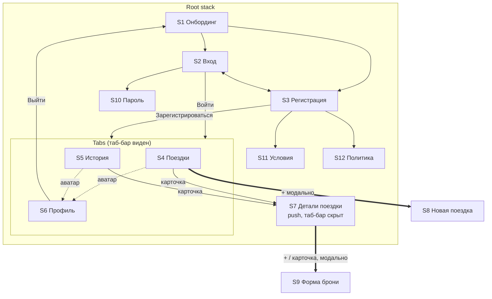
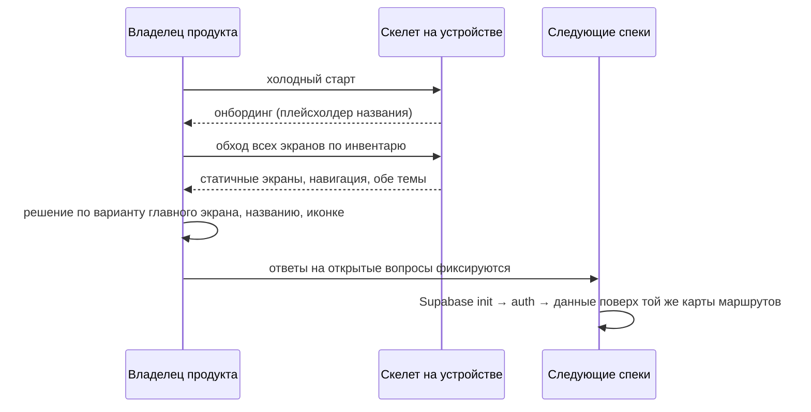

# Spec: App skeleton (навигационный каркас мобильного приложения)  |  Spec ID: SPEC-01  |  Status: approved
Supersedes: —
Implementation Plan: specs/plans/PLAN-01-app-skeleton.md

## Проблема й навіщо

Продукт описан на уровне идеи (`ideas/Трекер путешествий — проект.md`) и нарисован на дизайн-холсте
(`ideas/Travel Tracker — вариант A.html`, 11 фреймов 390×844), но кода нет ни в одном пакете
(`mobile/`, `shared/`, `supabase/`, `e2e/` — все со статусом «Not scaffolded yet»). Обсуждать экраны
по статичным картинкам дорого: неясно, как ощущается переход между экранами, где прячется таб-бар,
работает ли свайп «назад», читается ли liquid-glass на реальном устройстве и в светлой теме.

Нужен **скелет**: запускаемое на симуляторе/устройстве приложение, в котором все базовые экраны
существуют, связаны навигацией и оформлены по токенам дизайна, но **не делают ничего** — без авторизации,
без бэкенда, без данных и без сохранения. Это даёт владельцу продукта предмет для ревью («по этим
экранам я хожу руками и говорю, что не так») и даёт всем последующим спекам стабильный навигационный
контракт (имена маршрутов), к которому можно пристёгивать реальные фичи, не переделывая структуру.

Зачем именно сейчас: название продукта, иконка и вариант главного экрана ещё не выбраны — скелет
позволяет проверить навигацию и композицию, не завися от этих решений, и при этом фиксирует места,
куда позже войдут Supabase-авторизация, данные и офлайн.

## Goals / Non-goals

**Goals**
1. Все экраны продукта из инвентаря ниже существуют и достижимы руками на iOS-симуляторе и на устройстве.
2. Навигационная модель зафиксирована как контракт: набор табов, что открывается поверх (push), что модально,
   где таб-бар скрыт, как работает возврат.
3. Карта маршрутов (route names + params) зафиксирована как будущий контракт для deep/universal links.
4. Токены обеих тем (тёмная — тема по умолчанию, светлая полноценно поддержана) и типографические
   роли (Manrope / IBM Plex Mono для «билетных» данных) применены ко всем экранам из одного места.
5. Базовая корректность оболочки: safe areas, тач-таргеты, accessibility-подписи, iOS back-swipe,
   Dynamic Type не ломает верстку.
6. Интерфейс существует на двух языках — русском и английском — и следует языку устройства (решение Q9).
7. Выбор темы сохраняется между запусками приложения; пока выбора не было — приложение тёмное
   (решения Q8, Q17).
8. Архитектурные предпосылки соблюдены так, чтобы добавление Supabase-авторизации и данных не требовало
   перестройки маршрутов (см. «Принципы архитектуры»).

**Non-goals** (явно НЕ делаем в этом спеке)
- Никакой авторизации: ни Apple/Google/email-входа, ни сессии, ни защищённых маршрутов, ни SecureStore.
- Никакого бэкенда: `supabase init`, схема, RLS, Edge Functions — **вне** этого спека (отдельный спек, см. «Follow-up»).
- Никаких запросов к сети и никакого TanStack Query-слоя с реальными запросами.
- Никаких реальных данных: списки и карточки — статичные плейсхолдеры, зашитые в UI; не БД, не фикстуры с бэкенда.
- Никакой логики форм: ни валидации, ни маскирования, ни сохранения; поля могут быть неинтерактивными.
- Никакого офлайна, кэша данных, локальной БД, очереди записей. **Единственное исключение по хранению** —
  локально сохраняемый выбор темы (решение Q8): это несекретная настройка, а не данные продукта.
- Никакого ручного переключателя языка в интерфейсе — язык следует за языком устройства (решение Q9b);
  сам по себе перевод интерфейса на два языка в скелет **входит** и Non-goal'ом не является.
- Никаких уведомлений/напоминаний, Live Activities, Dynamic Island, Apple Wallet.
- Никакой проверки нестыковок, подсчёта сумм, подбора обложек по городу.
- Никакого `web/`, никакой Android-специфики (кросс-платформенность соблюдаем, но целимся и проверяем на iOS).
- Никакой финальной иконки и сплэша — временные заглушки.
- Никакого выбора финального названия продукта и финального bundle ID — только плейсхолдер `TripPlanner`
  в одном месте (решения Q11, Q12).
- Никакого домена universal links — только временная URL-схема `tripplanner://` (решение Q10).
- Никакой аналитики, крэш-репортинга, CI-пайплайна, EAS-сборки в стор.

## User stories

- **US-1.** Как владелец продукта, я хочу пройти по всем экранам приложения на устройстве, чтобы оценить
  структуру и композицию до того, как в них появится логика.
- **US-2.** Как владелец продукта, я хочу переключить тему на светлую прямо в приложении, чтобы проверить
  читаемость liquid-glass в обеих темах.
- **US-3.** Как владелец продукта, я хочу увидеть вживую вариант A «стекло» и быть уверенным, что карточку
  поездки можно заменить на «корешок» или «таймлайн» позже, не трогая навигацию.
- **US-3a.** Как владелец продукта, я хочу переключить язык устройства на английский и увидеть, что весь
  интерфейс переведён и верстка не ломается, чтобы не переделывать экраны при выходе на англоязычный рынок.
- **US-4.** Как разработчик (в роли автора следующих спеков), я хочу стабильные имена маршрутов и
  зафиксированную навигационную модель, чтобы фича-спеки ссылались на них, а не переизобретали.
- **US-5.** Как разработчик, я хочу, чтобы в скелете уже было ровно одно место для токенов темы, названия
  приложения и структуры навигации, чтобы переименование продукта и смена акцента были однострочными.
- **US-6.** Как разработчик, я хочу автоматический smoke-прогон, который обходит все экраны, чтобы
  поломка навигации ловилась до ручного ревью.

## Инвентарь экранов

«Что показывает скелет» = только статичное содержимое; никакие данные не загружаются и не сохраняются.

| # | Экран | Назначение | Что показывает скелет | Входы | Выходы |
|---|---|---|---|---|---|
| S1 | Онбординг | Первое впечатление, ценность продукта | Плейсхолдер названия приложения, заголовок «Все поездки — в одном месте», одна фраза ценности, точки-индикатор (статичные), кнопка «Начать», ссылка «Уже есть аккаунт? Войти» | Старт приложения (первый экран) | «Начать» → S3; «Войти» → S2 |
| S2 | Вход | Точка входа для существующего пользователя | «С возвращением», кнопки «Продолжить с Apple» / «Продолжить с Google» (не активны), разделитель «или по email», поля Email и Пароль (неинтерактивные плейсхолдеры), «Забыли пароль?», кнопка «Войти», «Нет аккаунта? Создать» | S1, S3 | «Войти» → S4 (вход в табы); «Создать» → S3; «Забыли пароль?» → S10 |
| S3 | Регистрация | Создание аккаунта | «Создать аккаунт», Apple/Google, «или по email», поля Имя/Email/Пароль, кнопка «Зарегистрироваться», текст согласия со ссылками «Условия использования» и «Политика конфиденциальности», «Уже есть аккаунт? Войти» | S1, S2 | «Зарегистрироваться» → S4; ссылки → S11/S12; «Войти» → S2 |
| S4 | Поездки (таб 1) | Главный экран: активные и будущие поездки | Крупный заголовок «Поездки», круглая аватар-кнопка справа вверху (буква-инициал), 3–4 статичные карточки поездок (цветная обложка-плейсхолдер, стеклянная панель с городом, диапазон дат моноширинным, статус-пилюля: акцентная «через 5 дней» у ближайшей, нейтральная у остальных, «план · дата не выбрана» у черновика), плавающая кнопка «+» | Вход из S2/S3, переключение таба | Карточка → S7; «+» (плавающая кнопка) → S8 модально; аватар → **переключение на таб «Профиль»** (S6), не новый экран; табы → S5/S6 |
| S5 | История (таб 2) | Завершённые поездки | Заголовок «История», аватар-кнопка, статичные приглушённые карточки со статусом «завершено» | Таб | Карточка → S7; аватар → переключение на таб «Профиль» (S6); табы |
| S6 | Профиль (таб 3) | Аккаунт и настройки | Аватар, имя-плейсхолдер, email-плейсхолдер; строки «Уведомления», «Подключённые аккаунты» («Booking.com»), «Валюта» (EUR) — нажимаемы, никуда не ведут, каждая несёт статичную пометку «скоро» (единое правило для всех заглушек, решение Q7); строка «Тема оформления» (Светлая / Тёмная / Системная) — **рабочий** переключатель с сохранением выбора (AC-15, AC-30); «Выйти» | Таб, аватар-кнопка с S4/S5 | «Выйти» → S1 (сброс на онбординг; ничего не очищается, кроме факта нахождения в табах); строки-заглушки — без перехода |
| S7 | Детали поездки | Вся фактура одной поездки | Hero-обложка ~260pt, стеклянная круглая кнопка «назад» слева вверху, стеклянная «…» справа вверху, стеклянная панель с городом, статус-пилюлей и строкой «12–18 сент 2026 · 6 ночей» (моноширинным); секции «Рейс» (кнопка «+» в заголовке секции; карточки с IATA-кодами «WAW → KRK», дата/время, чипы «Багаж включён»/«Без багажа», «2 пассажира»), «Отель» (название, check-in/check-out, чип «Завтрак: 5 из 6 дней»), «Аренда авто» (пустое состояние с действием «Добавить автомобиль»; в заголовке каждой секции — кнопка «+»). **Таб-бар скрыт** | S4, S5 | «назад» → откуда пришли; «+»/карточка в секции «Рейс» → S9-flight; «+» в секции «Отель» → S9-hotel; «Добавить автомобиль» / «+» в секции «Аренда авто» → S9-car; «…» — нажимаема, ничего не делает, несёт пометку «скоро» (решение Q7) |
| S8 | Новая поездка | Создание поездки | Модальный экран-заглушка: шапка «Отмена / Новая поездка / Готово», пара неактивных полей (Город, Даты), кнопка «Сохранить» — ничего не сохраняет | «+» с S4 | «Отмена»/«Готово»/«Сохранить» → закрыть модалку, вернуться на S4 |
| S9 | Форма брони (рейс / отель / авто) | Ввод брони | Шапка «Отмена / <Рейс\|Отель\|Авто> / Готово»; для рейса — поля Откуда, Куда, Дата вылета, Время, переключатель «Багаж включён», степпер «Пассажиры» со статичным значением «2» между «−» и «+» (решение Q15), Место, Номер билета, кнопка «Сохранить». **Отель** и **авто** — тот же каркас формы с плейсхолдер-полями (отель: Название, Город, Check-in, Check-out, Завтраки; авто: Компания, Получение, Возврат, Даты) (решение Q5). Поля ничего не валидируют и не сохраняют | S7 | Любая кнопка шапки/«Сохранить» → закрыть, вернуться на S7 |
| S10 | Восстановление пароля | Заглушка ветки «Забыли пароль?» | Заголовок, поле Email (плейсхолдер), кнопка «Отправить ссылку», кнопка «назад» | S2 | «назад»/«Отправить» → S2 |
| S11 | Условия использования | Юридический текст | Экран-заглушка с заголовком и текстом «Текст будет добавлен позже» / «Text will be added later» (обе локали, решение Q14), кнопка «назад» | S3 | «назад» → S3 |
| S12 | Политика конфиденциальности | Юридический текст | То же | S3 | «назад» → S3 |

Экраны S10–S12 в дизайн-холсте не нарисованы, но на него ссылаются кнопки/ссылки с S2 и S3 — без них
скелет содержит тупиковые элементы. Их содержимое сознательно минимально.

## Навигационная модель

Сплошные стрелки — push поверх текущего экрана; жирные (`==>`) — модальная презентация; пунктир —
переключение таба, а не новый экран.

Правила:
- Корневой стек: группа онбординга/аутентификации → группа табов. Перехода «назад» из табов в онбординг
  жестом нет; выход только через «Выйти» в профиле (в скелете это просто сброс стека).
- Таб-бар виден на S4, S5, S6 и скрыт на S7, S8, S9, S10, S11, S12.
- S7, S10, S11, S12 — push (работает свайп «назад» от левого края).
- S8 и S9 — модальные (закрываются кнопкой «Отмена»/«Готово» и свайпом вниз).
- Каждый таб держит свой стек: возврат с S7 возвращает в тот таб, из которого пришли.

## Карта маршрутов (контракт)

Имена маршрутов — контракт для будущих deep/universal links и для всех следующих спеков. Без путей файлов
и без деталей реализации.

| Маршрут | Экран | Параметры | Презентация |
|---|---|---|---|
| `/onboarding` | S1 | — | root |
| `/sign-in` | S2 | — | push |
| `/sign-up` | S3 | — | push |
| `/forgot-password` | S10 | — | push |
| `/legal/terms` | S11 | — | push |
| `/legal/privacy` | S12 | — | push |
| `/trips` | S4 | — | tab 1 |
| `/history` | S5 | — | tab 2 |
| `/profile` | S6 | — | tab 3 |
| `/trips/new` | S8 | — | modal |
| `/trips/[tripId]` | S7 | `tripId: string` | push, таб-бар скрыт |
| `/trips/[tripId]/flights/new` | S9 (рейс) | `tripId` | modal |
| `/trips/[tripId]/flights/[flightId]` | S9 (рейс) | `tripId`, `flightId` | modal |
| `/trips/[tripId]/hotels/new` | S9 (отель) | `tripId` | modal |
| `/trips/[tripId]/cars/new` | S9 (авто) | `tripId` | modal |

- Идентификаторы в скелете — фиктивные строки из статичного плейсхолдер-набора; экран не обязан проверять,
  что такой `tripId` существует (см. Edge cases).
- URL-схема приложения в скелете — временная `tripplanner://`, производная от единственного значения
  плейсхолдер-имени `TripPlanner` (решения Q10, Q11). Домен universal links **не фиксируется** и
  откладывается до выбора реального названия продукта (см. Follow-up).

## Что «нет функциональности» значит буквально

- Кнопка либо **переходит** по маршруту из карты выше, либо **не делает ничего** видимого (но остаётся
  нажимаемой и озвученной для VoiceOver). Третьего не дано. Единое правило для всех заглушек (решение Q7):
  элемент-заглушка нажимаем, не навигирует, не показывает alert и несёт рядом статичную пометку «скоро»
  (`скоро` / `soon`).
- Поля ввода не валидируются, введённое значение никуда не уходит и не обязано переживать уход с экрана.
- Ни один экран не делает сетевых запросов и не обращается к Supabase.
- **Ровно два исключения из правила «ничего не сохраняется и ничего не делается»**:
  1. **Тема** (решение Q8) — выбранное значение «Светлая / Тёмная / Системная» записывается в локальное
     хранилище настроек и применяется при следующем запуске.
  2. **Язык интерфейса** (решение Q9) — определяется языком устройства при запуске; ничего не сохраняется
     и не выбирается пользователем.
  Больше ничего в скелете не читает и не пишет хранилище.
- Все списки, карточки, статусы, даты, IATA-коды, имена и email — статичные плейсхолдеры в UI.
- Состояний загрузки/ошибки/пустоты по данным нет, кроме одного намеренно свёрстанного пустого состояния
  в секции «Аренда авто» на S7 — как образец оформления пустых состояний.

## Принципы архитектуры, которые скелет обязан сделать возможными

Формулировки на уровне ограничения (WHAT), не раскладки по файлам — раскладка это дело Implementation Plan
и правил `mobile-architecture`.

1. **Экраны тонкие.** Экран композирует UI и читает параметры маршрута; никакой логики получения данных
   в экране быть не должно — в скелете её просто нет, и структура не должна подталкивать добавить её туда.
2. **Токены темы — в одном месте.** Цвета, радиусы, отступы, типографические роли определены один раз;
   экраны не содержат hex-кодов и имён шрифтов.
3. **Название приложения — в одном месте.** Строка-плейсхолдер названия задаётся однократно и подставляется
   и в UI (S1), и в конфигурацию приложения; переименование = правка одного значения.
4. **Навигационная структура выражена один раз.** Набор табов, скрытие таб-бара и тип презентации заданы
   декларативно на уровне layout'ов, а не повторяются в каждом экране.
5. **Граница доступа к данным заранее одна.** Позже все обращения к Supabase пойдут через один клиентский
   модуль и `api/`-модули фич; скелет не должен создавать альтернативных путей (в нём нет ни одного).
6. **Продуктовая логика — в `shared/`.** В скелете её нет; ничего из того, что позже станет общим
   (даты, деньги, нестыковки), не должно закрепляться в `mobile/`.
7. **Ничего iOS-only вне платформенной границы.** В скелете нет ветвлений по платформе; любые платформенные
   различия (если возникнут, напр. blur) изолируются за нейтральным именем.
8. **Готовность к гейтингу по авторизации.** Добавление проверки сессии позже должно означать вставку
   условия на входе в группу табов, а не переименование или перенос маршрутов из карты выше.
9. **Визуальный вариант главного экрана заменяем.** Скелет реализует вариант A «стекло» (решение Q2),
   но вид карточки поездки — отдельная сменная единица: переход к «корешку» или «таймлайну» позже
   не должен трогать ни навигацию, ни экран «Поездки» как таковой.
10. **Тексты — в одном месте и сразу на двух языках.** Каждый видимый пользователю текст задаётся один раз
    и имеет русский и английский вариант; экраны обращаются к нему по смысловому ключу, а не к литералу.
    Форматирование дат, диапазонов дат и относительных подписей («через 5 дней» / «in 5 days») —
    локале-зависимое, а не склеенные вручную строки.
11. **Хранение настроек — одна граница.** Несекретные настройки (в скелете это только тема) пишутся через
    одну точку доступа к локальному хранилищу ключ-значение; это хранилище не предназначено для секретов
    и токенов — для них позже будет отдельная, защищённая граница (`AGENTS.md`, `mobile/insights.md`).

## Acceptance criteria (EARS)

**Запуск и оболочка**

- **AC-1.** WHEN приложение запускается в первый раз на iOS-симуляторе, the system **shall** показать экран
  `/onboarding` (S1) без каких-либо сетевых запросов и без экрана ошибки.
  *Verify: e2e (Maestro smoke: launch → «Все поездки — в одном месте» видно).*
- **AC-2.** The system **shall** отображать на экране онбординга строку-плейсхолдер названия приложения,
  идентичную имени приложения в конфигурации сборки.
  *Verify: unit (сравнение отображаемого значения с единственным источником) + manual.*
- **AC-3.** The system **shall** отрисовывать содержимое каждого экрана внутри безопасных зон устройства:
  ни один интерактивный элемент и ни одна строка текста не перекрывается вырезом, индикатором home
  и статус-баром на устройстве с вырезом.
  *Verify: manual (iPhone с Dynamic Island, обе ориентации системного шрифта).*
- **AC-4.** The system **shall** поддерживать только портретную ориентацию на iPhone.
  *Verify: manual (поворот устройства не меняет компоновку).*

**Навигация**

- **AC-5.** The system **shall** делать достижимым руками, без использования отладочных средств, каждый из
  экранов S1–S12 инвентаря, начиная с холодного старта.
  *Verify: e2e (Maestro flow обходит все 12 экранов) + manual.*
- **AC-6.** WHEN пользователь нажимает «Начать» на S1, the system **shall** открыть `/sign-up`;
  WHEN нажимает «Уже есть аккаунт? Войти», the system **shall** открыть `/sign-in`.
  *Verify: e2e.*
- **AC-7.** WHEN пользователь нажимает «Войти» на S2 или «Зарегистрироваться» на S3, the system **shall**
  перейти в группу табов на `/trips` без какой-либо проверки введённых значений.
  *Verify: e2e.*
- **AC-8.** WHILE открыт любой из экранов `/trips`, `/history`, `/profile`, the system **shall** показывать
  нижний таб-бар с тремя элементами «Поездки», «История», «Профиль» и подсвечивать активный.
  *Verify: e2e + manual.*
- **AC-9.** WHILE открыт любой из экранов S7–S12, the system **shall** не показывать нижний таб-бар.
  *Verify: e2e (отсутствие таб-бара по подписи) + manual.*
- **AC-10.** WHEN пользователь открывает детали поездки из таба «История» и затем возвращается назад,
  the system **shall** вернуть его на `/history`, а не на `/trips`.
  *Verify: e2e.*
- **AC-11.** WHEN пользователь выполняет свайп от левого края экрана на любом push-экране (S7, S10, S11, S12),
  the system **shall** вернуть предыдущий экран так же, как кнопка «назад».
  *Verify: manual (жест на устройстве).*
- **AC-12.** WHEN пользователь нажимает «Отмена», «Готово» или «Сохранить» на модальном экране (S8, S9),
  the system **shall** закрыть модалку и вернуть предыдущий экран без изменения его содержимого.
  *Verify: e2e.*
- **AC-13.** WHEN пользователь нажимает «Выйти» на `/profile`, the system **shall** вернуть приложение на
  `/onboarding` и сделать так, что жест «назад» не возвращает в табы.
  *Verify: e2e + manual.*

**Тема и типографика**

- **AC-14.** WHEN приложение запускается и действительного сохранённого выбора темы нет, the system **shall**
  использовать **тёмную** тему, независимо от системной настройки устройства (решение Q17). «Системная»
  остаётся одним из трёх выбираемых пользователем значений, но никогда не является значением по умолчанию.
  *Verify: manual (первый запуск на устройстве со светлой системной темой → приложение тёмное) + unit.*
- **AC-15.** WHEN пользователь меняет значение «Тема оформления» на `/profile`, the system **shall** применить
  новую тему ко всем экранам приложения немедленно, без перезапуска.
  *Verify: manual + unit (тема-провайдер отдаёт выбранный набор токенов).*
- **AC-16.** The system **shall** брать все цвета фона, стекла, границы стекла, текста и акцента из единого
  набора токенов со значениями: фон `#0B0D11`/`#F3F1EC`, стекло `rgba(255,255,255,0.07)`/`rgba(255,255,255,0.55)`,
  граница стекла `rgba(255,255,255,0.14)`/`rgba(20,23,28,0.09)`, текст `#F5F6F7`/`#14171C`, акцент `#F2A93B`
  (тёмная/светлая).
  *Verify: unit (снимок значений токенов) + manual.*
- **AC-17.** The system **shall** использовать Manrope для всего интерфейсного текста и IBM Plex Mono
  исключительно для «билетных» данных: кодов аэропортов, дат и диапазонов дат, номеров билетов, мест.
  *Verify: manual (визуальная проверка S4, S7, S9) + unit (типографические роли определены один раз).*
- **AC-18.** IF шрифт Manrope или IBM Plex Mono не успел загрузиться к моменту первой отрисовки, THEN the
  system **shall** удерживать сплэш/заглушку до готовности шрифтов, а не показывать экран системным шрифтом
  с последующим скачком верстки.
  *Verify: manual (холодный старт) + e2e (первый экран стабилен после launch).*

**Доступность и тач-таргеты**

- **AC-19.** The system **shall** давать каждому интерактивному элементу (кнопке, строке списка, карточке,
  элементу таб-бара, аватар-кнопке) непустую accessibility-подпись и корректную роль.
  *Verify: manual (Accessibility Inspector / VoiceOver) + unit где элемент переиспользуемый.*
- **AC-20.** The system **shall** обеспечивать для каждого интерактивного элемента область нажатия не меньше
  44×44 pt, даже если его видимый размер меньше.
  *Verify: manual (Accessibility Inspector) + unit (общие примитивы кнопок).*
- **AC-21.** WHILE системный размер текста установлен в максимальное значение из стандартного диапазона
  (без Accessibility Sizes), the system **shall** сохранять читаемость каждого экрана: текст не обрезается
  в середине слова без многоточия и не перекрывает соседние элементы.
  *Verify: manual (Dynamic Type на устройстве).*
- **AC-22.** The system **shall** отрисовывать каждый экран инвентаря в обеих темах без нечитаемого текста
  (текст на стекле поверх цветной обложки остаётся различимым).
  *Verify: manual (обход всех экранов в тёмной и светлой теме).*

**Каркас как контракт**

- **AC-23.** The system **shall** реализовывать маршруты ровно с теми именами и параметрами, которые
  перечислены в карте маршрутов, и не вводить в скелете других навигационных маршрутов.
  *Verify: unit (перечень маршрутов сверяется со списком) + manual.*
- **AC-24.** The system **shall** держать весь видимый пользователю текст вне разметки экранов — в едином
  наборе локализованных строк, адресуемых по смысловому ключу, чтобы добавление языка или смена названия
  продукта не требовали правок в экранах.
  *Verify: unit (экраны не содержат литеральных пользовательских строк) + manual.*
- **AC-25.** The system **shall** не выполнять ни одного сетевого запроса и не обращаться к Supabase ни на
  одном экране скелета.
  *Verify: manual (сетевой инспектор при обходе всех экранов пуст) + unit (клиент Supabase отсутствует
  среди зависимостей экранов).*
- **AC-26.** WHEN приложение собирается командой типизации/линта пакета `mobile/`, the system **shall**
  проходить проверку типов в строгом режиме без ошибок и без подавляющих директив.
  *Verify: unit (`pnpm typecheck` в `mobile/`).*
- **AC-27.** The system **shall** не содержать ветвлений поведения по платформе (`ios` vs `android`)
  в коде экранов и общих компонентов скелета.
  *Verify: unit (проверка отсутствия платформенных ветвлений вне платформенной границы) + manual.*
- **AC-28.** WHEN запускается Maestro smoke-flow «обход скелета», the system **shall** успешно пройти
  последовательность: запуск → онбординг → регистрация → табы → переключение всех трёх табов → детали
  поездки → возврат → форма рейса → закрытие → выход.
  *Verify: e2e.*
- **AC-29.** The system **shall** предоставлять временные иконку приложения и сплэш-экран, визуально
  отличимые от дефолтных заготовок Expo, чтобы скелет на домашнем экране не выглядел как пустой шаблон.
  *Verify: manual.*

**Сохранение темы (решение Q8)**

- **AC-30.** WHEN пользователь выбирает на `/profile` любое из значений «Светлая», «Тёмная», «Системная»
  и затем полностью перезапускает приложение, the system **shall** применить именно этот выбор, а не
  тёмную тему по умолчанию (в том числе выбор «Системная» должен пережить перезапуск и заставить
  приложение следовать теме устройства).
  *Verify: e2e (выбрать «Светлая» → перезапуск → светлый экран) + manual (то же для «Системная»).*
- **AC-31.** IF сохранённое значение темы отсутствует, не читается или не входит в набор
  «Светлая / Тёмная / Системная», THEN the system **shall** молча использовать тёмную тему и продолжить
  работу без ошибки и без блокирующего экрана — то есть один и тот же простой откат на все случаи
  отсутствия действительного выбора (решение Q17).
  *Verify: unit (чтение подставного повреждённого значения и отсутствующего значения → тёмная тема).*
- **AC-32.** WHEN приложение запускается с действительным сохранённым выбором темы, the system **shall**
  отрисовать первый экран уже в этой теме — без видимой вспышки другой темы между сплэшем и первым экраном.
  *Verify: manual (холодный старт при выбранной «Светлая» на устройстве с тёмной системной темой; запись
  экрана при необходимости).*
- **AC-33.** The system **shall** записывать в локальное хранилище настроек только выбор темы и только
  после явного выбора пользователем (до первого выбора скелет не пишет ничего); никакие персональные
  данные, идентификаторы и секреты в скелете не записываются.
  *Verify: manual (осмотр содержимого хранилища после обхода всех экранов) + unit (единственный ключ записи).*

**Локализация (решения Q9, Q9b)**

- **AC-34.** The system **shall** предоставлять для каждой видимой пользователю строки перевод на русский
  и на английский; ни в одной из двух локалей не должно быть видно непереведённой строки или ключа.
  *Verify: unit (наборы ключей двух локалей совпадают, пустых значений нет) + manual (обход всех экранов
  на устройстве с русским и с английским языком).*
- **AC-35.** WHEN приложение запускается на устройстве с русским языком, the system **shall** показать
  русский интерфейс; WHEN язык устройства — английский, the system **shall** показать английский.
  *Verify: e2e (прогон smoke-flow на обеих локалях) + manual.*
- **AC-36.** IF язык устройства не русский и не английский, THEN the system **shall** показать английский
  интерфейс.
  *Verify: unit (выбор локали по коду языка) + manual (устройство на немецком).*
- **AC-37.** The system **shall** форматировать даты, диапазоны дат и относительные подписи
  («через 5 дней» / «in 5 days», «завершено» / «completed») средствами локали, а не склейкой строк,
  так что в английской локали не остаётся русского формата и наоборот.
  *Verify: unit (формат для обеих локалей) + manual (S4, S5, S7).*
- **AC-38.** The system **shall** оставлять «билетные» данные — коды аэропортов, номера билетов, номера мест —
  непереведёнными и набранными моноширинным шрифтом в обеих локалях.
  *Verify: manual (S4, S7, S9 на обеих локалях).*
- **AC-39.** The system **shall** сохранять целостность верстки каждого экрана в той локали, где текст длиннее
  (как правило английской): заголовки, кнопки, строки списка и подписи табов не обрезаются в середине слова
  без многоточия и не перекрывают соседние элементы — в том числе при увеличенном системном размере текста.
  *Verify: manual (обход всех экранов на обеих локалях при максимальном стандартном Dynamic Type).*
- **AC-40.** The system **shall** не предоставлять в интерфейсе ручного переключателя языка
  (язык определяется только языком устройства).
  *Verify: manual (на `/profile` нет строки выбора языка).*

## Edge cases

- **Открытие деталей несуществующей поездки** (`/trips/<произвольный id>`, например из будущей ссылки или
  из отладки): скелет не имеет данных, поэтому экран показывает тот же статичный плейсхолдер-контент
  независимо от `tripId`; падения быть не должно. Настоящая обработка «поездка не найдена» — предмет
  спека деталей поездки.
- **Повторное нажатие на активный таб**: должно возвращать стек этого таба к корню (например, с S7 назад
  на S4), а не открывать второй экземпляр экрана.
- **Быстрое двойное нажатие на кнопку перехода**: не должно приводить к двум одинаковым экранам в стеке.
- **Свайп вниз на модальном экране формы**: закрывает модалку так же, как «Отмена»; никакого диалога
  «сохранить черновик?» в скелете нет (появится вместе с логикой форм).
- **Аппаратная/системная смена темы во время работы**: если выбрана «Системная», приложение следует за
  системой; если выбрана «Светлая»/«Тёмная» — системное изменение игнорируется.
- **Хранилище настроек недоступно или значение темы повреждено** (первый запуск, переустановка, чужое
  значение, мусор): приложение стартует в тёмной теме без ошибки (AC-31) и при следующем выборе
  темы перезаписывает значение. Правило одно на все случаи: нет действительного выбора → тёмная.
- **Запись настройки не удалась** (хранилище недоступно): тема всё равно применяется в текущей сессии;
  приложение не показывает ошибку, но и не делает вид, что значение сохранено, если оно точно не сохранилось.
- **Смена языка устройства при работающем приложении**: после возврата в приложение (или, в худшем случае,
  после его перезапуска — это допустимое поведение) интерфейс должен быть на новом языке; смешанных
  языков на одном экране быть не должно.
- **Язык устройства не ru и не en** (например немецкий): интерфейс английский (AC-36), даты форматируются
  по английской локали — не по немецкой и не по русской.
- **Английская локаль длиннее русской** (или наоборот): подписи табов, кнопки шапки модалок
  («Отмена»/«Готово») и статус-пилюли — самые узкие места; один из плейсхолдеров сознательно делается
  длинным в обеих локалях.
- **Локаль с другим направлением письма** (RTL) в скелете не поддерживается и не проверяется — ни русский,
  ни английский её не требуют.
- **Очень длинный текст** (название города, имя пользователя) в плейсхолдерах: карточка не должна ломаться —
  один из плейсхолдеров сознательно делается длинным, чтобы проверить перенос/усечение.
- **Клавиатура на экранах с полями** (S2, S3, S9, S10): даже если поля ничего не делают, открытая клавиатура
  не должна перекрывать первичную кнопку без возможности прокрутки.
- **Возврат из фонового режима**: приложение возвращается на тот же экран, а не перезапускает навигацию.
- **Отсутствие сети при запуске**: скелет запускается и работает полностью — это ценное свойство, которое
  стоит проверить руками (в авиарежиме).

## Mobile considerations

**Platforms: ios+android.** Проверяем и оцениваем на iOS (первый релиз — App Store), но ни одно поведение
скелета не является iOS-only: **список iOS-only поведений пуст**, и это осознанное требование (AC-27).
Свайп «назад» от левого края — нативный жест iOS; на Android его эквивалент — системная кнопка/жест
«назад», и это обеспечивается самой навигационной библиотекой, а не кодом экрана.

- **Языки интерфейса:** русский и английский с первого дня; язык берётся из языка устройства, ручного
  переключателя нет (решения Q9, Q9b). Запасной язык — английский. Список поддерживаемых локалей должен
  быть объявлен и в конфигурации приложения, чтобы система считала приложение локализованным.
- **Офлайн-поведение:** скелет полностью работоспособен без сети (нет ни одного запроса). Настоящее
  офлайн-поведение (кэш, очередь записей) — вне спека.
- **Локальное хранение:** единственная сохраняемая величина — выбор темы. Это несекретная настройка, и она
  хранится в обычном локальном хранилище ключ-значение; секреты, токены и сессии в нём не хранятся ни
  сейчас, ни позже — для них будет отдельная защищённая граница (`AGENTS.md`, `mobile/insights.md`).
- **Разрешения:** скелет **не запрашивает ни одного системного разрешения** (ни камеры, ни фото, ни
  уведомлений, ни геолокации). Следовательно, нет и denied-пути. Это требование, а не наблюдение: если
  реализация потянет зависимость, требующую usage-строку, это отклонение от спека.
- **App Store влияние:** скелет не подаётся в стор в рамках этого спека. Новых permission-строк нет.
  Скелет не собирает данные о пользователе, поэтому декларации о сборе данных не появляются. Правила про
  аккаунт/UGC неприменимы — нет аккаунтов и нет пользовательского контента.
  **Новый пункт из-за решения Q8:** появление локального хранилища добавляет зависимость, у которой могут
  быть «required reason»-API; до релиза обязательно проверить заявленные ею причины доступа и продублировать
  их в privacy manifest приложения — Apple не всегда учитывает манифесты вложенных зависимостей
  (`mobile/AGENTS.md`, `mobile/insights.md`). Для скелета это проверка, а не блокер выпуска, но
  зафиксировать её нужно здесь, а не в спеке релиза. Решения, которые обязаны быть приняты **до первой EAS-сборки** и
  которые этот спек сознательно не фиксирует: финальное название продукта, bundle identifier, иконка
  (6 вариантов на холсте, ни один не выбран), сплэш.
- **Ориентация:** только портрет (AC-4); iPad явно не поддерживается в скелете.
- **Тема:** тёмная по умолчанию и как единственный откат при отсутствии/повреждении сохранённого выбора,
  светлая и «Системная» — выбираемые значения (AC-14, AC-15, AC-30, AC-31); liquid-glass реализуется как
  полупрозрачные размытые панели — деградация на слабых устройствах допустима и оценивается вручную.

## Non-functional

- **Производительность.**
  - Холодный старт до первого отрисованного экрана — ориентир ≤ 2 с на iPhone 12 и новее в release-сборке;
    в скелете нечему тормозить, поэтому превышение — сигнал о проблеме в оболочке (шрифты, splash, бандл).
  - Прокрутка списка поездок и экрана деталей — без видимых подвисаний; размытые (glass) панели поверх
    обложек — главный риск, проверяется на реальном устройстве, не на симуляторе.
  - Переход между экранами воспринимается мгновенным (нет заметной задержки до появления следующего экрана).
- **Безопасность.** Скелет не обрабатывает учётные данные, не хранит токенов, не содержит ключей и
  секретов — в том числе не должно появиться никаких `EXPO_PUBLIC_*` значений «на будущее». Поля пароля
  на S2/S3 всё равно оформляются как защищённые (secure entry) и не логируются, чтобы образец не стал
  плохим примером для реальной реализации. Появившееся локальное хранилище настроек (тема) — **не** место
  для секретов: оно не зашифровано и доступно при доступе к файловой системе устройства; в скелете туда
  пишется ровно один несекретный ключ (AC-33), и этот запрет должен пережить скелет.
- **Локализация как нефункциональное требование.** Два языка с первого дня означают, что верстка должна
  выдерживать расширение текста (AC-39) и что формат дат обязан быть локале-зависимым (AC-37) — оба
  свойства дешевле заложить сейчас, чем чинить на живых экранах.
- **Доступность.** См. AC-19–AC-22: подписи и роли у всех интерактивных элементов, тач-таргет ≥ 44 pt,
  Dynamic Type не ломает верстку, контраст текста на стеклянных панелях проверяется в обеих темах.
  Целевой ориентир контраста — WCAG AA (4.5:1) для основного текста; для текста поверх цветной обложки
  под стеклом это проверяется вручную и, если не достигается, фиксируется усилением стеклянной подложки.
- **Наблюдаемость.** Формальной телеметрии в скелете нет (Non-goal). Минимум: ошибки рендера не должны
  приводить к «белому экрану» без следа — необработанное исключение должно быть видимым в логах dev-клиента.
  Настоящий крэш-репортинг — отдельный спек (release setup).

## Workflow & Contracts

Межсервисного взаимодействия в скелете нет: ни одного вызова Supabase, ни одного внешнего API (AC-25).
Единственный контракт, который этот спек фиксирует, — **навигационный**: карта маршрутов выше. Он является
контрактом потому, что на него позже завяжутся deep/universal links (гостевая ссылка на поездку из бэклога)
и все последующие спеки.

Поток ревью скелета (то, что реально произойдёт с этим артефактом):

Внутренние контракты между модулями в скелете сводятся к трём однозначным точкам (границы, не файлы):
источник токенов темы, источник пользовательских строк и названия приложения, объявление навигационной
структуры. Всё остальное потребляет их, а не дублирует.

## Inputs (provenance)

- Инвентарь экранов, тексты, композиция: [design canvas: `ideas/Travel Tracker — вариант A.html`, 11 фреймов
  390×844] — декодировано вызывающим агентом; сам спек-агент холст не читал (это бандл base64+gzip,
  см. root `insights.md`).
- Навигационная модель, список экранов, модель данных, бэклог: [product brief:
  `ideas/Трекер путешествий — проект.md`].
- Токены темы и типографика: [product brief, таблица токенов] — значения на холсте **не сверялись** с
  таблицей брифа визуально; при расхождении источником истины считается бриф (Q13).
- Ограничения стека и структуры: [repo: root `AGENTS.md`, `mobile/AGENTS.md`, `shared/AGENTS.md`,
  `supabase/AGENTS.md`, `.claude/skills/mobile-architecture/SKILL.md`].
- Решение по бэкенду: [ADR: `docs/decisions/ADR-001-backend-supabase.md`].
- Известные гочи (privacy manifest, LargeSecureStore, размер сессии): [insights: root и `mobile/insights.md`] —
  в скелете не применяются, но объясняют, почему хранилище и сессия сознательно вынесены за его границы.
- Решения Q1–Q15 в разделе «Принятые решения»: [owner decisions: ответы владельца в чате, 2026-09-18].
- Новых источников данных нет: **никаких** сторонних API, LLM-вызовов и детерминированной логики из `shared/`
  скелет не использует.

## Untrusted inputs

Внешнего текста скелет не читает: нет сторонних API, нет пользовательского контента, нет импорта файлов,
нет вывода LLM, нет сети вообще (AC-25). Видимые строки — зашитые разработчиком локализованные плейсхолдеры.

Два входа, которые появились из решений Q8/Q9 и которые формально приходят «снаружи кода»:
- **Сохранённое значение темы.** Локальное хранилище на устройстве не является доверенным источником:
  значение могло быть повреждено, отредактировано или остаться от другой версии приложения. Поэтому оно
  трактуется как данные, подлежащие проверке: допустимы ровно три значения («Светлая», «Тёмная»,
  «Системная»), всё остальное молча заменяется на тёмную тему (AC-31). Значение никогда не используется
  как имя маршрута, ключ или что-либо исполняемое.
- **Язык устройства.** Код локали из системы используется только для выбора одного из двух заранее
  заложенных наборов строк; неизвестный код не порождает поиска файла или ключа по этому коду, а просто
  даёт английский (AC-36).

Одно замечание на будущее, которое скелет обязан не испортить: маршруты из карты выше станут поверхностью
deep/universal links, а параметры ссылок (`tripId` и прочие) — это **недоверенный ввод** от кого угодно,
кто отправит ссылку. Поэтому в скелете экран деталей обязан безопасно переживать произвольный `tripId`
(см. Edge cases), а спек авторизации/шаринга обязан описать валидацию и авторизацию параметров ссылки —
ссылка никогда не должна быть основанием для доступа сама по себе.

## Принятые решения

Ответы владельца (2026-09-18). Номера Q сохранены для трассируемости; всё перечисленное уже разнесено
по разделам спека и переспрашивать это не нужно. Открытых вопросов, блокирующих планирование, не осталось.

| # | Вопрос | Решение |
|---|---|---|
| Q1 | Профиль из таба и из аватара | Оба пути; аватар **переключает таб** «Профиль», второй экземпляр экрана не создаётся |
| Q2 | Вариант главного экрана | Вариант **A «стекло»**; карточка поездки остаётся сменной единицей, чтобы B/C можно было ввести позже без правок навигации |
| Q3 | Создание поездки | Плавающая «+» на табе «Поездки» → модальный `/trips/new` |
| Q4 | Экран «Сейчас» | **Не** в скелете; перенесён в Follow-up |
| Q5 | Формы отеля и авто | Заглушки всех трёх форм (рейс по макету, отель и авто — тот же каркас с плейсхолдер-полями); «Добавить автомобиль» и «+» в заголовках секций ведут на них |
| Q6 | Проход без авторизации | Фиксированный порядок, **без** dev-«skip»: «Войти»/«Зарегистрироваться» входят в табы, «Выйти» возвращает на онбординг |
| Q7 | Поведение заглушек | Единое правило: элемент нажимаем, никуда не ведёт, без alert'а, с пометкой «скоро» — и строки профиля, и «…» на деталях поездки |
| Q8 | Сохранение темы | **Сохраняется** локально и применяется при следующем запуске; скелет перестаёт быть полностью беззаписным (см. AC-30…AC-33, Non-functional, Mobile considerations) |
| Q9 / Q9b | Языки | Русский **и** английский с первого дня, настоящая локализация; язык берётся из языка устройства, запасной — английский; ручного переключателя нет (перенесён в Follow-up) |
| Q10 | URL-схема | Временная `tripplanner://`, производная от плейсхолдер-имени; домен universal links отложен |
| Q11 | Плейсхолдер имени | `TripPlanner` — одно значение в одном месте |
| Q13 | Токены | Источник истины — таблица токенов в брифе; холст визуально с ней не сверялся |
| Q14 | Экраны S10–S12 | Три минимальные заглушки (пароль, условия, политика) с текстом-«будет добавлено позже» в обеих локалях |
| Q15 | `{{passengers}}` | Дефект макета подтверждён; в скелете степпер «Пассажиры» показывает статичное «2» между «−» и «+». **Макет нужно починить** |
| Q17 (2026-09-18) | Тема при первом запуске | **Тёмная**, независимо от системной настройки (соответствует брифу: стекло на тёмном выразительнее). Принято одно простое правило на все случаи: нет действительного сохранённого выбора — нет значения, значение повреждено/не читается, запись не удалась — приложение тёмное. «Системная» остаётся выбираемым пользователем значением, но не является значением по умолчанию и не используется как откат (AC-14, AC-31) |

## [NEEDS CLARIFICATION]

Вопросов, блокирующих скелет, не осталось. Оба пункта ниже — зафиксированные к исполнению позже;
ответа от владельца сейчас не требуют.

- **Q12 (отложено, не блокирует скелет).** Bundle identifier этим спеком сознательно не фиксируется, но
  **обязан** быть выбран до первой EAS-сборки — после публикации он не меняется. Фиксируется вместе с
  реальным названием продукта в спеке release setup.
- **Q16 (пробел дизайна, к спеку формы рейса).** Форма рейса содержит одно поле «Время», тогда как модель
  данных требует время вылета И прилёта, таймзоны обоих концов и номер рейса. Скелет этого не решает —
  учесть при проектировании настоящей формы.

## Follow-up specs (not in this one)

1. **Supabase init + схема и RLS** — `supabase init`, миграции для `trip/flight/hotel/car`, поля `source`,
   `timestamptz` + IANA tz, валюта на запись, RLS-политики и pgTAP-тесты, генерация типов в `shared/`.
2. **Авторизация** — Apple / Google / email, Sign in with Apple как требование стора при наличии
   стороннего входа, LargeSecureStore для сессии, гейтинг группы табов, удаление аккаунта (требование стора).
3. **Список поездок с реальными данными** — TanStack Query, состояния загрузки/пустоты/ошибки,
   автоперенос завершённых поездок в «Историю» плюс ручной перенос.
4. **Детали поездки + форма рейса** — реальная модель брони, валидация, таймзоны, отель и авто.
5. **Офлайн-доступ** — read-кэш и очередь записей; отдельная оценка sync-движка (ADR-001 требует спека
   перед выбором PowerSync или аналога).
6. **Проверка нестыковок** — правила в `shared/`, одинаковые на всех клиентах.
7. **Экран «Сейчас»** — решением Q4 выведен из скелета; отдельно решается, четвёртый это таб или блок
   на экране «Поездки».
8. **Ручной переключатель языка** — решением Q9b выведен из скелета: строка выбора языка в профиле,
   сохранение выбора, поведение при смене на лету.
9. **Universal links и bundle ID** — домен, associated domains, финальный bundle identifier; принимается
   вместе с реальным названием продукта (Q10, Q12).
10. **Исправление макета формы рейса** — дефект `{{passengers}}` (Q15) и пробел с одним полем «Время»
    вместо вылета/прилёта, таймзон и номера рейса (Q16).
11. **Release setup** — название, иконка и сплэш, EAS-профили, privacy manifest (включая причины доступа
    зависимости локального хранилища, см. Mobile considerations), метаданные стора.
