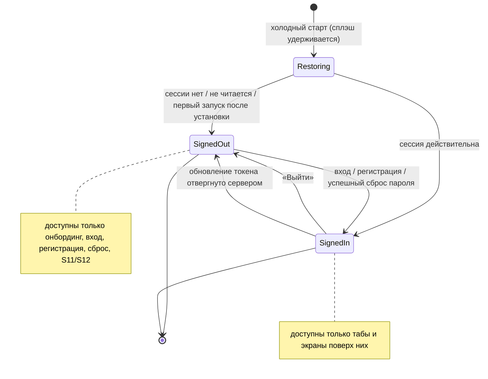
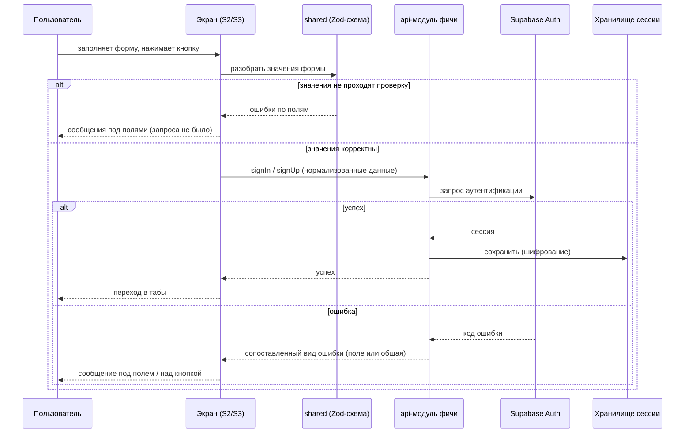
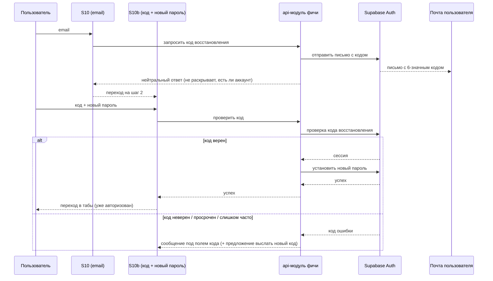

# Spec: Email-авторизация (регистрация, вход, сессия, сброс пароля)  |  Spec ID: SPEC-02  |  Status: draft
Supersedes: — (SPEC-01 остаётся в силе; перечень его AC, которые этот спек заменяет, — в разделе «Что заменяется в SPEC-01»)
Implementation Plan: specs/plans/PLAN-02-email-auth.md

## Проблема й навіщо

SPEC-01 дал работающий навигационный каркас, в котором авторизация — картинка: поля на S2/S3
неинтерактивны (`PlaceholderField` с `editable={false}`), «Войти» и «Зарегистрироваться» просто делают
`router.replace("/trips")`, «Выйти» сбрасывает стек на онбординг, а профиль показывает `MOCK_USER`.
Сессии нет, бэкенда нет: `supabase/` пуст, `shared/` не заскаффолжен, в `mobile/package.json` нет
ни `@supabase/supabase-js`, ни `expo-secure-store`. Более того, скелет содержит guardrail-тест
(`mobile/__tests__/guardrails.test.ts`), который **запрещает** слово `supabase` и любой `fetch` в исходниках
и допускает ровно один ключ в AsyncStorage — то есть «нет бэкенда» сейчас закреплено автоматической проверкой.

Продукт при этом с самого начала синхронизирующийся: поездки живут на сервере, гостевого режима нет
(`design/screens/auth.md`), данные принадлежат пользователю и защищаются RLS (ADR-001). Значит без аккаунта
невозможно сделать ни один следующий шаг: ни таблицы с RLS, ни список поездок с реальными данными, ни офлайн-кэш,
ни удаление аккаунта (блокер App Store). Авторизация — единственный фундамент, на который опирается всё
остальное, и её отсутствие сейчас блокирует сразу четыре follow-up-спека SPEC-01 (1, 2, 3, 5).

Этот спек делает первый и минимальный слой: **email + пароль**, настоящая сессия, которая переживает
перезапуск приложения, гейтинг маршрутов по сессии и реальные имя/email в профиле. Всё остальное
(социальные входы, подтверждение email, удаление аккаунта, таблицы данных) сознательно остаётся за границей,
чтобы этот кусок можно было довести до конца и проверить руками.

## Goals / Non-goals

**Goals**

1. Пользователь может создать аккаунт по email и паролю и сразу оказаться внутри приложения (без подтверждения
   email, решение Q2).
2. Пользователь может войти существующим email и паролем.
3. Сессия переживает перезапуск приложения и хранится в зашифрованном виде (LargeSecureStore: AES-ключ
   в SecureStore, шифротекст в AsyncStorage).
4. Пользователь может восстановить пароль, не выходя из приложения: код из письма вводится в приложении
   (решение Q3), без deep links и universal links.
5. Маршруты разделены по сессии: без сессии не попасть в табы, с сессией не попасть на онбординг/вход/регистрацию.
6. «Выйти» действительно завершает сессию и очищает её локально.
7. Профиль (S6) и аватар-кнопка в шапке S4/S5 показывают настоящие имя и email аккаунта вместо `MOCK_USER`.
8. Появляются минимально необходимые, но настоящие границы: проект Supabase (`supabase init` + `config.toml`),
   клиент `lib/supabase` + `api/`-модуль фичи, пакет `@tripplanner/shared` со схемами валидации форм.
9. Поля S2/S3/S10 становятся настоящими полями ввода с валидацией, ошибками под полем и состоянием загрузки
   в кнопке — по `design/screens/auth.md`.

**Non-goals** (явно НЕ делаем в этом спеке)

- **Удаление аккаунта в приложении** — блокер App Store 5.1.1(v) остаётся открытым; отдельный спек (Follow-up 1).
  Строка «Удалить аккаунт» из `design/screens/account.md` в профиле не появляется.
- **Подтверждение email** при регистрации (`enable_confirmations = false`, решение Q2) и всё, что за ним тянется
  (письмо со ссылкой, universal links, повторная отправка подтверждения).
- **Вход через Apple и Google**: кнопки остаются заглушками «скоро» ровно в том виде, в каком они есть
  сейчас (решение Q4). Sign in with Apple становится обязательным только когда заработает реальный
  сторонний вход — см. «Mobile considerations».
- **Флаг «онбординг показан один раз»**: поведение остаётся текущим — онбординг показывается тогда, когда нет
  сессии (решение Q10; это осознанное расхождение с `design/screens/onboarding.md`).
- **Смена email и смена пароля из профиля**, редактирование имени и аватара, любые новые строки в профиле.
- **Таблицы данных, RLS, pgTAP, Edge Functions, генерация типов БД** — таблиц в этом спеке не создаётся
  (Follow-up SPEC-01 №1). Экраны поездок продолжают показывать данные из `src/mocks/`.
- **Хостинговый проект Supabase**: подключение к hosted-проекту, ключи окружения релиза, миграция локальной
  схемы — отдельно и только с явного разрешения владельца (root `AGENTS.md`, «Do NOT touch»).
- **Офлайн-режим**, кроме одного свойства: уже сохранённая сессия читается локально и без сети (AC-9).
  Никакой очереди запросов, никакого кэша данных.
- **Гостевой режим**, MFA/TOTP, биометрический вход, вход по magic link, вход по одноразовому коду вместо
  пароля, «запомнить меня» как отдельная настройка.
- **Аналитика, крэш-репортинг, серверный аудит-лог** входов.
- **Web-клиент**: `shared/` создаётся так, чтобы web им позже воспользовался, но самого `web/` нет.

## User stories

- **US-1.** Как новый пользователь, я ввожу имя, email и пароль и сразу оказываюсь в списке поездок — без
  писем, ссылок и ожидания.
- **US-2.** Как вернувшийся пользователь, я ввожу email и пароль и попадаю внутрь; если я ошибся, я вижу,
  что именно не так, прямо под полем, а не в системном алерте.
- **US-3.** Как пользователь, который вчера закрыл приложение, я открываю его сегодня и сразу вижу свои поездки,
  без повторного входа и без мелькания экрана онбординга.
- **US-4.** Как пользователь, забывший пароль, я получаю код на почту, ввожу его и новый пароль прямо
  в приложении и продолжаю работу — мне не нужно ловить ссылку в почтовом клиенте.
- **US-5.** Как пользователь в самолёте (без сети), я открываю приложение и вижу интерфейс, а не экран входа:
  моя сессия лежит на устройстве.
- **US-6.** Как пользователь, я нажимаю «Выйти» и уверен, что следующий человек, взявший телефон, не вернётся
  в мой аккаунт жестом «назад».
- **US-7.** Как владелец продукта, я вижу в профиле своё настоящее имя и email, а не «Anna Kowalska».
- **US-8.** Как разработчик следующих спеков, я хочу один клиент Supabase и один `api/`-модуль как единственную
  границу доступа к бэкенду, чтобы таблицы и RLS легли поверх без переделки.

## Инвентарь экранов

Изменения относительно SPEC-01. Экраны, не перечисленные здесь (S4, S5, S7–S9, S11, S12), внешне не меняются;
их единственное изменение — они недостижимы без сессии (AC-20).

| # | Экран / маршрут | Что меняется | Входы | Выходы |
|---|---|---|---|---|
| S1 | Онбординг `/onboarding` | Содержимое не меняется. Показывается только когда сессии нет; с сессией — недостижим (AC-21) | Холодный старт без сессии; выход из аккаунта | «Начать» → S3; «Войти» → S2 |
| S2 | Вход `/sign-in` | Под заголовком появляется пояснение «Войдите, чтобы синхронизировать поездки» (дизайн). Поля Email и Пароль — настоящие. «Забыли пароль?» цветом `textSecondary`, зона нажатия 44pt. Кнопка «Войти» выполняет вход, на время запроса блокируется и показывает индикатор внутри себя. Ошибки — под полями. Apple/Google/разделитель — без изменений («скоро») | S1, S3, S10-шаг-1 | Успех → табы `/trips`; «Создать» → S3; «Забыли пароль?» → S10 |
| S3 | Регистрация `/sign-up` | Пояснение «Одна поездка, все детали — под рукой». Настоящие поля Имя / Email / Пароль (подсказка «Минимум 8 символов»). Кнопка создаёт аккаунт и сессию. Текст согласия и ссылки S11/S12 — без изменений | S1, S2 | Успех → табы `/trips`; ссылки → S11/S12; «Войти» → S2 |
| S6 | Профиль `/profile` | `MOCK_USER` заменяется данными сессии: имя (`display_name`) и email; инициал аватара — из них же. Строки «Уведомления», «Подключённые аккаунты», «Валюта» и переключатель темы не меняются (значения «Booking.com» и «EUR» остаются статичными заглушками). «Выйти» действительно завершает сессию | Таб | «Выйти» → S1 |
| S10 | Сброс пароля, шаг 1 `/forgot-password` | Заглушка становится рабочей: поле Email, кнопка «Отправить код». Текст меняется со «ссылки» на «код». После отправки — переход на шаг 2 | S2 | «Отправить код» → S10b; «назад» → S2 |
| S10b | Сброс пароля, шаг 2 `/reset-password` (**новый маршрут**) | Показывает email, на который отправлен код (не редактируется). Поле «Код из письма» (6 цифр, цифровая клавиатура), поле «Новый пароль», кнопка «Сохранить пароль», ссылка «Отправить код ещё раз» с обратным отсчётом | S10 | Успех → табы `/trips` (пользователь уже вошёл, решение Q8); «назад» → S10 |

Расхождения кода и дизайна, которые этот спек закрывает в пользу дизайна/скриншотов (решение Q16):
подзаголовки S2/S3, плейсхолдеры полей («Andrew», «you@example.com», «Минимум 8 символов»), цвет
«Забыли пароль?» (`textSecondary`, не `accent`).

## Карта маршрутов (дополнение к SPEC-01)

| Маршрут | Экран | Параметры | Презентация | Доступ |
|---|---|---|---|---|
| `/reset-password` | S10b | — (email передаётся **не** через параметры маршрута, см. AC-39) | push | только без сессии |

Остальные маршруты SPEC-01 сохраняются без изменений; добавляется только правило доступа:
«группа онбординга/аутентификации» (`/onboarding`, `/sign-in`, `/sign-up`, `/forgot-password`, `/reset-password`,
`/legal/*`) и «группа табов» (`(tabs)`, `/trips/*`) разделены проверкой сессии. `/legal/terms` и `/legal/privacy`
доступны в обоих состояниях — они нужны и до регистрации, и из профиля.

## Acceptance criteria (EARS)

### Запуск и жизненный цикл сессии

- **AC-1.** WHEN приложение запускается и на устройстве есть действительная сохранённая сессия, the system
  **shall** показать первым экраном `/trips` — без экрана онбординга, входа или промежуточной вспышки другого экрана.
  *Verify: manual (холодный старт после входа, запись экрана) + e2e.*
- **AC-2.** WHILE восстановление сессии не завершено, the system **shall** удерживать сплэш-экран (тем же
  механизмом, что шрифты и тема SPEC-01 AC-18/AC-32) и не отрисовывать ни один экран приложения.
  *Verify: unit (шелл не рендерит навигацию до готовности сессии) + manual.*
- **AC-3.** IF сохранённой сессии нет, она не читается или расшифровать её не удалось, THEN the system **shall**
  молча перейти в состояние «не авторизован», показать `/onboarding` и очистить остатки сессии в локальном
  хранилище — без экрана ошибки и без блокирующего диалога.
  *Verify: unit (подставные значения: пусто / мусор / неверный ключ) + manual.*
- **AC-4.** IF refresh-токен истёк, отозван или отвергнут сервером, THEN the system **shall** перевести
  приложение в состояние «не авторизован», очистить локальную сессию и показать `/onboarding`.
  *Verify: unit (мок клиента отдаёт ошибку обновления токена) + manual (отзыв сессии на сервере).*
- **AC-5.** WHILE пользователь авторизован и приложение находится на переднем плане, the system **shall**
  держать автообновление токена включённым; WHEN приложение уходит в фон, the system **shall** его останавливать
  и возобновлять при возврате на передний план.
  *Verify: unit (реакция на смену состояния приложения) + manual (фон > времени жизни access-токена → возврат
  в приложение работает без повторного входа).*
- **AC-6.** WHEN приложение запускается впервые после установки (включая переустановку поверх удалённого
  приложения), the system **shall** удалить любую сохранённую сессию до первой попытки её использовать —
  данные Keychain переживают удаление приложения (`mobile/insights.md`, 2026-09-18).
  *Verify: unit (признак «первый запуск» отсутствует → очистка вызвана) + manual (установить → войти → удалить
  приложение → установить заново → приложение на онбординге).*
- **AC-7.** The system **shall** хранить сессию только в зашифрованном виде: симметричный ключ — в защищённом
  хранилище устройства, шифротекст — в локальном хранилище ключ-значение; ни access-токен, ни refresh-токен,
  ни пароль не попадают в незашифрованное хранилище в открытом виде.
  *Verify: unit (в незашифрованном хранилище нет значения, содержащего токен) + manual (осмотр содержимого
  хранилища на устройстве после входа).*
- **AC-8.** WHILE пользователь авторизован, the system **shall** делать запросы к Supabase только через
  единственный клиентский модуль и `api/`-модули фич; ни один экран не обращается к сети напрямую.
  *Verify: unit (статический guardrail: импорт `supabase-js` разрешён ровно в одном модуле).*
- **AC-9.** WHILE устройство без сети, а сохранённая сессия действительна, the system **shall** открыть
  приложение в авторизованном состоянии (табы с текущим содержимым экранов) и не показывать ни экран входа,
  ни ошибку сети при старте.
  *Verify: manual (авиарежим, холодный старт) + unit (чтение сессии не требует сетевого вызова).*

### Регистрация (S3)

- **AC-10.** WHEN пользователь отправляет форму регистрации с корректными именем, email и паролем, the system
  **shall** создать аккаунт, немедленно получить действительную сессию (без подтверждения email) и открыть `/trips`.
  *Verify: e2e (регистрация со свежим email → табы) + unit (api-модуль вызывает регистрацию и сохраняет сессию).*
- **AC-11.** WHEN аккаунт создаётся, the system **shall** сохранить введённое имя в метаданных пользователя
  под ключом `display_name` (решение Q9) и использовать именно его как отображаемое имя в приложении.
  *Verify: unit (тело запроса содержит `display_name`) + manual (профиль показывает введённое имя).*
- **AC-12.** IF пароль короче 8 символов, email не похож на адрес или имя пустое (после удаления пробелов),
  THEN the system **shall** показать сообщение под соответствующим полем и **не** отправлять запрос на сервер.
  *Verify: unit (схема валидации в `shared/` + экран не вызывает api) + e2e.*
- **AC-13.** IF email уже зарегистрирован, THEN the system **shall** показать под полем email сообщение
  «Аккаунт с таким email уже существует» со ссылкой-действием «Войти», ведущей на S2 с уже подставленным email
  (решение Q12).
  *Verify: unit (мок ошибки сервера → сообщение и переход) + manual.*
- **AC-14.** WHILE запрос регистрации или входа выполняется, the system **shall** блокировать кнопку отправки
  и показывать индикатор загрузки внутри неё, не перекрывая экран модальным спиннером; повторные нажатия
  не порождают второго запроса.
  *Verify: unit (двойное нажатие → ровно один вызов api) + manual.*

### Вход (S2)

- **AC-15.** WHEN пользователь отправляет форму входа с корректной парой email/пароль, the system **shall**
  создать сессию и открыть `/trips`.
  *Verify: e2e + unit.*
- **AC-16.** IF пара email/пароль не подходит, THEN the system **shall** показать одно и то же сообщение
  «Неверный email или пароль» независимо от того, существует ли такой аккаунт, и не очищать введённый email.
  *Verify: unit (несуществующий email и неверный пароль дают идентичный текст) + e2e.*
- **AC-17.** The system **shall** приводить email к нижнему регистру и удалять пробелы по краям перед отправкой
  и перед валидацией — во всех трёх формах (вход, регистрация, сброс пароля).
  *Verify: unit (схема в `shared/`).*
- **AC-18.** IF сервер отвечает «слишком много запросов» (rate limit), THEN the system **shall** показать
  отдельное сообщение «Слишком много попыток, попробуйте позже», отличное от сообщения о неверных данных.
  *Verify: unit (мок 429 → отдельный текст).*
- **AC-19.** IF запрос не дошёл из-за отсутствия сети или превышения тайм-аута, THEN the system **shall**
  показать сообщение о проблеме с соединением, сохранить всё введённое в форме и позволить повторить отправку
  одним нажатием.
  *Verify: unit (мок сетевой ошибки) + manual (авиарежим на экране входа).*

### Гейтинг маршрутов и выход

- **AC-20.** WHILE сессии нет, the system **shall** не допускать отображения ни одного экрана группы табов
  (`/trips`, `/history`, `/profile`) и ни одного экрана поверх них (`/trips/*`): любая попытка открыть такой
  маршрут (в том числе по ссылке `tripplanner://` или после выхода) приводит на `/onboarding`.
  *Verify: unit (рендер маршрута без сессии → редирект) + e2e.*
- **AC-21.** WHILE сессия есть, the system **shall** перенаправлять `/onboarding`, `/sign-in`, `/sign-up`,
  `/forgot-password` и `/reset-password` на `/trips`; `/legal/terms` и `/legal/privacy` при этом остаются
  доступными в обоих состояниях.
  *Verify: unit (рендер каждого маршрута с сессией) + manual.*
- **AC-22.** WHEN пользователь нажимает «Выйти» в профиле, the system **shall** завершить сессию, удалить её
  из локального хранилища и показать `/onboarding` так, что ни жест «назад», ни повторный запуск приложения
  не возвращают в табы.
  *Verify: e2e (выход → перезапуск → онбординг) + unit.*
- **AC-23.** IF серверная часть выхода не удалась (нет сети, сервер ответил ошибкой), THEN the system **shall**
  всё равно удалить локальную сессию и перевести пользователя на `/onboarding` — выход не может «не сработать»
  на устройстве.
  *Verify: unit (мок ошибки выхода → локальная сессия очищена).*
- **AC-24.** WHILE пользователь находится в табах и его сессия становится недействительной (отозвана,
  не обновляется), the system **shall** перевести приложение на `/onboarding` вместо показа пустых экранов
  или повторяющихся ошибок.
  *Verify: unit (событие «сессия завершена» во время работы) + manual.*

### Профиль и отображаемое имя

- **AC-25.** WHILE пользователь авторизован, the system **shall** показывать на `/profile` имя и email текущего
  аккаунта; статичный `MOCK_USER` больше не является источником имени и email ни на одном экране.
  *Verify: unit (профиль рендерится из сессии; `MOCK_USER` не импортируется для имени/email) + e2e.*
- **AC-26.** IF у аккаунта нет непустого `display_name`, THEN the system **shall** показывать вместо имени
  часть email до символа `@` (решение Q13), а инициалом аватара — её первый символ; пустого места
  и пустого кружка-аватара быть не должно.
  *Verify: unit (аккаунт без метаданных) + manual.*
- **AC-27.** The system **shall** брать инициал аватар-кнопки в шапке `/trips` и `/history` из того же
  отображаемого имени, что и профиль, а не из отдельного источника.
  *Verify: unit (один источник для трёх экранов).*

### Сброс пароля (S10 → S10b)

- **AC-28.** WHEN пользователь отправляет email на шаге 1, the system **shall** запросить отправку кода
  восстановления и перейти на шаг 2 с одинаковым нейтральным текстом («Если такой аккаунт существует,
  мы отправили на него код») независимо от того, зарегистрирован ли этот email.
  *Verify: unit (существующий и несуществующий email дают один и тот же экран и текст) + manual.*
- **AC-29.** The system **shall** принимать на шаге 2 код ровно из 6 цифр, показывать цифровую клавиатуру
  и не отправлять запрос, пока введено меньше 6 цифр.
  *Verify: unit + manual.*
- **AC-30.** WHEN пользователь отправляет корректный код вместе с новым паролем длиной не менее 8 символов,
  the system **shall** установить новый пароль, оставить пользователя авторизованным и открыть `/trips`
  (решение Q8).
  *Verify: e2e (локальный почтовый ящик Supabase) + unit.*
- **AC-31.** IF код неверен **или** просрочен, THEN the system **shall** показать под полем кода одно
  сообщение «Код неверен или устарел» вместе с действием «Отправить код ещё раз», сохранить введённый
  новый пароль и позволить ввести код заново. Различать эти два случая нельзя: сервер отвечает на них
  одинаково (`otp_expired`, HTTP 403), и выдумывать разницу в интерфейсе — значит врать пользователю.
  *Verify: unit (мок ошибки проверки кода) + manual (истёкший код на локальном стенде).*
- **AC-32.** IF новый пароль совпадает с текущим паролем аккаунта (сервер отвечает `same_password`),
  THEN the system **shall** показать под полем пароля отдельное сообщение «Новый пароль должен отличаться
  от старого» и оставить пользователя на шаге 2.
  *Verify: unit (мок ошибки `same_password`).*
- **AC-33.** WHILE после отправки кода не истёк период ожидания повторной отправки (60 секунд), the system **shall**
  держать действие «Отправить код ещё раз» неактивным и показывать оставшееся время; после истечения —
  снова активным.
  *Verify: unit (таймер) + manual.*
- **AC-34.** IF сервер отвечает ограничением частоты на отправку письма, THEN the system **shall** показать
  сообщение «Слишком часто, попробуйте позже» и не считать это ошибкой введённых данных.
  *Verify: unit (мок ошибки rate limit).*
- **AC-35.** IF новый пароль короче 8 символов, THEN the system **shall** показать ошибку под полем пароля
  и не отправлять запрос.
  *Verify: unit (та же схема `shared/`, что и регистрация).*

### Ошибки, ввод, доступность, локализация

- **AC-36.** The system **shall** показывать любую ошибку формы под тем полем, к которому она относится,
  цветом `danger`, и не использовать для этого системные алерты и модальные окна; ошибки, не относящиеся
  к конкретному полю (сеть, rate limit, неизвестная), показываются одной строкой над кнопкой отправки.
  *Verify: unit (каждая ветка ошибок) + manual (обе темы).*
- **AC-37.** IF сервер вернул ошибку, для которой в приложении нет сопоставленного сообщения, THEN the system
  **shall** показать общее локализованное сообщение и **не** выводить пользователю сырой текст или код ошибки сервера.
  *Verify: unit (неизвестный код ошибки → общий текст, в выводе нет исходной строки).*
- **AC-38.** The system **shall** делать поля ввода настоящими: подпись, тип клавиатуры под содержимое
  (email — адресная, код — цифровая), отключённая автокапитализация и автокоррекция для email и пароля,
  подсказки автозаполнения (email, текущий пароль, новый пароль, одноразовый код), маскирование пароля,
  переход к следующему полю с клавиатуры и отправка формы с последнего поля, видимые состояния фокуса,
  ошибки и блокировки.
  *Verify: unit (свойства полей) + manual (автозаполнение пароля из Keychain на устройстве).*
- **AC-39.** The system **shall** не передавать пароль, новый пароль и код восстановления через параметры
  маршрута, не записывать их в локальное хранилище и не выводить их в логи ни в одном виде, включая логи
  ошибок и отладочный вывод dev-клиента.
  *Verify: unit (статический guardrail на параметры маршрутов + проверка, что api-модуль не логирует тело запроса)
  + manual (осмотр логов при неуспешном входе).*
- **AC-40.** The system **shall** озвучивать ошибку поля вспомогательным технологиям: сообщение связано
  с полем и произносится при появлении, а не остаётся только визуальным.
  *Verify: manual (VoiceOver на S2 с неверным паролем) + unit (ошибка присутствует в доступном описании поля).*
- **AC-41.** The system **shall** давать элементу «Забыли пароль?» цвет `textSecondary` и область нажатия
  не меньше 44×44 pt.
  *Verify: unit (общий примитив нажимаемой строки) + manual (Accessibility Inspector).*
- **AC-42.** The system **shall** отрисовывать заблокированную кнопку отправки фоном `divider` и текстом
  `textTertiary` (правило `design/tokens.md` «Состояния»), а не понижением прозрачности активного стиля.
  *Verify: unit (стиль заблокированной кнопки) + manual (обе темы).*
- **AC-43.** The system **shall** иметь для каждой новой видимой строки (подписи полей, плейсхолдеры,
  сообщения валидации, сопоставленные серверные ошибки, тексты шагов сброса пароля) перевод на русский
  и английский; непереведённых строк и ключей не остаётся ни в одной локали.
  *Verify: unit (существующий тест паритета локалей).*
- **AC-44.** The system **shall** сохранять читаемость всех изменённых экранов в светлой и тёмной теме:
  контраст текста ошибки цветом `danger` на фоне экрана — не ниже 4.5:1 в обеих темах.
  *Verify: manual (обход S2, S3, S10, S10b, S6 в обеих темах с измерением контраста).*
- **AC-45.** WHILE открыта клавиатура на S2, S3, S10 или S10b, the system **shall** оставлять доступными
  (прокруткой) и активное поле, и кнопку отправки.
  *Verify: manual (устройство, самое нижнее поле формы).*

### Конфигурация и безопасность

- **AC-46.** The system **shall** не содержать в клиентском приложении ключа `service_role` и никаких секретов
  в значениях `EXPO_PUBLIC_*`: публичными считаются только URL проекта и анонимный (publishable) ключ.
  *Verify: unit (статический guardrail: `service_role` не встречается в `mobile/`) + manual (осмотр конфигурации сборки).*
- **AC-47.** IF URL проекта или публичный ключ отсутствуют в конфигурации сборки, THEN the system **shall**
  завершиться понятной ошибкой конфигурации при инициализации клиента, а не «работать» и падать на первом запросе.
  *Verify: unit (создание клиента без переменных).*
- **AC-48.** The system **shall** описывать настройки аутентификации в версионируемом файле конфигурации
  проекта Supabase (`supabase/config.toml`) явными значениями, не полагаясь на умолчания: провайдер email
  включён, регистрация разрешена, подтверждение email выключено, минимальная длина пароля 8 (умолчание — 6),
  длина кода 6, срок жизни кода 600 секунд (умолчание — 3600, см. AC-51), минимальный интервал между
  письмами 60 секунд, ограничения частоты (`email_sent`, `token_verifications`, `sign_in_sign_ups`,
  `token_refresh`) — так, что локальный запуск воспроизводит поведение из этого спека.
  *Verify: manual (локальный `supabase start` + прогон сценариев AC-10, AC-28…AC-34 против него).*
- **AC-51.** The system **shall** содержать шаблон письма восстановления пароля, в котором присутствует
  сам код (`{{ .Token }}`): стандартный шаблон Supabase содержит только ссылку, и без правки шаблона
  пользователь не получит кода вообще — весь поток Q3 на этом умирает.
  *Verify: manual (локальный стенд: письмо в почтовом ящике содержит шестизначный код) + e2e.*
- **AC-52.** The system **shall** ограничивать окно перебора кода тем, что срок его жизни не превышает
  10 минут: серверной блокировки после N неверных попыток не существует, есть только ограничение частоты
  по IP, поэтому срок жизни кода — единственный управляемый нами параметр этого риска.
  *Verify: manual (код, введённый спустя 11 минут, отвергается) + unit (значение в конфигурации).*
- **AC-49.** The system **shall** оставлять кнопки «Продолжить с Apple» и «Продолжить с Google» и разделитель
  «или по email» ровно в текущем виде: нажимаемы, ничего не делают, несут пометку «скоро» (правило SPEC-01 Q7).
  *Verify: unit (существующие тесты S2/S3) + manual.*
- **AC-50.** The system **shall** обеспечивать прохождение `pnpm -r typecheck` и `pnpm -r test` во всех
  затронутых пакетах, включая обновлённые guardrail-тесты скелета (см. «Что заменяется в SPEC-01»),
  без подавляющих директив.
  *Verify: unit (`pnpm -r typecheck`, `pnpm -r test`).*

## Edge cases

- **Двойное/тройное нажатие «Войти»**: отправляется ровно один запрос; повторные нажатия игнорируются,
  пока идёт текущий (AC-14).
- **Уход в фон во время запроса**: по возвращении экран показывает результат запроса (успех → табы,
  ошибка → сообщение), а не «вечный» индикатор.
- **Убийство приложения сразу после успешной регистрации**: при следующем запуске пользователь авторизован —
  сессия записывается до перехода на `/trips`, а не после.
- **Выход во время выполняющегося запроса** (например, «Выйти» нажато, пока обновляется токен): локальная
  сессия всё равно очищается, результат запроса, пришедший после выхода, не возвращает пользователя в табы.
- **Автозаполнение пароля из Keychain** на S2 и предложение «сохранить пароль» после регистрации: форма
  должна корректно принимать вставленное значение (валидация срабатывает на изменение значения, а не только
  на ручной ввод).
- **Вставка email с пробелом в конце или заглавными буквами** — нормализуется (AC-17), а не отвергается.
- **Ввод только пробелов** в поле имени или пароля: после удаления пробелов по краям имя считается пустым
  (ошибка); пароль **не** обрезается по краям — пробел является допустимым символом пароля, и длина
  проверяется по исходной строке.
- **Очень длинное имя** (несколько сотен символов) и **имя из эмодзи/письменности с другой шириной**:
  ограничение длины имени — 64 символа на клиенте; профиль и шапка не ломаются, инициал берётся как первый
  графемный кластер (эмодзи-инициал допустим).
- **Очень длинный email** (локальная часть под 64 символа): поле не ломает верстку, текст усекается многоточием.
- **Расхождение часов устройства** (время сдвинуто на часы вперёд/назад): приложение не должно считать
  действительную сессию просроченной по локальным часам — источником истины является ответ сервера
  на обновление токена, а не локальное сравнение времени.
- **Код восстановления введён после того, как пользователь уже вошёл другим способом** (сессия появилась
  между шагами): экран сброса недостижим с сессией (AC-21), незавершённый ввод отбрасывается.
- **Повторная отправка кода**, когда предыдущий ещё действует: действителен последний отправленный код;
  сообщение шага 2 не утверждает обратного.
- **Уход с шага 2 и возврат на него**: введённый код и новый пароль не сохраняются (AC-39) — форма пустая.
- **Отключение сети между шагом 1 и шагом 2**: шаг 2 открывается (письмо уже запрошено), отправка кода
  даёт сообщение о соединении с возможностью повтора.
- **Сессия отозвана на сервере, пока приложение в фоне**: при возврате приложение переходит на онбординг
  (AC-24), а не показывает пустые экраны.
- **Переустановка приложения**: сохранённые в Keychain остатки предыдущей установки не дают автоматического
  входа (AC-6).
- **Запуск без сети и без сессии**: показывается онбординг; попытка войти даёт сообщение о соединении,
  а не бесконечный индикатор.
- **Смена языка устройства между шагами сброса пароля**: интерфейс переключается; текст письма при этом
  приходит на языке шаблона Supabase (в этом спеке шаблон один — см. `[NEEDS CLARIFICATION]`).

## Mobile considerations

**Platforms: ios+android.** Проверяем на iOS. Список iOS-only поведений пуст и должен таким остаться
(SPEC-01 AC-27): защищённое хранилище, автозаполнение пароля и цифровая клавиатура доступны на обеих платформах,
любые различия прячутся за платформенной границей `mobile/src/platform/`.

- **Офлайн-поведение.** Единственное офлайновое свойство — чтение уже сохранённой сессии (AC-9): приложение
  открывается авторизованным без сети. Вход, регистрация и сброс пароля требуют сети и при её отсутствии дают
  понятное сообщение (AC-19). Очередей и кэша данных нет.
- **Локальное хранение.** Появляется второй писатель в AsyncStorage — зашифрованный блоб сессии, и первый
  пользователь защищённого хранилища устройства — AES-ключ. Это меняет правило SPEC-01 «в хранилище ровно один
  ключ» (см. «Что заменяется в SPEC-01»). Правило «в незашифрованном хранилище нет секретов в открытом виде»
  остаётся (AC-7).
- **Разрешения.** Спек **не** запрашивает ни одного системного разрешения. Ни камеры, ни уведомлений,
  ни Face ID (биометрический вход — Non-goal). Denied-пути, следовательно, нет. Появление любого запроса
  разрешения — отклонение от спека.
- **App Store влияние.**
  - Приложение начинает **собирать данные пользователя** (email и имя, связанные с личностью, назначение —
    работа приложения/аутентификация). До подачи в стор это обязано появиться в декларации сбора данных;
    к первой сборке с этим спеком декларация перестаёт быть пустой.
  - Новые нативные зависимости (защищённое хранилище, криптография) требуют повторного аудита privacy manifest
    и, при необходимости, новых причин доступа в `ios.privacyManifests` — Apple не разбирает манифесты
    статически слинкованных подов (`mobile/insights.md`, `docs/release/privacy-manifest-audit.md`).
  - Новых permission-строк не появляется.
  - **Открытый риск (не блокер этого спека, решение Q4):** в релизной сборке будут видны нерабочие кнопки
    «Продолжить с Apple» и «Продолжить с Google» с пометкой «скоро». Ревью App Store может расценить
    нерабочие элементы интерфейса как незавершённое приложение (Guideline 2.1). Обязанность добавить
    Sign in with Apple (Guideline 4.8) возникает только когда заработает реальный сторонний вход, то есть
    этим спеком не создаётся. Решение «убрать кнопки перед первой подачей или оставить» принимается
    в спеке релиза.
  - **Блокер релиза остаётся открытым:** удаление аккаунта в приложении (Guideline 5.1.1(v)) — Follow-up 1.
    С появлением настоящих аккаунтов этот блокер из теоретического становится реальным.
- **Тема.** Все изменённые экраны обязаны быть корректны в светлой и тёмной теме (AC-44). Ошибки цветом
  `danger`, заблокированная кнопка — `divider`/`textTertiary` (AC-42). Новых токенов не требуется:
  `danger` уже определён в теме и до сих пор не использовался ни одним экраном (`mobile/insights.md`, 2026-09-20).
  Состояние фокуса поля выражается границей цветом `accent`, состояние ошибки — границей цветом `danger`;
  `design/tokens.md` эти два состояния сейчас не описывает — раздел «Состояния» нужно дополнить (Follow-up 7).
- **Типографика.** Email, пароль и код вводятся **не** моноширинным шрифтом: моно зарезервирован
  за «билетными» данными (`design/README.md`). Это относится и к полю шестизначного кода.
- **Ориентация:** только портрет, без изменений.

## Non-functional

- **Производительность.**
  - Восстановление сессии при холодном старте не должно заметно удлинять запуск: ориентир — не более +300 мс
    к времени до первого экрана из SPEC-01 (расшифровка одного небольшого значения, без сетевого вызова).
  - Вход, регистрация, отправка кода и смена пароля: тайм-аут запроса — 15 секунд; по его истечении
    пользователь получает сообщение (AC-19), а не бесконечный индикатор.
  - Автообновление токена не выполняется в фоне (AC-5) — это и энергетическое требование, и способ
    не получать бессмысленные сетевые ошибки в фоне.
- **Безопасность** (консультация со skill `security`, категории A01, A04, A06, A07, A09):
  - Авторизация принципиально серверная: клиентский гейтинг маршрутов (AC-20) — это UX, а не защита;
    настоящая защита данных появится вместе с RLS в спеке таблиц. Ни один экран не должен трактовать
    «пользователь дошёл до маршрута» как право на данные.
  - Пароли на сервере хранит Supabase Auth; приложение не хеширует, не сохраняет и не передаёт пароль никуда,
    кроме самого запроса аутентификации (AC-39).
  - Ключ `service_role` в клиенте отсутствует (AC-46); публичный анонимный ключ секретом не является,
    но и не даёт доступа к чужим данным — это свойство обеспечивается RLS, которого пока нет, что и есть
    причина не создавать таблицы в этом спеке.
  - Защита от перебора обеспечивается серверными ограничениями частоты (AC-48), а не клиентом; клиент обязан
    отличать «неверные данные» от «слишком много попыток» (AC-18) и не подсказывать, существует ли аккаунт (AC-16).
  - Осознанно принятая слабость: при выключенном подтверждении email регистрация на уже занятый адрес
    отвечает ошибкой, то есть позволяет проверить, зарегистрирован ли email (решение Q12). Компенсация —
    ограничение частоты; пересматривается вместе с включением подтверждения email (Follow-up 2).
  - Перебор кода восстановления: сервер не блокирует аккаунт после N неверных попыток, поэтому единственный
    рычаг на нашей стороне — короткий срок жизни кода (AC-52) плюс серверное ограничение частоты проверок
    по IP. Клиентский счётчик попыток защитой не является и не вводится (`[NEEDS CLARIFICATION] C4`).
  - Остаточный канал утечки в потоке сброса пароля: на несуществующий адрес сервер отвечает «успехом»,
    а на существующий, если код уже отправлялся минуту назад, — ошибкой частоты. Отличить одно от другого
    можно, но только зная момент предыдущей отправки; интерфейс этой разницы не показывает (AC-28, AC-34).
  - Требование ASVS L1 «12+ символов» сознательно не принимается: минимум — 8 (решение Q1/Q5). Проверка пароля
    по базам утечек в этом спеке не включается (см. `[NEEDS CLARIFICATION] C2`).
- **Доступность.** Ошибки озвучиваются и связаны с полем (AC-40); зона нажатия ≥44 pt у всех новых элементов,
  включая «Забыли пароль?» и «Отправить код ещё раз» (AC-41); Dynamic Type не ломает формы; контраст ≥4.5:1
  в обеих темах (AC-44); поля имеют подписи, а не только плейсхолдеры.
- **Наблюдаемость.** Телеметрии по-прежнему нет. Минимум, который обязан быть: неуспешный запрос
  аутентификации оставляет в логах dev-клиента запись с кодом ошибки и именем операции — **без** email,
  пароля, кода и токенов (AC-39). Отсутствие или неверность конфигурации проекта проявляется явной ошибкой
  при старте (AC-47), а не молчаливой неработоспособностью.

## Workflow & Contracts

### Состояния сессии

### Регистрация и вход

### Сброс пароля кодом

### Контракты между модулями

Контракты описаны как границы, без раскладки по файлам.

1. **`shared/` → `mobile/` (и позже `web/`, Edge Functions).** Пакет `@tripplanner/shared` предоставляет схемы
   разбора и нормализации форм аутентификации: вход (email, пароль), регистрация (имя, email, пароль),
   запрос сброса (email), установка нового пароля (код, новый пароль). Схема одновременно **нормализует**
   (email — trim + нижний регистр; имя — trim) и **проверяет** (email похож на адрес; пароль ≥ 8 символов;
   имя непустое и ≤ 64 символов; код — ровно 6 цифр). Результат разбора даёт для каждого невалидного поля
   стабильный идентификатор ошибки (не готовый текст) — текст подставляет клиент из своих локализованных строк.
   Пакет остаётся runtime-нейтральным: никакого `supabase-js`, никакого `react-native` (`shared/AGENTS.md`).
2. **`mobile` → Supabase Auth.** Единственная точка доступа — клиентский модуль Supabase плюс `api/`-модуль
   фичи авторизации (`mobile/AGENTS.md`). Наружу он отдаёт результат в форме «успех + сессия» либо
   «классифицированная ошибка» из фиксированного набора видов: неверные учётные данные, email уже занят,
   слабый пароль, неверный код, просроченный код, слишком много запросов, нет соединения, неизвестная ошибка.
   Сырые ошибки бэкенда наружу не проходят (AC-37) — это и контракт локализации, и граница безопасности.
3. **`mobile` → хранилище сессии.** Сессия проходит через одну границу хранения: ключ шифрования —
   в защищённом хранилище устройства, шифротекст — в хранилище ключ-значение. Пароли и коды через эту границу
   не проходят никогда.
4. **Конфигурация Supabase.** `supabase/config.toml` — версионируемый контракт поведения сервера
   (AC-48). Таблиц, политик RLS и Edge Functions этот спек не создаёт.
5. **Данные экранов остаются на моках.** `src/mocks/` продолжает питать поездки и историю; из него уходит
   только пользователь (имя, email) — «Booking.com» и «EUR» остаются статичными заглушками строк профиля.

## Inputs (provenance)

- Экранные тексты, поведение форм, правила ошибок: [design: `design/screens/auth.md`,
  `design/screens/onboarding.md`, `design/screens/account.md`, `design/tokens.md`, `design/README.md`].
- Навигационный контракт, правила заглушек, тема, локализация: [reused: SPEC-01].
- Текущее состояние кода (поля-заглушки, `MOCK_USER`, отсутствие сессии, guardrail-тесты, отсутствие
  `shared/` и `supabase/`): [repo: `mobile/src/features/auth/*`, `mobile/src/features/profile/*`,
  `mobile/app/*`, `mobile/__tests__/guardrails.test.ts`, `mobile/package.json`, `supabase/AGENTS.md`,
  `shared/AGENTS.md`] — прочитано этим спеком.
- Решение о бэкенде и границах: [ADR: `docs/decisions/ADR-001-backend-supabase.md`].
- Гочи хранения (лимит SecureStore, Keychain переживает переустановку, privacy manifest): [insights:
  `mobile/insights.md`, root `insights.md`].
- Поведение Supabase Auth (коды ошибок, восстановление пароля кодом, ключи `config.toml`, работа клиента
  в React Native): [third-party API: Supabase Auth / GoTrue] — проверено по официальной документации
  и исходникам при подготовке этого спека. Опорные источники: руководство по password-based auth
  (`supabase.com/docs/guides/auth/passwords`), шаблоны писем (`.../auth/auth-email-templates`,
  переменная `{{ .Token }}`), справочник кодов ошибок (`.../auth/debugging/error-codes`), ограничения
  частоты (`.../auth/rate-limits`), конфигурация CLI (`.../local-development/cli/config`), быстрый старт
  для React Native и руководство Expo (шаблон LargeSecureStore, `detectSessionInUrl: false`,
  `startAutoRefresh`/`stopAutoRefresh` по `AppState`), исходники GoTrue `verify.go` / `recover.go` /
  `mail.go` / `user.go`. **Проверить при реализации** на фактически установленных версиях CLI и
  `supabase-js`: имена и умолчания ключей `config.toml` (документация и шаблон CLI расходятся, например
  по `max_frequency`), точный ответ `getSession()` после неудачного обновления токена, и назван ли
  локальный почтовый ящик Inbucket или Mailpit (секция переименована; порт `54324` в обоих случаях).
- Требования стора: [third-party policy: App Store Review Guidelines 2.1, 4.8, 5.1.1(v)] — через
  `design/screens/*.md` и root `AGENTS.md`.
- Никаких LLM-вызовов и никаких сторонних API, кроме Supabase, этот спек не вводит.

## Untrusted inputs

Спек впервые вводит в приложение текст, приходящий извне кода, поэтому раздел не формальный.

- **Ответы и сообщения об ошибках Supabase.** Приходят по сети и не обязаны быть ни локализованными,
  ни безопасными для показа. Трактуются как данные: используется только **код/вид** ошибки, по нему
  выбирается собственная локализованная строка; сырой текст сервера пользователю не показывается (AC-37)
  и не подставляется в разметку.
- **Метаданные пользователя (`display_name`).** Это текст, который пользователь ввёл сам, но хранится он
  на сервере и может быть изменён в обход приложения (или прийти из будущего стороннего входа). Показывается
  только как текст (усечение, ограничение длины, AC-26 и Edge cases), никогда не используется как ключ,
  имя маршрута, часть URL или что-либо исполняемое.
- **Email как значение.** Нормализуется и проверяется схемой перед любым использованием (AC-17); не участвует
  в построении маршрутов. Email между шагами сброса пароля передаётся внутренним состоянием потока, а не
  параметром маршрута (AC-39) — параметр маршрута является недоверенным вводом по определению (SPEC-01,
  «Untrusted inputs»).
- **Сохранённая сессия на устройстве.** Недоверенный вход: значение могло быть повреждено, отредактировано,
  остаться от другой установки или от другой версии приложения. Не расшифровывается/не разбирается — считается
  отсутствующим (AC-3); остатки чистятся при первом запуске после установки (AC-6).
- **Ссылки `tripplanner://`.** Этот спек не добавляет ни одного нового обработчика ссылок и явно не вводит
  deep links в поток сброса пароля (решение Q3). Ссылка по-прежнему не является основанием для доступа:
  маршрут группы табов, открытый по ссылке без сессии, ведёт на онбординг (AC-20).
- **Prompt-injection поверхности нет**: LLM-вызовов в этом спеке нет; когда появится импорт броней
  из писем/PDF, разбираемый текст станет полноценно недоверенным — это отмечено здесь, чтобы
  соответствующий спек не начал с чистого листа.

## Что заменяется в SPEC-01

Этот спек не отменяет SPEC-01 целиком. Заменяются (и должны быть переписаны вместе с их автоматическими
проверками) следующие его критерии:

| SPEC-01 | Было | Становится |
|---|---|---|
| AC-1 | Холодный старт всегда показывает `/onboarding` | Холодный старт с сессией показывает `/trips` (AC-1 этого спека); без сессии — по-прежнему онбординг |
| AC-7 | «Войти»/«Зарегистрироваться» входят в табы без какой-либо проверки | Вход в табы только после успешной аутентификации (AC-10, AC-15) |
| AC-13 | «Выйти» сбрасывает стек на онбординг, ничего не очищая | «Выйти» завершает сессию и очищает её локально (AC-22, AC-23) |
| AC-25 | Ни одного сетевого запроса и ни одного обращения к Supabase | Обращения к Supabase Auth разрешены и ограничены одной границей (AC-8); guardrail-правило `no-backend-or-network` в `mobile/__tests__/guardrails.test.ts` должно быть переписано из «нигде» в «только в разрешённом модуле» |
| AC-28 | Maestro smoke-flow проходит регистрацию нажатием кнопки | Flow требует ввода учётных данных; `e2e/flows/skeleton-smoke.yaml` обязан быть обновлён, иначе он падает |
| AC-33 | В локальное хранилище пишется ровно один ключ (тема) | Добавляется зашифрованный блоб сессии и ключ в защищённом хранилище (AC-7); `ALLOWED_SETTING_KEYS` и тест «ровно один ключ, ровно один вызов записи» должны быть расширены осознанно |

Дополнительно расширяется (не заменяется) SPEC-01 AC-23: карта маршрутов получает `/reset-password`,
и перечень маршрутов в контрактном тесте должен быть обновлён.

Не затронуты: AC-2…AC-6, AC-8…AC-12, AC-14…AC-22, AC-24, AC-26, AC-27, AC-29…AC-32, AC-34…AC-40.

## Стратегия проверки по пакетам

- **`shared/` (vitest).** Схемы форм: нормализация email (пробелы, регистр), граница длины пароля (7/8),
  пароль с пробелами по краям не обрезается, имя из пробелов, имя длиной 64/65, код из 5/6/7 символов
  и код с нецифровыми символами, стабильность идентификаторов ошибок.
- **`mobile/` (jest-expo + RNTL, клиент Supabase замокан).** Экраны и потоки: каждая ветка ошибок S2/S3/S10/S10b,
  однократность запроса при двойном нажатии, гейтинг маршрутов в обоих состояниях сессии, восстановление
  сессии при старте (успешное, пустое, повреждённое, первый запуск после установки), выход при ошибке сервера,
  профиль из сессии и запасное имя из email, отсутствие пароля в параметрах маршрутов и в логах,
  обновлённые guardrail-правила.
- **`supabase/`.** Таблиц этот спек не создаёт, поэтому pgTAP-тестов и тестов RLS в нём нет — тестировать
  нечего, и `supabase test db` здесь не запускается (`TESTING.md`: pgTAP — «каждая политика RLS»,
  а политик пока нет). Проверяется другое: локальный запуск воспроизводит настройки `config.toml`, и сценарии
  регистрации/входа/сброса пароля проходят против локального стенда с его почтовым ящиком (AC-48, AC-51).
  Учесть: встроенный почтовик ограничивает отправку письмами в час на IP — при прогоне сценария сброса
  пароля несколько раз подряд лимит упирается раньше, чем кончается терпение (см. `[NEEDS CLARIFICATION] C7`).
- **`e2e/` (Maestro).** Один новый поток: регистрация свежим адресом → табы → выход → вход тем же адресом →
  табы. Как и существующие потоки, он не содержит литералов интерфейса (строки приходят из `scripts/e2e.sh`).
  **Запустить его сейчас нельзя** (Maestro не установлен, dev-клиент падает на симуляторе iOS 27 —
  `e2e/AGENTS.md`, `mobile/AGENTS.md`), поэтому поток авторуется «вслепую», а его допущения фиксируются
  в `e2e/insights.md`.
- **Ручная проверка на устройстве** (то, что не проверяется ничем автоматическим): переживание сессии
  после перезапуска и после переустановки, автозаполнение пароля из Keychain, поведение в авиарежиме,
  реальное письмо с кодом, VoiceOver на сообщениях об ошибках, контраст в обеих темах, отсутствие вспышки
  онбординга при старте с сессией.

## Принятые решения

Решения владельца (2026-09-21) плюс решения, **предложенные этим спеком** и подлежащие подтверждению
(помечены «предложено»).

| # | Вопрос | Решение |
|---|---|---|
| Q1 | Способ аутентификации | **Email + пароль**. Не magic link, не вход одноразовым кодом |
| Q2 | Подтверждение email | **Выключено** (`enable_confirmations = false`): регистрация сразу даёт сессию. Включение — вместе с universal links (SPEC-01 Follow-up 9) |
| Q3 | Сброс пароля | **Шестизначный код из письма, вводимый в приложении**; никаких deep links |
| Q4 | Apple / Google | Остаются заглушками «скоро» в текущем виде; риск ревью зафиксирован в «Mobile considerations», блокером этого спека не является |
| Q5 | Объём | Плюс к входу/регистрации/сессии: `supabase init` + `config.toml`, клиент с LargeSecureStore, `api/`-модуль фичи, схемы форм в `shared/`, гейтинг маршрутов, выход, настоящие имя и email в профиле |
| Q6 | Вне объёма | Удаление аккаунта, флаг «онбординг один раз», реальный сторонний вход, подтверждение email, смена email/пароля в профиле, редактирование профиля, офлайн сверх восстановления сессии, таблицы и RLS, гостевой режим, MFA |
| Q7 | Разбиение сброса пароля (**предложено**) | **Два шага, два маршрута**: `/forgot-password` (email) → `/reset-password` (код + новый пароль). Один экран смешал бы «до письма» и «после письма» в одной форме; три экрана (код отдельно от пароля) добавили бы шаг без пользы, так как код и пароль проверяются одним запросом |
| Q8 | Что после успешной смены пароля (**предложено**) | Проверка кода уже создаёт сессию, поэтому пользователь **остаётся авторизованным и попадает в табы**; возврат на экран входа с требованием ввести только что заданный пароль был бы искусственным |
| Q9 | Где хранится имя (**предложено**) | Метаданные пользователя, ключ **`display_name`** — один ключ, одно имя. Официального соглашения у Supabase нет (примеры в документации используют `name`, `first_name`/`last_name`, а сторонние провайдеры заполняют `full_name`), поэтому ключ выбираем сами и придерживаемся его. Чтение `full_name`/`name` как запасного источника понадобится, когда появится вход через Apple/Google — в этом спеке не требуется. Таблицы профилей нет (Non-goal); когда она появится, `display_name` переезжает в неё |
| Q10 | Онбординг | Показывается **всегда, когда нет сессии** (после выхода — снова). Это расхождение с `design/screens/onboarding.md` («показывается один раз») принято сознательно: флаг «показан» — отдельная сущность, а без него экран остаётся единственной осмысленной точкой входа для неавторизованного пользователя |
| Q11 | `shared/` (**предложено**) | Создаётся **в этом спеке**, минимально: только схемы форм аутентификации. Альтернатива (положить схемы в `mobile/`) отвергнута: root `AGENTS.md` требует общую продуктовую логику в `shared/`, а перенос позже стоит дороже, чем создание пакета сейчас |
| Q12 | Энумерация при регистрации (**предложено**) | Сообщение «email уже занят» **показывается**. При выключенном подтверждении email сервер всё равно отвечает ошибкой, поэтому скрыть факт занятости на клиенте нельзя — можно лишь ухудшить UX, не устранив утечку. Компенсация: ограничение частоты (AC-48) и нейтральный ответ в потоке сброса пароля (AC-28). Пересматривается вместе с Q2 |
| Q13 | Пустое имя (**предложено**) | Показывается часть email до `@`; инициал — её первый символ |
| Q14 | Конфигурация клиента (**предложено**) | URL проекта и анонимный (publishable) ключ — публичные значения сборки; секретов в `EXPO_PUBLIC_*` нет и быть не может (AC-46) |
| Q15 | Стенд для разработки (**предложено**) | Разработка и проверка — на **локальном** Supabase (`supabase start`) с локальным почтовым ящиком. Хостинговый проект в этом спеке не создаётся и не трогается (root `AGENTS.md`, «Do NOT touch») |
| Q16 | Код против дизайна | В расхождениях (подзаголовки S2/S3, плейсхолдеры полей, цвет «Забыли пароль?») источник истины — **дизайн/скриншоты**; код приводится к ним |

## [NEEDS CLARIFICATION]

Ни один из пунктов не блокирует планирование: для каждого указан вариант по умолчанию, который следует
считать принятым, если владелец не скажет иного.

- **C1. Язык письма с кодом.** Шаблоны писем Supabase не зависят от языка устройства; приложение двуязычное.
  *По умолчанию:* один английский шаблон письма на этот спек (текст письма — минимальный: код и срок его
  действия); двуязычные шаблоны — отдельная задача вместе с подтверждением email.
- **C2. Проверка пароля по базам утечек.** Supabase умеет отклонять пароли из публичных утечек; это меняет
  набор ошибок формы и может быть недоступно на локальном стенде/бесплатном тарифе.
  *По умолчанию:* в этом спеке **не включаем**; минимум 8 символов без дополнительных требований к составу.
  Если включим позже — добавится ещё один вид ошибки поля пароля.
- **C3. Срок жизни кода восстановления.** Умолчание Supabase — 1 час; при шестизначном коде и отсутствии
  блокировки по числу попыток это широкое окно.
  *По умолчанию:* **600 секунд (10 минут)** (AC-52). Если владелец сочтёт, что 10 минут слишком мало для
  медленной доставки почты, приемлемый компромисс — 900.
- **C4. Количество попыток ввода кода.** Серверной блокировки после N неверных попыток в Supabase нет —
  только ограничение частоты проверок по IP (порядка 30 за 5 минут).
  *По умолчанию:* клиент **не** вводит собственный счётчик попыток (его всё равно тривиально обойти,
  переустановив приложение) и полагается на короткий срок жизни кода плюс серверное ограничение частоты.
- **C7. Ограничение на отправку писем встроенным почтовиком Supabase** — порядка 2 писем в час на IP.
  Это бьёт по прогону e2e и по ручной проверке сброса пароля чаще двух раз подряд.
  *По умолчанию:* на локальном стенде лимит поднимается в `config.toml` до значения, удобного для разработки,
  а в спеке релиза (где появится настоящий SMTP-провайдер) значение выбирается заново — в этом спеке
  продакшен-значение не фиксируется.
- **C5. Существующие пользователи локального стенда.** Тестовые аккаунты для e2e и ручных прогонов нужно
  где-то создавать (`e2e/AGENTS.md` требует «seeded test account»).
  *По умолчанию:* e2e-поток регистрирует **свежий адрес** на каждом прогоне (уникальность — за счёт метки
  времени), чтобы не заводить сидирование БД до появления первых таблиц.
- **C6. Что делать со строкой «Удалить аккаунт» в дизайне профиля.** `design/screens/account.md` её требует,
  этот спек её не делает.
  *По умолчанию:* строка **не появляется** до своего спека — заглушка «скоро» на удалении аккаунта была бы
  хуже её отсутствия (App Store прямо запрещает нерабочее удаление аккаунта).

## Follow-up specs (not in this one)

1. **Удаление аккаунта в приложении** — блокер релиза (App Store 5.1.1(v)): экран подтверждения из
   `design/screens/account.md`, Edge Function с `service_role`, каскадное удаление данных, выход без
   промежуточных экранов, pgTAP-проверка, что после удаления не остаётся данных (`supabase/AGENTS.md`).
2. **Подтверждение email + universal links** — включение `enable_confirmations`, письмо со ссылкой,
   associated domains, повторная отправка подтверждения; вместе с этим пересматривается решение Q12.
3. **Вход через Apple и Google** — реальные провайдеры; Sign in with Apple становится обязательным
   (Guideline 4.8); нативный флоу Apple на iOS и Android-эквивалент.
4. **Смена пароля и email из профиля**, редактирование имени и аватара.
5. **Таблицы, RLS и реальные данные поездок** (SPEC-01 Follow-up 1 и 3) — первый потребитель этой сессии;
   именно там проверяется, что авторизация действительно защищает данные, а не только маршруты.
6. **Подключение хостингового проекта Supabase и окружения релиза** — только с явного разрешения владельца;
   ключи сборок, профили EAS, миграция схемы.
7. **Дополнение `design/tokens.md`** — состояния поля ввода (фокус, ошибка) в разделе «Состояния»; сейчас
   описаны только отключённое и нажатое состояния.
8. **MFA (TOTP)** — если когда-нибудь понадобится, учесть: сессия, полученная проверкой кода восстановления,
   имеет низкий уровень доверия, и пользователю с включённым MFA смена пароля из такой сессии будет
   запрещена сервером — понадобится отдельная ветка потока.
9. **Блокировка приложения биометрией** (Face ID поверх существующей сессии) — если владелец сочтёт нужным;
   в этом спеке сознательно нет.
