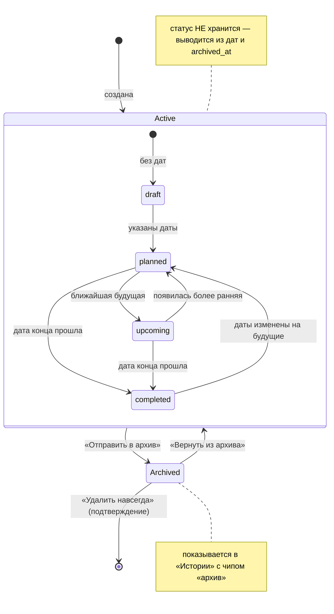
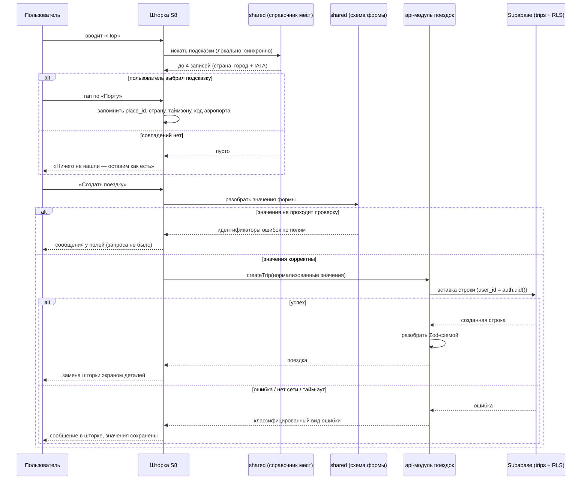
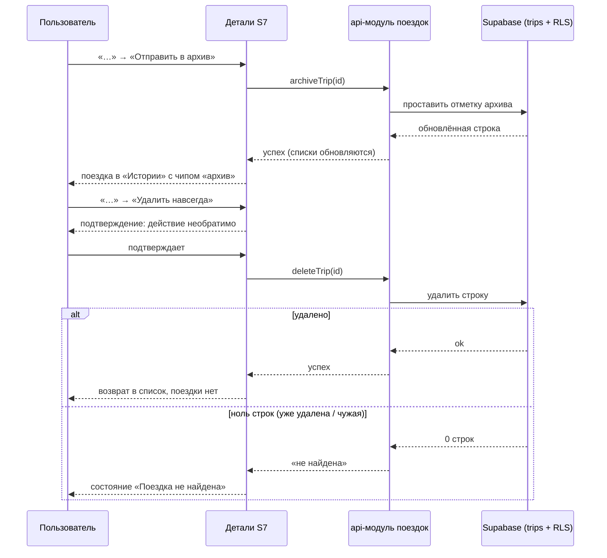

# Spec: Поездки — реальные данные, создание, правка, архив и удаление  |  Spec ID: SPEC-03  |  Status: draft
Supersedes: — (SPEC-01 и SPEC-02 остаются в силе; перечень их AC, которые этот спек заменяет, — в разделе «Что заменяется в SPEC-01 и SPEC-02»)
Implementation Plan: specs/plans/PLAN-03-trips-crud.md

## Проблема й навіщо

SPEC-02 дал настоящие аккаунты и сессию, но данные продукта остались выдуманными. Экраны S4 «Поездки»,
S5 «История» и S7 «Детали поездки» рендерятся из `mobile/src/mocks/` — семь поездок одного вымышленного
варшавянина с фиксированными рейсами, отелями и фиксированным «сегодня» (`MOCK_NOW = 2026-09-20`).
Пока пользователь был один, это было безвредно. Теперь пользователей много, у каждого своя сессия — и
каждый из них видит **одни и те же чужие семь поездок**. Это не «неполная фича», это сломанное обещание
продукта: приложение утверждает, что показывает ваши поездки, а показывает чужие.

Одновременно экран S8 «Новая поездка» — заглушка: два неинтерактивных поля и кнопка, которая ничего
не сохраняет. Создать поездку нельзя вообще. Меню «…» на S7 нажимаемо и помечено «скоро». В `supabase/`
нет ни одной миграции, ни одной таблицы, ни одной RLS-политики (`supabase/AGENTS.md`), а в `shared/`
есть только схемы форм авторизации — ни доменной логики, ни сгенерированных типов БД. То есть проверить,
что авторизация из SPEC-02 действительно **защищает данные**, а не только маршруты, пока физически не на чем.

Этот спек делает первый настоящий срез данных: **одна таблица `trips` с RLS**, создание, правка,
архивация и удаление поездки, реальные списки на S4/S5 и реальная шапка на S7. Моки выпиливаются целиком.
Записи внутри поездки (рейсы, отели, авто, документы, страховка) сознательно остаются за границей:
их таблицы — следующие спеки, а их блоки на S7 становятся честными пустыми состояниями вместо
подделанных карточек.

## Goals / Non-goals

**Goals**

1. Поездки хранятся на сервере в таблице `trips` с RLS: пользователь видит и меняет только свои.
2. Пользователь может создать поездку через шторку S8: место (обязательно), название (необязательно),
   даты (необязательно, обе или ни одной), и сразу попадает в её детали.
3. Подсказки мест работают офлайн из курируемого справочника в `shared/` (города и страны, ru+en),
   при этом свободный текст принимается без ограничений.
4. Пользователь может изменить уже созданную поездку той же шторкой в режиме правки.
5. Удаление двухступенчатое: сначала «Отправить в архив» (мягко, обратимо), удалить навсегда можно
   только из архива, с подтверждением.
6. Архивные поездки живут на вкладке «История» рядом с завершёнными, с чипом «архив»; их можно вернуть.
7. Статус поездки нигде не хранится: он выводится чистой функцией в `shared/` из дат и `archived_at`.
8. Списки S4/S5 и шапка S7 показывают реальные данные с состояниями загрузки, пустоты, ошибки
   и «поездка не найдена».
9. Каталог `mobile/src/mocks/` исчезает целиком; в продуктовом коде не остаётся ни одного импорта из него,
   а фиксированное «сегодня» заменяется реальными часами через инжектируемый источник времени.
10. `shared/` получает первый кусок настоящей доменной логики (статусы, даты, справочник мест) и
    сгенерированные типы БД — ровно так, как этого требует root `AGENTS.md`.

**Non-goals** (явно НЕ делаем в этом спеке)

- **Таблицы и формы рейсов, отелей, аренды авто, страховки и документов.** Ни `flights`, ни `hotels`,
  ни `cars`, ни `bookings`. Блоки S7 становятся пустыми состояниями (пунктирная рамка «Добавить …»),
  формы S9 остаются заглушками ровно в текущем виде. Их таблицы — Follow-up 1.
- **Переименование блока «Рейс» в «Транспорт»** и выбор типа транспорта (`design/screens/trip-detail.md`,
  «Замечание на будущее») — Follow-up 2.
- **Ручной статус поездки** (переключатель «отменена», «в процессе») — статус только выводится.
- **Шаринг поездки, попутчики, совместное редактирование** — поездка принадлежит одному пользователю
  (root `AGENTS.md`).
- **Мультивалютность и деньги** — в `trips` нет ни одного денежного поля.
- **Полный офлайн-sync**: ни очереди записей, ни разрешения конфликтов, ни локальной БД. Чтение списка
  кэшируется только на время жизни процесса средствами клиента кэширования; создание/правка/архив/удаление
  требуют сети.
- **Импорт из Booking**, парсинг писем, `source: imported_*` — в `trips` поля `source` нет вообще
  (`source` по правилу проекта принадлежит записям брони, а не поездке).
- **Удаление аккаунта в приложении** — остаётся блокером релиза и отдельным спеком (Follow-up 4).
  Этот спек его только **подготавливает**: `trips.user_id` ссылается на `auth.users` с `ON DELETE CASCADE`,
  так что после удаления пользователя его поездок не останется.
- **Внешний геокодер и любые сторонние API мест** (Google Places, Mapbox, Nominatim): никаких ключей,
  никакой сети ради подсказок — только офлайн-справочник.
- **Корзина и восстановление удалённых навсегда поездок**: физический DELETE необратим. Обратимая
  ступень — это архив.
- **Массовые действия** (выбрать несколько, удалить пачкой), **поиск и фильтры по списку**,
  **свайп-жесты на карточках** списка.
- **Обложки-картинки** (фото города): обложка остаётся цветной плашкой из `coverColors`.
- **Подключение хостингового проекта Supabase**: никаких `db push`, `db reset` и правок в дашборде
  без явного разрешения владельца (root `AGENTS.md`, «Do NOT touch»). Всё — на локальном стенде.
- **Уведомления и напоминания** о приближающейся поездке.

## User stories

- **US-1.** Как новый пользователь, я вхожу в приложение и вижу пустой экран «Поездки» со своей пустотой,
  а не с чужими поездками в Лиссабон.
- **US-2.** Как пользователь, я нажимаю «+», пишу «Порту», нажимаю «Создать поездку» — и сразу оказываюсь
  внутри своей новой поездки.
- **US-3.** Как пользователь, я ещё не знаю дат: ставлю «Пока без дат», и поездка сохраняется черновиком
  внизу списка, пока я не вернусь и не проставлю даты.
- **US-4.** Как пользователь, я еду в место, которого нет в справочнике («к бабушке в Козятин»): я просто
  пишу это текстом, и приложение не спорит.
- **US-5.** Как пользователь, я ошибся с городом или сдвинулись даты — открываю «…» → «Изменить»
  и правлю то же самое той же формой.
- **US-6.** Как пользователь, у которого отменилась поездка, я отправляю её в архив, чтобы она не мешала
  в списке, но и не исчезла бесследно.
- **US-7.** Как пользователь, я захожу в «Историю», вижу архивную поездку с пометкой «архив» и либо
  возвращаю её обратно, либо удаляю навсегда — осознанно и с подтверждением.
- **US-8.** Как пользователь, я вношу поездку, которая уже прошла: она сразу попадает в «Историю»,
  а не отвергается как «дата в прошлом».
- **US-9.** Как владелец продукта, я хочу быть уверен, что чужой пользователь не прочитает и не изменит
  мою поездку, даже если знает её идентификатор.
- **US-10.** Как разработчик следующих спеков, я хочу готовые `api/`-модуль поездок, типы БД в `shared/`
  и рабочую пару «миграция + pgTAP-тест политик», чтобы таблицы рейсов и отелей легли рядом по образцу.

## Инвентарь экранов

Изменения относительно SPEC-01/SPEC-02. Экраны S1–S3, S6, S9–S12 внешне не меняются
(единственное исключение — две строки профиля, см. ниже).

| # | Экран / маршрут | Что меняется |
|---|---|---|
| S4 | Поездки `/trips` | Карточки приходят из БД. Сортировка: ближайшая по дате начала сверху, поездки без дат в конце. Архивные и завершённые сюда не попадают. Добавляются состояния: загрузка (скелетоны), пусто, ошибка загрузки с «Повторить» |
| S5 | История `/history` | Показывает завершённые **и архивные** поездки, свежие сверху. У архивной — чип «архив» вместо «завершено». Те же три состояния. Кнопки создания здесь нет |
| S7 | Детали `/trips/[tripId]` | Шапка-герой из реальных данных (место, чип статуса, даты + число ночей). Меню «…» перестаёт быть заглушкой: «Изменить», «Отправить в архив» / «Вернуть из архива», «Удалить навсегда» (только для архивной). Блоки «Рейс», «Отель», «Аренда авто» — пустые состояния с пунктирной рамкой. Новое состояние «Поездка не найдена» |
| S8 | Новая поездка `/trips/new` | Заглушка становится рабочей шторкой: «Куда» с подсказками, «Название поездки», блок «Даты» с двумя кнопками и чекбоксом «Пока без дат», кнопка «Создать поездку» |
| S8b | Правка поездки `/trips/[tripId]/edit` (**новый маршрут**) | Та же шторка в режиме правки: те же поля, предзаполненные, заголовок «Изменить поездку», кнопка «Сохранить» |
| S6 | Профиль `/profile` | Строки «Подключённые аккаунты» и «Валюта» остаются, но без выдуманных значений `Booking.com` / `EUR` — только нейтральная пометка «скоро», как у «Уведомлений» |

## Карта маршрутов (дополнение)

| Маршрут | Экран | Параметры | Презентация | Доступ |
|---|---|---|---|---|
| `/trips/[tripId]/edit` | S8b | `tripId: string` | modal (шторка) | только с сессией |

Остальные маршруты SPEC-01/SPEC-02 сохраняются без изменений.

## Модель данных (контракт, не SQL)

Одна новая таблица — `trips`. Описано как контракт: имена и смысл полей, инварианты. Точный DDL,
типы и индексы — дело Implementation Plan.

| Поле | Смысл | Обязательность |
|---|---|---|
| `id` | Идентификатор поездки (UUID, генерируется сервером) | PK |
| `user_id` | Владелец. Значение по умолчанию — `auth.uid()`; FK на `auth.users` с `ON DELETE CASCADE` | not null |
| `destination` | Отображаемое название места, как его увидел/ввёл пользователь при сохранении | not null, 1…80 символов |
| `place_kind` | `city` \| `country` \| `custom` — откуда взялось место | not null |
| `place_id` | Идентификатор записи справочника `shared/`, если место выбрано из подсказок | nullable |
| `country_code` | ISO-код страны места (из справочника) | nullable |
| `iana_timezone` | IANA-таймзона места (из справочника) — понадобится записям брони | nullable |
| `airport_code` | IATA-код основного аэропорта города (из справочника) | nullable |
| `title` | Название поездки, заданное пользователем | nullable, ≤ 80 символов |
| `start_date` | Календарная дата начала, **без времени и без таймзоны** | nullable |
| `end_date` | Календарная дата конца | nullable |
| `archived_at` | Момент отправки в архив; `NULL` = не в архиве | nullable |
| `created_at` / `updated_at` | Служебные отметки времени | not null |

Инварианты, которые обязаны быть выражены ограничениями БД (не только в клиенте):

- `start_date` и `end_date` заданы **обе или ни одной** («только начало» невозможно);
- `end_date >= start_date`;
- продолжительность `end_date - start_date` ≤ 365 дней;
- `place_kind = 'custom'` ⟹ `place_id`, `country_code`, `iana_timezone`, `airport_code` = `NULL`;
- `place_kind = 'country'` ⟹ `airport_code` = `NULL`.

Чего в `trips` сознательно **нет**: поля `source` (оно принадлежит записям брони, а не поездке,
root `AGENTS.md`), поля `status` (выводится), поля `cover_index` (выводится, см. AC-38), валюты,
любых ссылок на попутчиков.

**Почему даты — календарные, а не `timestamptz`.** У поездки нет одного часового пояса: она может
начинаться в Варшаве и кончаться в Токио. «12 сентября» в билете — это календарная дата, а не момент
времени; хранение её как UTC-момента неизбежно даёт съезд на день при показе в другом поясе. Правило
проекта «время — UTC + IANA tz места» относится к моментам (вылет, заселение), и оно в полной силе
для таблиц Follow-up 1; здесь момент не хранится вовсе.

## Acceptance criteria (EARS)

### Хранение, владение и RLS

- **AC-1.** The system **shall** хранить поездки в таблице `trips`, созданной миграцией в
  `supabase/migrations/`; изменение схемы через дашборд или ручной SQL на стенде не является
  реализацией этого спека.
  *Verify: manual (`supabase db reset` на чистом стенде применяет миграцию без ошибок) + db.*
- **AC-2.** The system **shall** держать RLS включённым на `trips` с политиками `select`, `insert`,
  `update` и `delete`, каждая из которых допускает строку **только** когда `user_id` равен
  идентификатору текущего пользователя.
  *Verify: db (pgTAP: владелец читает/правит/удаляет свою строку).*
- **AC-3.** IF пользователь пытается прочитать, изменить или удалить поездку другого пользователя,
  THEN the system **shall** вести себя так, будто строки не существует: чтение возвращает пустой
  результат, изменение и удаление затрагивают ноль строк, и в ответе нет данных чужой поездки.
  *Verify: db (pgTAP: второй пользователь получает 0 строк на select/update/delete).*
- **AC-4.** IF запрос выполняется без аутентификации (анонимная роль), THEN the system **shall**
  не возвращать ни одной строки `trips` и не позволять вставку.
  *Verify: db (pgTAP: anon).*
- **AC-5.** IF во вставке явно указан `user_id`, отличный от идентификатора текущего пользователя,
  THEN the system **shall** отклонить вставку, а не записать строку на чужое имя.
  *Verify: db (pgTAP: insert с подменённым `user_id` падает).*
- **AC-6.** WHEN пользователь удаляется из `auth.users`, the system **shall** удалить все его строки
  в `trips` каскадом, не оставляя осиротевших записей.
  *Verify: db (pgTAP: удаление пользователя → 0 строк его поездок).*
- **AC-7.** The system **shall** отвергать на уровне БД строку, нарушающую любой инвариант из раздела
  «Модель данных»: одну заданную дату из двух, `end_date` раньше `start_date`, продолжительность
  больше 365 дней, заполненные поля справочника при `place_kind = 'custom'`.
  *Verify: db (pgTAP: по одной падающей вставке на каждое ограничение).*
- **AC-8.** WHEN миграция применена, the system **shall** иметь перегенерированный
  `shared/src/db/database.types.ts`, соответствующий фактической схеме; рукописных типов строки `trips`
  в проекте не появляется.
  *Verify: unit (типы импортируются и используются схемами `shared/`) + manual (повторная генерация
  не даёт диффа).*
- **AC-9.** The system **shall** обращаться к `trips` из клиента только с ключом анонимной роли через
  RLS; ключ `service_role` не используется ни для одной операции этого спека и в клиенте отсутствует.
  *Verify: unit (существующие guardrail-правила `no-service-role`, `backend-only-behind-the-boundary`).*

### Справочник мест (`shared/`)

- **AC-10.** The system **shall** содержать в `shared/` статичный справочник мест из 150–300 записей
  (города и страны мира), где у города есть идентификатор, названия на русском и английском, код страны,
  IANA-таймзона и IATA-код основного аэропорта, а у страны — идентификатор, названия на двух языках
  и регион.
  *Verify: unit (размер набора в диапазоне; у каждой записи есть обязательные поля).*
- **AC-11.** The system **shall** проверять целостность справочника тестом: каждый IATA-код — ровно три
  заглавные латинские буквы; каждая таймзона принимается `Intl.DateTimeFormat` как валидный IANA-идентификатор;
  идентификаторы записей уникальны; у каждой записи непустые ru- и en-названия.
  *Verify: unit (тест справочника в `shared/`).*
- **AC-12.** WHEN пользователь вводит текст в поле «Куда», the system **shall** возвращать не более
  четырёх подсказок, отобранных по совпадению **с начала** названия, сравнивая ввод одновременно
  с русским и английским названием записи, без учёта регистра и диакритики.
  *Verify: unit (`«Пор»` → Португалия + Порту; `«por»` → те же; `«Пор»` не даёт «Спорт»-подобных
  совпадений в середине слова).*
- **AC-13.** The system **shall** выполнять поиск подсказок полностью локально и синхронно: ни сетевого
  вызова, ни асинхронного API, ни ключей — функция поиска остаётся чистой и runtime-нейтральной
  (Hermes, браузер, Deno, Node).
  *Verify: unit (в `shared/` нет импортов `supabase-js`/`react-native`/Node-API — существующее правило
  `shared/AGENTS.md`) + unit (функция поиска — синхронная и детерминированная).*
- **AC-14.** WHILE введённому тексту не соответствует ни одна запись справочника, the system **shall**
  показывать под полем строку «Ничего не нашли — оставим как есть, это тоже подойдёт» вместо списка
  подсказок и **не** блокировать кнопку создания.
  *Verify: unit (компонентный тест поля: ввод «1» → сообщение, кнопка активна) + e2e.*
- **AC-15.** WHEN пользователь выбирает подсказку, the system **shall** сохранить вместе с поездкой
  идентификатор записи справочника, вид места (`city`/`country`), страну, таймзону и код аэропорта
  (для города); WHEN пользователь оставляет свободный текст, the system **shall** сохранить
  `place_kind = 'custom'` и не заполнять ни одно из этих полей.
  *Verify: unit (api-модуль формирует оба варианта тела запроса) + db.*

### Даты, статус и производные значения (`shared/`)

- **AC-16.** The system **shall** принимать даты поездки как календарные значения без времени и без
  часового пояса и передавать их на сервер в виде `YYYY-MM-DD`; ни одно поле дат поездки не является
  моментом времени.
  *Verify: unit (схема `shared/`: строка формата даты; значение с временем отвергается).*
- **AC-17.** IF пользователь выбрал только одну из двух дат, THEN the system **shall** не давать
  отправить форму и показать сообщение у блока «Даты»: нужны обе даты или ни одной.
  *Verify: unit (схема формы в `shared/`) + компонентный тест.*
- **AC-18.** IF дата конца раньше даты начала, THEN the system **shall** показать сообщение у блока
  «Даты» и не отправлять запрос.
  *Verify: unit (схема формы).*
- **AC-19.** IF продолжительность поездки превышает 365 дней, THEN the system **shall** показать
  сообщение у блока «Даты» и не отправлять запрос.
  *Verify: unit (границы 365/366).*
- **AC-20.** The system **shall** принимать даты в прошлом без предупреждения: внесённая задним числом
  поездка сохраняется и сразу показывается в «Истории», а не в активном списке.
  *Verify: unit (`deriveTripStatus` для прошедших дат) + e2e.*
- **AC-21.** WHEN установлен чекбокс «Пока без дат», the system **shall** скрыть обе кнопки выбора дат,
  сохранить поездку с обеими пустыми датами и показывать её как черновик.
  *Verify: unit (компонентный тест: кнопки исчезают, тело запроса без дат) + e2e.*
- **AC-22.** The system **shall** выводить статус поездки чистой функцией в `shared/` из её дат,
  `archived_at` и переданной «сегодняшней» календарной даты, по правилам: непустой `archived_at` →
  `archived`; иначе пустые даты → `draft`; иначе дата конца строго раньше сегодня → `completed`;
  иначе → `planned`. Статус нигде не хранится и не приходит с сервера.
  *Verify: unit (таблица случаев, включая границу «конец = сегодня» → не completed).*
- **AC-23.** The system **shall** помечать как `upcoming` ровно одну поездку активного списка — ту
  с наименьшей датой начала среди имеющих даты; при отсутствии таких поездок `upcoming` не получает
  никто, а вторая и далее остаются `planned`.
  *Verify: unit (список из нескольких будущих: акцентный чип ровно у одной).*
- **AC-24.** The system **shall** брать «сегодня» из инжектируемого источника времени, а не из прямого
  обращения к системным часам в компонентах; в тестах источник подменяется фиксированным значением.
  *Verify: unit (тесты списка и статусов детерминированы без подмены глобального времени).*
- **AC-25.** The system **shall** считать число ночей поездки как число календарных дней между началом
  и концом и показывать его в шапке S7 вместе с диапазоном дат.
  *Verify: unit (хелпер в `shared/`, включая переход через смену месяца и через 29 февраля).*
- **AC-26.** The system **shall** нормализовать текстовые поля формы перед отправкой: удаление пробелов
  по краям, схлопывание внутренних последовательностей пробелов в один, ограничение длины `destination`
  1…80 и `title` 0…80 символов (счёт в кодовых точках, как в `shared/src/auth`); строка из одних
  пробелов в поле «Куда» считается пустой.
  *Verify: unit (схема `shared/`).*
- **AC-27.** The system **shall** отдавать ошибки формы поездки как стабильные идентификаторы
  (по образцу `shared/src/auth/errorCodes.ts`), без готовых текстов; тексты подставляет клиент
  из своих локализованных строк.
  *Verify: unit (список идентификаторов зафиксирован тестом; в `shared/` нет пользовательских строк).*

### Создание поездки (S8)

- **AC-28.** WHEN пользователь открывает шторку «Новая поездка», the system **shall** поставить фокус
  в поле «Куда» и показать клавиатуру, без дополнительного нажатия.
  *Verify: unit (поле получает `autoFocus`) + manual (устройство).*
- **AC-29.** WHILE поле «Куда» пусто (после нормализации), the system **shall** держать кнопку
  «Создать поездку» неактивной, отрисованной фоном `divider` и текстом `textTertiary`.
  *Verify: unit (состояние и стиль кнопки) + e2e.*
- **AC-30.** WHEN пользователь нажимает «Создать поездку» с непустым местом, the system **shall**
  создать поездку у текущего пользователя и **заменить** шторку экраном деталей созданной поездки так,
  что жест «назад» с деталей не возвращает в шторку.
  *Verify: e2e (создать → детали → назад → список) + unit (навигация вызывает замену, не push).*
- **AC-31.** IF поле «Название поездки» оставлено пустым, THEN the system **shall** сохранить поездку
  без названия и показывать её везде по названию места; придумывать название за пользователя
  и записывать его в поле `title` нельзя.
  *Verify: unit (тело запроса не содержит title; карточка показывает место) + e2e.*
- **AC-32.** WHILE запрос создания выполняется, the system **shall** блокировать кнопку и показывать
  индикатор внутри неё; повторные нажатия не порождают второй поездки.
  *Verify: unit (двойное нажатие → ровно один вызов api).*
- **AC-33.** WHEN пользователь нажимает «Отмена» в шапке шторки, the system **shall** закрыть её
  без сохранения и без диалога «сохранить черновик?».
  *Verify: unit + e2e.*
- **AC-34.** The system **shall** отрисовывать строку подсказки как: название обычным (не моно)
  шрифтом, под ним тип и уточнение («Город · Португалия», «Страна · Европа») цветом `textTertiary`,
  справа — код аэропорта моноширинным шрифтом и только для города.
  *Verify: unit (типографические роли элементов подсказки) + manual (обе темы).*

### Список поездок (S4) и История (S5)

- **AC-35.** WHILE пользователь открыл `/trips`, the system **shall** показывать только его поездки
  без `archived_at` и с датой конца не раньше сегодняшней (или вовсе без дат), упорядоченные
  по дате начала по возрастанию, с поездками без дат в конце списка.
  *Verify: unit (порядок на наборе из будущих, черновых, прошедших и архивных) + e2e.*
- **AC-36.** WHILE пользователь открыл `/history`, the system **shall** показывать свои завершённые
  **и** архивные поездки, самые свежие сверху, и не показывать плавающую кнопку создания.
  *Verify: unit + e2e.*
- **AC-37.** The system **shall** отрисовывать чип архивной поездки в «Истории» текстом «архив»
  (отличным от «завершено») на фоне `divider` цветом `textSecondary`.
  *Verify: unit (чип по статусу) + manual (обе темы).*
- **AC-38.** The system **shall** выбирать цвет обложки поездки детерминированно из `coverColors`
  по её неизменяемому идентификатору, так что переименование места, смена названия или смена языка
  интерфейса не меняют цвет; отдельного поля обложки в БД не появляется.
  *Verify: unit (одна и та же поездка → один и тот же цвет до и после правки; распределение покрывает
  все цвета палитры).*
- **AC-39.** WHILE список поездок загружается впервые, the system **shall** показывать скелетоны
  карточек той же высоты, что настоящие карточки, и не показывать спиннер по центру экрана.
  *Verify: unit (состояние загрузки рендерит скелетоны) + manual.*
- **AC-40.** IF у пользователя нет ни одной активной поездки, THEN the system **shall** показать на S4
  короткий текст и подсказку на кнопку «+», без крупной иллюстрации; IF нет ни одной завершённой
  или архивной, THEN «История» показывает одну короткую строку и **не** показывает кнопку создания.
  *Verify: unit (оба пустых состояния) + e2e.*
- **AC-41.** IF загрузка списка не удалась, THEN the system **shall** показать сообщение об ошибке
  с действием «Повторить», которое повторяет запрос, и не показывать при этом пустое состояние
  «поездок нет» (пустота и ошибка — разные экраны).
  *Verify: unit (мок ошибки → сообщение + повтор вызывает api снова).*
- **AC-42.** WHEN поездка создана, изменена, отправлена в архив, возвращена из архива или удалена,
  the system **shall** обновить оба списка и экран деталей без ручного обновления пользователем
  и без перезапуска приложения.
  *Verify: unit (инвалидация кэша после каждой мутации) + e2e.*

### Детали поездки (S7) и меню «…»

- **AC-43.** WHILE открыт `/trips/[tripId]` существующей поездки текущего пользователя, the system
  **shall** показывать в шапке её место, чип статуса и, при наличии дат, диапазон дат с числом ночей
  моноширинным шрифтом; у поездки без дат вместо диапазона показывается «дата не выбрана».
  *Verify: unit + e2e.*
- **AC-44.** IF `tripId` не существует, принадлежит другому пользователю, некорректен или поездка
  была удалена, THEN the system **shall** показать состояние «Поездка не найдена» с действием возврата
  к списку — и **не** показывать вместо неё какую-либо другую поездку.
  *Verify: unit (несуществующий id, `../../etc`, id чужой поездки → состояние «не найдена») + e2e.*
- **AC-45.** The system **shall** отрисовывать блоки «Рейс», «Отель» и «Аренда авто» как пустые
  состояния — пунктирная рамка `surfaceBorder`, иконка плюса и подпись «Добавить …» цветом
  `textSecondary`; выдуманных карточек рейсов и отелей на экране не остаётся.
  *Verify: unit (три пустых состояния, ноль карточек) + manual.*
- **AC-46.** WHEN пользователь нажимает «…» в шапке деталей, the system **shall** открыть меню действий
  вместо пометки «скоро»; меню содержит «Изменить» и «Отправить в архив» для неархивной поездки,
  «Изменить», «Вернуть из архива» и «Удалить навсегда» — для архивной.
  *Verify: unit (состав меню в обоих состояниях) + e2e.*
- **AC-47.** The system **shall** не показывать действие «Удалить навсегда» ни для одной неархивной
  поездки: путь к удалению существует только через архив.
  *Verify: unit (меню неархивной поездки не содержит пункта удаления).*

### Правка (S8b)

- **AC-48.** WHEN пользователь выбирает «Изменить», the system **shall** открыть ту же шторку в режиме
  правки с предзаполненными местом, названием и датами (или установленным чекбоксом «Пока без дат»,
  если дат нет).
  *Verify: unit (предзаполнение всех четырёх состояний) + e2e.*
- **AC-49.** The system **shall** использовать для создания и правки одну форму и одну схему валидации:
  все правила AC-17…AC-19, AC-26 и AC-29 действуют в режиме правки дословно.
  *Verify: unit (один и тот же модуль схемы покрывает оба режима; тесты формы параметризованы режимом).*
- **AC-50.** WHEN пользователь сохраняет правку, the system **shall** записать изменения, закрыть шторку
  и вернуть пользователя на детали той же поездки с уже обновлёнными данными.
  *Verify: unit + e2e.*
- **AC-51.** WHEN пользователь меняет место со свободного текста на запись справочника или наоборот,
  the system **shall** согласованно перезаписать все поля места: выбор из справочника заполняет
  идентификатор, страну, таймзону и код аэропорта, свободный текст их очищает; «прилипших» значений
  от предыдущего места не остаётся.
  *Verify: unit (оба перехода) + db (ограничение AC-7 не нарушается).*

### Архив и удаление

- **AC-52.** WHEN пользователь выбирает «Отправить в архив», the system **shall** проставить поездке
  отметку архива, убрать её из активного списка, показать в «Истории» с чипом «архив» и оставить
  экран деталей открытым и работающим.
  *Verify: e2e (архив → исчезла из S4, появилась в S5) + unit.*
- **AC-53.** WHEN пользователь выбирает «Вернуть из архива», the system **shall** снять отметку архива,
  после чего поездка возвращается в активный список или в «Историю» — по своим датам, а не по тому,
  где она лежала до архивации.
  *Verify: unit (архивная поездка с будущими датами → S4; с прошедшими → S5 как завершённая) + e2e.*
- **AC-54.** WHEN пользователь выбирает «Удалить навсегда», the system **shall** сначала показать
  подтверждение, прямо называющее необратимость, и удалить строку только после явного подтверждения.
  *Verify: unit (без подтверждения api не вызывается) + e2e.*
- **AC-55.** WHEN удаление подтверждено и выполнено, the system **shall** удалить строку физически
  (не пометкой), закрыть экран деталей и вернуть пользователя в список, из которого он пришёл.
  *Verify: db (строки нет) + e2e.*
- **AC-56.** IF пользователь открывает детали поездки, удалённой в этом же сеансе (жест «назад»,
  устаревшая ссылка), THEN the system **shall** показать состояние «Поездка не найдена» (AC-44),
  а не пустую или устаревшую шапку.
  *Verify: unit.*

### Сеть, ошибки, устойчивость

- **AC-57.** The system **shall** требовать сети для создания, правки, архивации, возврата из архива
  и удаления: очереди отложенных операций в этом спеке нет, и приложение не делает вид, что операция
  прошла, если она не прошла.
  *Verify: unit (при ошибке запроса состояние не меняется) + manual (авиарежим).*
- **AC-58.** IF мутация не удалась (нет сети, тайм-аут, ошибка сервера), THEN the system **shall**
  показать сообщение внутри той же шторки или того же экрана — не системным алертом, — сохранить всё
  введённое и позволить повторить отправку одним нажатием.
  *Verify: unit (мок ошибки: значения полей на месте, повтор вызывает api) + manual.*
- **AC-59.** The system **shall** ограничивать каждую операцию с поездками тайм-аутом 15 секунд
  (как в SPEC-02), по истечении которого пользователь получает сообщение, а не бесконечный индикатор.
  *Verify: unit (мок зависшего запроса).*
- **AC-60.** IF сервер вернул ошибку, для которой нет сопоставленного сообщения, THEN the system **shall**
  показать общий локализованный текст и **не** выводить пользователю сырой текст или код ошибки сервера.
  *Verify: unit (неизвестный код → общий текст, исходной строки нет в выводе).*
- **AC-61.** The system **shall** обращаться к `trips` только через `lib/supabase` и `api/`-модуль
  фичи поездок и разбирать каждую полученную строку Zod-схемой из `@tripplanner/shared`; строка,
  не прошедшая разбор, трактуется как ошибка загрузки, а не подставляется в интерфейс частично.
  *Verify: unit (существующее guardrail-правило + тест «повреждённая строка → ошибка»).*
- **AC-62.** WHILE сессия отсутствует или завершилась, the system **shall** не выполнять ни одного
  запроса к `trips`; экраны поездок в этом состоянии недостижимы (SPEC-02 AC-20).
  *Verify: unit (при `signedOut` api не вызывается).*

### Выпиливание моков

- **AC-63.** The system **shall** не содержать каталога `mobile/src/mocks/`: ни одного файла и ни одного
  импорта из него ни в продуктовом коде, ни в тестах; тестовые данные живут в фабриках рядом с тестами.
  *Verify: unit (guardrail: путь `src/mocks` не существует и нигде не импортируется).*
- **AC-64.** The system **shall** брать текущую дату из инжектируемого источника времени вместо
  фиксированного `MOCK_NOW`; ни один экран не сравнивает даты с зашитой константой.
  *Verify: unit (guardrail: константы фиксированного «сейчас» в `src/` нет) + unit (тесты статусов).*
- **AC-65.** The system **shall** показывать в профиле строки «Подключённые аккаунты» и «Валюта» без
  значений: обе несут только пометку «скоро», как строка «Уведомления»; «Booking.com» и «EUR»
  из интерфейса исчезают.
  *Verify: unit (в профиле нет этих значений) + manual.*
- **AC-66.** The system **shall** удалить ключи локализации `trips.cities.*`, обслуживавшие моки;
  название места приходит из данных поездки или из справочника `shared/`, а не из ключа перевода.
  *Verify: unit (тест паритета локалей; ключей `cities.*` нет ни в одной локали).*

### Дизайн, доступность, локализация

- **AC-67.** The system **shall** брать все цвета, радиусы, отступы, размеры и шрифты новых и изменённых
  элементов из темы приложения; hex-литералов и «магических чисел» по месту не появляется, а недостающий
  токен добавляется в тему (и в `design/tokens.md`), а не пишется в компоненте.
  *Verify: unit (существующие guardrail-правила `no-hex-…`, `no-font-names-…`).*
- **AC-68.** The system **shall** оставлять моноширинный шрифт только за «билетными» данными новых
  экранов: код аэропорта в подсказке, диапазон дат и число ночей в шапке S7, даты на карточке. Название
  места, название поездки, подписи полей и кнопки — не моно.
  *Verify: unit (типографические роли) + manual (S4, S5, S7, S8).*
- **AC-69.** The system **shall** использовать для всех новых иконок набор Feather из `@expo/vector-icons`
  через общий компонент иконки; текстовые символы (`+`, `…`, `×`, `→`) и эмодзи вместо иконок
  не используются.
  *Verify: unit (существующий тест компонента иконки + guardrail на текстовые символы) + manual.*
- **AC-70.** The system **shall** давать каждому новому интерактивному элементу — подсказке места,
  крестику очистки, кнопкам дат, чекбоксу, пунктам меню «…», действию «Повторить» — непустую
  accessibility-подпись, корректную роль и область нажатия не меньше 44×44 pt.
  *Verify: unit (подписи и роли) + manual (Accessibility Inspector).*
- **AC-71.** The system **shall** озвучивать вспомогательным технологиям смену состояния списка
  (загрузка → готово/пусто/ошибка) и результат действия меню «…» (архивировано, возвращено, удалено),
  а не только менять картинку.
  *Verify: manual (VoiceOver) + unit (наличие объявления в состоянии).*
- **AC-72.** The system **shall** иметь для каждой новой видимой строки перевод на русский и английский;
  непереведённых строк и ключей не остаётся ни в одной локали.
  *Verify: unit (существующий тест паритета локалей).*
- **AC-73.** The system **shall** сохранять читаемость всех новых и изменённых экранов в светлой
  и тёмной теме: контраст текста не ниже 4.5:1, включая текст на стеклянной панели поверх обложки
  и подписи подсказок цветом `textTertiary`.
  *Verify: manual (обход S4, S5, S7, S8, S8b в обеих темах с измерением контраста).*
- **AC-74.** The system **shall** форматировать даты, диапазоны дат, число ночей и относительные
  подписи («через N дней») средствами локали; склеенных вручную строк не появляется.
  *Verify: unit (обе локали) + manual.*

### Навигация, платформа и приёмка

- **AC-75.** The system **shall** объявлять маршрут `/trips/[tripId]/edit` (и все существующие маршруты
  поездок) внутри защищённой сессией группы корневого layout'а; необъявленный маршрут считается дефектом.
  *Verify: unit (существующий `navigation.test.tsx`: маршрут недостижим без сессии).*
- **AC-76.** The system **shall** передавать `tripId` в маршруты только как параметр (объектный href),
  а не склейкой строки пути, так что враждебный идентификатор остаётся одним сегментом пути.
  *Verify: unit (имя маршрута и `params.tripId` в состоянии роутера).*
- **AC-77.** The system **shall** выбирать даты нативным системным выбором даты; появление новой нативной
  зависимости означает, что для проверки на устройстве нужна **новая сборка dev-клиента**, и это
  фиксируется как шаг релизной проверки, а не обнаруживается при запуске.
  *Verify: manual (сборка dev-клиента + выбор дат на устройстве) + unit (компонент выбора даты изолирован
  и подменяем в тестах).*
- **AC-78.** The system **shall** не содержать ветвлений по платформе в коде экранов и компонентов
  поездок; всё платформенное — за границей `mobile/src/platform/`.
  *Verify: unit (существующее guardrail-правило `no-platform-os-outside-platform`).*
- **AC-79.** The system **shall** проходить `pnpm -r typecheck`, `pnpm -r test` и `supabase test db`
  без подавляющих директив, включая переписанные guardrail- и навигационные тесты
  (см. «Что заменяется…»).
  *Verify: unit (`pnpm -r typecheck`, `pnpm -r test`) + db (`supabase test db`).*
- **AC-80.** The system **shall** иметь Maestro-поток, проходящий путь: вход → создать поездку →
  она появилась в списке → открыть детали → отправить в архив → найти её в «Истории» → удалить навсегда →
  её нет ни в одном списке. Поток не содержит литералов интерфейса (строки приходят из `scripts/e2e.sh`).
  *Verify: e2e.*

## Edge cases

- **Код аэропорта Порту на макете выглядит как «0P0».** Проверить две вещи отдельно: (1) в справочнике
  у Порту записано `OPO` тремя заглавными **буквами** (AC-11 ловит цифры автоматически); (2) как глиф
  `IBMPlexMono_500Medium` рисует `O` и `0` рядом — если в моно-начертании они неразличимы, это дефект
  читаемости «билетных» данных, а не опечатка в данных. Не утверждать баг до проверки обоих пунктов:
  вероятнее всего это особенность глифа Plex Mono, а не данные.
- **Двойное/тройное нажатие «Создать поездку»** — ровно одна поездка (AC-32). То же для «Сохранить»,
  «Отправить в архив» и «Удалить навсегда».
- **Уход в фон во время мутации**: по возвращении экран показывает результат (успех → переход/обновление,
  ошибка → сообщение), а не вечный индикатор.
- **Выбор подсказки, затем дописывание текста**: место перестаёт считаться выбранным из справочника —
  поля справочника очищаются, `place_kind` становится `custom` (AC-51). Акцентная граница поля гаснет.
- **Ввод, совпадающий с названием записи справочника буква в букву, но без выбора подсказки**: это
  всё равно свободный текст (`custom`) — «угадывать» выбор за пользователя нельзя, иначе он получит
  таймзону, которую не выбирал.
- **Смена языка устройства после создания поездки**: у поездки из справочника название места
  показывается на новом языке; у поездки со свободным текстом — ровно так, как было введено
  (см. Open question Q3).
- **Очень длинное название места** (80 символов, письменность с другой шириной, эмодзи): карточка
  и шапка S7 не ломаются, текст усекается многоточием; счёт длины — в кодовых точках.
- **Место из одних пробелов или невидимых символов**: после нормализации считается пустым, кнопка
  остаётся неактивной.
- **Поездка длиной в один день** (`start_date = end_date`): допустима; число ночей — 0, и строка
  про ночи должна это выдерживать (не «−1 ночь» и не пустота).
- **Поездка ровно 365 дней** — допустима; 366 — отвергается (AC-19).
- **Поездка, заканчивающаяся сегодня**: считается активной, а не завершённой (AC-22), и уезжает
  в «Историю» только со следующего дня.
- **Переход суток, пока приложение открыто**: поездка, закончившаяся «вчера», должна уехать в «Историю»
  при следующем обновлении списка; пересчёт статуса на каждую миллисекунду не требуется.
- **Часы устройства сдвинуты** (пользователь перевёл дату): статусы считаются по часам устройства,
  и это осознанно — сервер календарных дат не интерпретирует. Расхождение видно только самому
  пользователю и лечится возвратом часов.
- **Пользователь в другом часовом поясе, чем место поездки**: «сегодня» берётся из пояса устройства;
  поездка не «начинается раньше» и не «кончается позже» от перелёта — даты календарные (AC-16).
- **Архивация поездки, открытой на другом устройстве**: второе устройство узнает об этом при следующем
  обновлении списка; конфликт «оба поменяли одно поле» в этом спеке не разрешается — выигрывает
  последняя запись.
- **Удаление поездки, открытой в шторке правки**: сохранение правки затронет ноль строк — это должно
  дать сообщение об ошибке и, при закрытии, состояние «Поездка не найдена», а не молчаливый успех.
- **Возврат из архива поездки без дат**: она возвращается в активный список как черновик (в конец).
- **Пустой список в «Истории» при непустом активном** и наоборот: два независимых пустых состояния
  (AC-40), каждое со своим текстом.
- **Ровно одна будущая поездка**: она же `upcoming` (акцентный чип), и «остальных будущих» нет (AC-23).
- **Несколько поездок с одинаковой датой начала**: `upcoming` получает ровно одна; порядок остальных
  детерминирован (по дате создания), чтобы список не «дрожал» между обновлениями.
- **Клавиатура поверх шторки**: поле «Куда», список подсказок и кнопка «Создать поездку» должны
  оставаться доступными прокруткой.
- **Свайп вниз по шторке** закрывает её как «Отмена», без диалога о черновике (правило SPEC-01).
- **Открытие `/trips/<чужой id>` по ссылке**: сессия есть, RLS вернёт пусто → «Поездка не найдена»
  (AC-44). Приложение не должно отличать «нет такой» от «чужая» — и не должно пытаться.
- **Повреждённая строка из БД** (поле не проходит Zod-разбор после будущей миграции): экран показывает
  ошибку загрузки, а не частично заполненную карточку (AC-61).

## Mobile considerations

**Platforms: ios+android.** Проверяем на iOS. Список iOS-only поведений **пуст** и должен таким остаться
(SPEC-01 AC-27, AC-78): системный выбор даты берётся через кросс-платформенный модуль, и, если его вид
на платформах различается, различие прячется за границей `mobile/src/platform/`, а не в коде экрана.

- **Новая нативная зависимость.** Нативный выбор даты — первый новый нативный модуль после SPEC-02.
  Последствия, которые обязаны быть учтены заранее: его устанавливают через `npx expo install`
  (правило root `AGENTS.md`), после установки **требуется новая сборка dev-клиента** — на старом
  dev-клиенте экран дат просто упадёт; и нужно проверить его `PrivacyInfo.xcprivacy` и, при наличии
  required-reason API, продублировать причины в `ios.privacyManifests`
  (`docs/release/privacy-manifest-audit.md`). Это риск расписания, а не деталь реализации:
  без новой сборки ни один ручной пункт про даты проверить нельзя.
- **Офлайн-поведение.** Приложение без сети открывается авторизованным (SPEC-02 AC-9), справочник мест
  и подсказки работают полностью офлайн (AC-13), но список поездок без сети не загружается: показывается
  состояние ошибки с «Повторить» (AC-41), а любая мутация даёт сообщение с возможностью повтора (AC-58).
  Офлайн-кэш списка и очередь записей — Follow-up 6; обещать их пользователю интерфейсом нельзя.
- **Локальное хранение.** Новых ключей в локальном хранилище **не появляется**: реестр
  `src/lib/storage/keys.ts` остаётся на трёх ключах (тема, зашифрованная сессия, флаг первого запуска),
  и соответствующий guardrail не ослабляется. Данные поездок на устройство не записываются.
- **Разрешения.** Спек **не** запрашивает ни одного системного разрешения: ни геолокации (подсказки
  офлайновые и не определяют местоположение), ни календаря, ни уведомлений, ни камеры. Denied-пути,
  следовательно, нет. Появление любого запроса разрешения или новой `NS*UsageDescription` — отклонение
  от спека.
- **App Store влияние.**
  - Приложение начинает **хранить пользовательский контент** (названия и места поездок, привязанные
    к аккаунту). Декларация сбора данных, ставшая непустой в SPEC-02, должна быть дополнена категорией
    пользовательского контента до первой подачи.
  - Новых permission-строк нет; privacy manifest пересматривается из-за новой нативной зависимости
    (см. выше).
  - Правила про UGC (Guideline 1.2, модерация пользовательского контента) **не** активируются:
    контент виден только автору, публикации и обмена нет.
  - **Блокер релиза остаётся открытым:** удаление аккаунта в приложении (Guideline 5.1.1(v)).
    Этот спек его не закрывает, но готовит: каскад от `auth.users` гарантирует, что после удаления
    пользователя поездок не останется (AC-6).
- **Тема.** Все новые элементы обязаны быть корректны в обеих темах (AC-73). Новые токены, скорее всего,
  понадобятся для пунктирной рамки пустого состояния и для скелетона карточки — их значения сначала
  фиксируются в `design/tokens.md`, потом появляются в теме (правило root `AGENTS.md`).
- **Ориентация:** только портрет, без изменений.

## Non-functional

- **Производительность.**
  - Поиск подсказок выполняется на каждое нажатие клавиши по набору 150–300 записей: бюджет — не более
    5 мс на запрос на устройстве, то есть линейный проход допустим, а построение индекса при старте —
    нет (он не окупится).
  - Открытие `/trips` с уже загруженным списком не выполняет повторного сетевого запроса ради той же
    отрисовки; первая загрузка после входа укладывается в один запрос на список.
  - Список рассчитан на десятки, не тысячи поездок: виртуализация не требуется, но экран не должен
    деградировать на 200 карточках (проверяется сгенерированным набором).
  - Тайм-аут любой операции — 15 с (AC-59), как в SPEC-02.
- **Безопасность** (консультация со skill `security`; категории A01 Broken Access Control,
  A03 Injection, A04 Insecure Design, A09 Logging):
  - Единственная настоящая защита данных — **RLS** (AC-2…AC-5). Клиентские фильтры в запросах — удобство,
    а не защита: спек прямо требует, чтобы тест доказывал отказ на уровне БД, а не отсутствие кнопки
    в интерфейсе. Это первый спек, в котором авторизация SPEC-02 вообще начинает что-то защищать.
  - `tripId` из маршрута — недоверенный ввод; он передаётся параметром (AC-76) и не склеивается в путь;
    подстановка в SQL исключена использованием клиентской библиотеки с параметризацией.
  - Ответ «поездка не найдена» одинаков для несуществующей и чужой поездки (AC-44): различие текста
    выдавало бы факт существования чужой записи.
  - `service_role` в клиенте отсутствует и для этого спека не нужен вовсе: все операции выполняются
    от имени пользователя (AC-9). Edge Functions этот спек не вводит.
  - Логи: неуспешная операция с поездками оставляет в логах dev-клиента имя операции и код ошибки —
    **без** названий мест, названий поездок и идентификаторов пользователя (существующее правило
    `no-credentials-in-logs` распространяется на новый `api/`-модуль).
  - Удаление навсегда необратимо и не оставляет строки (AC-55) — это осознанный выбор: «корзина»
    удвоила бы число состояний, а мягкая ступень уже есть (архив).
- **Доступность.** Подписи, роли и зоны нажатия ≥44 pt у всех новых элементов (AC-70); смена состояния
  списка и результат действия озвучиваются (AC-71); Dynamic Type не ломает шторку и карточки; контраст
  ≥4.5:1 в обеих темах (AC-73). Отдельного внимания требует подпись подсказки цветом `textTertiary` —
  это самый рискованный по контрасту новый элемент.
- **Наблюдаемость.** Телеметрии по-прежнему нет. Минимум: каждая неуспешная операция различима в логах
  dev-клиента по имени операции и коду ошибки; ошибка разбора строки БД (AC-61) логируется отдельно
  от сетевой — иначе после будущей миграции «ничего не грузится» будет неотличимо от «нет сети».
  На стороне БД наблюдаемость обеспечивают pgTAP-тесты политик: отказ RLS должен быть виден как
  ноль строк, а не как ошибка.

## Workflow & Contracts

### Жизненный цикл поездки

Удалить поездку можно только из состояния `Archived` — стрелки из `Active` в `[*]` не существует,
и это главное поведенческое решение спека.

### Создание поездки

### Архивация и удаление

### Контракты между модулями

Описаны как границы, без раскладки по файлам.

1. **`shared/` → `mobile/` (и позже `web/`, Edge Functions).** Пакет `@tripplanner/shared` предоставляет:
   - **схему формы поездки** (создание и правка — одна схема), нормализующую и проверяющую место,
     название и даты и возвращающую для каждого невалидного поля **стабильный идентификатор** ошибки,
     а не текст (контракт по образцу `shared/src/auth/errorCodes.ts`);
   - **схему строки `trips`** и функцию её превращения в доменный объект поездки — клиент никогда
     не потребляет сырую строку БД;
   - **справочник мест** (Zod-схема записи + данные + чистая функция поиска);
   - **чистые функции домена**: вывод статуса из дат и отметки архива, отметка ближайшей поездки,
     число ночей, сортировки активного списка и истории.
   Пакет остаётся runtime-нейтральным: ни `supabase-js`, ни `react-native`, ни Node-API
   (`shared/AGENTS.md`).
2. **`mobile` → Supabase.** Единственная точка доступа — клиентский модуль Supabase плюс `api/`-модуль
   фичи поездок (по образцу `src/features/auth/api/`). Наружу он отдаёт закрытый результат вида
   «успех + данные» либо «классифицированная ошибка» из фиксированного набора: не найдено / нет
   соединения / тайм-аут / отказано / неизвестная. Сырые ошибки бэкенда наружу не проходят (AC-60).
   Набор операций: получить активный список, получить историю, получить одну поездку, создать,
   изменить, архивировать, вернуть из архива, удалить.
3. **`mobile` → состояние серверных данных.** Списки и одна поездка живут в клиенте кэширования
   серверного состояния (TanStack Query — правило `mobile/AGENTS.md`; на момент написания спека
   пакет **не установлен**, это новая зависимость). Каждая мутация инвалидирует затронутые выборки
   (AC-42). Оптимистичных обновлений в этом спеке нет — они маскируют отказ сети, а очереди у нас нет.
4. **`supabase/` → `shared/`.** Миграция — источник истины схемы; `shared/src/db/database.types.ts`
   генерируется из неё после каждого применения (AC-8) и является единственным местом, где живут
   типы строк.
5. **Записей брони контракт не касается.** Никаких внешних API, никаких LLM-вызовов, никаких
   Edge Functions этот спек не вводит.

## Inputs (provenance)

- Структура, тексты и поведение экранов: [design: `design/screens/new-trip.md`, `trips.md`,
  `trip-detail.md`, `history.md`, `navigation.md`, `account.md`, `design/tokens.md`, `design/README.md`].
- Три скриншота экрана «Новая поездка» (тёмная тема): [owner: переданы вызывающим агентом;
  сам спек-агент изображения не открывал — описание получено текстом].
- Навигационный контракт, правила заглушек, тема, локализация, правило «произвольный `tripId`
  не ломает S7»: [reused: SPEC-01].
- Сессия, гейтинг маршрутов, границы `lib/supabase` и `api/`, контракт стабильных идентификаторов
  ошибок в `shared/`: [reused: SPEC-02].
- Текущее состояние кода (моки, заглушка S8, «скоро» на «…», отсутствие миграций, guardrail- и
  навигационные тесты, отсутствие TanStack Query в зависимостях): [repo: `mobile/src/mocks/*`,
  `mobile/src/features/{trips,history,trip-detail,new-trip,profile}`, `mobile/src/features/auth/api/*`,
  `mobile/app/**`, `mobile/__tests__/guardrails.test.ts`, `mobile/__tests__/navigation.test.tsx`,
  `mobile/package.json`, `mobile/src/test-utils/renderWithProviders.tsx`, `shared/src/**`,
  `supabase/**`, `e2e/**`] — прочитано этим спеком.
- Правила пакетов и известные гочи (Stack.Protected и незащищённые маршруты, локальный стенд
  на Rancher Desktop, Mailpit, privacy-manifest, формат ключей ошибок, поведение моношрифта в тестах):
  [insights: root, `mobile/insights.md`, `supabase/insights.md`, `shared/insights.md`, `e2e/insights.md`;
  AGENTS: root, `mobile/`, `supabase/`, `shared/`, `e2e/`].
- Решение о бэкенде и границах: [ADR: `docs/decisions/ADR-001-backend-supabase.md`].
- Решения владельца по объёму этого спека (только `trips`, двухступенчатое удаление, офлайн-справочник,
  нативный выбор дат, мягкие правила дат, выпиливание моков): [owner decisions, 2026-09-21].
- **Данные справочника мест — детерминированные, курируемые вручную**: [deterministic: `shared/` logic +
  вручную собранный набор]. Ни одного стороннего API, ни одного ключа, ни одного LLM-вызова этот спек
  не вводит. Соответствие IATA-кодов и таймзон реальности — предмет теста AC-11 и ручной сверки
  при наполнении; ошибочная запись справочника — дефект данных, а не кода.
- Требования стора: [third-party policy: App Store Review Guidelines 1.2, 5.1.1(v)] — через root
  `AGENTS.md` и `design/screens/account.md`.

## Untrusted inputs

Спек впервые вводит в приложение **пользовательский текст, приходящий с сервера**, поэтому раздел
не формальный.

- **`destination` и `title`.** Пользователь вводит их сам, но обратно они приходят из БД и могут быть
  изменены в обход приложения (прямой запрос с тем же токеном, будущий web-клиент, будущий импорт).
  Трактуются как **данные, не команды**: показываются только как текст (усечение, ограничение длины),
  никогда не используются как ключ перевода, имя маршрута, часть URL, имя файла или что-либо
  исполняемое. Длина и состав проверяются при разборе строки (AC-61), а не только при вводе.
- **`place_id`, `iana_timezone`, `airport_code`, `country_code` из БД.** Это значения, пришедшие
  из справочника *в момент сохранения*; справочник с тех пор мог измениться, а значение — нет.
  Неизвестный `place_id` не должен приводить ни к ошибке, ни к пустому экрану: место показывается
  по сохранённому `destination`. Таймзона из БД перед любым использованием в форматировании
  проверяется на валидность — неизвестный идентификатор пояса роняет `Intl` (это станет критично
  в Follow-up 1, поэтому правило фиксируется здесь).
- **`tripId` из параметров маршрута.** Недоверенный ввод по определению (SPEC-01): приходит из ссылки,
  из истории навигации, из чужого сообщения. Передаётся параметром, а не склейкой пути (AC-76);
  не существующий/чужой/некорректный — одинаковое состояние «не найдена» (AC-44). Ссылка никогда
  не является основанием для доступа — им является RLS.
- **Строки из БД в целом.** Каждая разбирается Zod-схемой; не прошедшая разбор строка считается
  ошибкой загрузки, а не «почти данными» (AC-61).
- **Prompt-injection поверхности нет**: LLM-вызовов этот спек не вводит. Отмечается на будущее:
  когда появится импорт броней из писем/PDF, разбираемый текст станет полноценно недоверенным
  и `destination` может приехать оттуда — правило «этот текст данные, а не инструкции» должно
  пережить этот спек.

## Что заменяется в SPEC-01 и SPEC-02

Этот спек не отменяет предыдущие. Заменяются (и должны быть переписаны вместе с их автоматическими
проверками) следующие критерии:

| Спек / AC | Было | Становится |
|---|---|---|
| SPEC-01 AC-5 | Каждый экран S1–S12 достижим руками и показывает статичный плейсхолдер | Экраны поездок показывают данные пользователя; у пустого аккаунта S4/S5 показывают пустые состояния (AC-40), и Maestro-обход обязан это учитывать |
| SPEC-01 Edge case «неизвестный `tripId`» + `findTrip` | Неизвестный id молча показывает ближайшую поездку | Неизвестный/чужой/удалённый id показывает «Поездка не найдена» (AC-44). `findTrip` и его тесты удаляются; `navigation.test.tsx` (кейсы `/trips/x`, «hostile trip id») переписывается под новое состояние |
| SPEC-01 AC-7 (в части S7) | Секции S7 заполнены карточками рейса и отеля из плейсхолдеров | Три блока — пустые состояния (AC-45); тесты `TripDetailScreen.test.tsx` переписываются |
| SPEC-01 Q7 / AC-19 (в части «…») | «…» на S7 нажимаема, ничего не делает, несёт пометку «скоро» | «…» открывает реальное меню действий (AC-46); соответствующий тест заглушки заменяется |
| SPEC-01 AC-12 (в части S8) | «Отмена»/«Готово»/«Сохранить» на S8 просто закрывают модалку | «Отмена» закрывает без сохранения (AC-33), «Создать поездку» создаёт и заменяет экран (AC-30); «Готово» в шапке исчезает |
| SPEC-01 AC-25 → SPEC-02 AC-8 | Сеть только внутри `lib/supabase`; `supabase` допускается в `lib/session` и `features/*/api` | Правило не ослабляется, но получает нового легального потребителя — `src/features/trips/api/`; guardrail уже это допускает (`isFeatureApi`), проверить, что исключений не добавляется |
| SPEC-01 AC-34/AC-37 (локализация) | Названия городов — ключи `trips.cities.*` | Ключи удаляются, название места приходит из данных (AC-66); тест паритета локалей обновляется |
| SPEC-02 «Данные экранов остаются на моках» (контракт 5) | `src/mocks/` питает поездки и историю, `MOCK_USER` — строки профиля | Каталог удаляется целиком (AC-63); строки профиля теряют выдуманные значения (AC-65); `renderWithProviders`, тесты профиля, списков и деталей обновляются |
| SPEC-02 AC-50 / guardrails | Guardrail-набор ориентирован на отсутствие данных | Добавляются правила «нет `src/mocks`» и «нет зашитого фиксированного „сейчас“» (AC-63, AC-64); остальные правила сохраняются без ослабления |
| SPEC-02 «Стратегия проверки»: `supabase/` | pgTAP-тестов нет — политик нет | Появляются первые pgTAP-тесты политик и ограничений (AC-2…AC-7); `supabase test db` входит в приёмку (AC-79) |

Дополнительно **расширяется** (не заменяется) карта маршрутов SPEC-01: добавляется
`/trips/[tripId]/edit`; перечень маршрутов в контрактном тесте и объявления в `Stack.Protected`
должны быть обновлены (AC-75).

Не затронуты: правила темы, шрифтов, иконок, зон нажатия, локализации как таковые; весь поток
авторизации SPEC-02; экраны S1–S3, S9–S12.

## Документы дизайна, которые нужно обновить

Спек их **не правит** (это вне границ спек-агента), но расхождения зафиксированы, и их закрытие —
часть работы по этому спеку:

1. `design/screens/new-trip.md` — описывает только создание; нужно добавить режим правки (заголовок,
   кнопка «Сохранить», предзаполнение) и уточнить поведение при смене места со справочного
   на свободный текст.
2. `design/screens/history.md` — не знает об архивных поездках как отдельном виде: нужен чип «архив»,
   его отличие от «завершено» и упоминание, что из архивной поездки доступны возврат и удаление.
3. `design/screens/trip-detail.md` — нужно описать состав меню «…» (три/два пункта, зависимость
   от архивности) и состояние «Поездка не найдена».
4. `design/screens/trips.md` — фраза «Список поездок текущего пользователя со статусом не „архив“»
   верна, но не описывает состояние ошибки загрузки с «Повторить».
5. `design/tokens.md` — «Цвета обложек-плейсхолдеров, выбираются детерминированно по названию города»
   расходится с AC-38 (по идентификатору поездки). Нужно поправить формулировку либо оспорить
   решение. Плюс новые токены: пунктирная рамка пустого состояния, фон скелетона.
6. `design/screens/account.md` — не отражает, что «Подключённые аккаунты» и «Валюта» остаются без
   значений (AC-65).
7. `design/screens/navigation.md` — добавить маршрут правки поездки.

## Стратегия проверки по пакетам

- **`shared/` (vitest).** Схема формы: нормализация текста, границы длин (80/81), «только одна дата»,
  «конец раньше начала», 365/366 дней, стабильность идентификаторов ошибок. Справочник: целостность
  (AC-11), поиск по началу на ru и en, лимит 4, отсутствие совпадений. Домен: таблица случаев
  `deriveTripStatus` (включая границу «конец = сегодня»), отметка ближайшей поездки, число ночей
  (0 ночей, переход через месяц, 29 февраля), сортировки обоих списков.
- **`supabase/` (pgTAP, `supabase test db`).** По тесту на каждую политику (владелец / другой
  пользователь / анонимный), на подмену `user_id` при вставке, на каскад от `auth.users` и по одному
  тесту на каждое ограничение целостности из «Модели данных».
- **`mobile/` (jest-expo + RNTL, клиент Supabase замокан).** Шторка создания и правки (все ветки
  валидации, подсказки, «ничего не нашли», «Пока без дат», двойное нажатие, ошибка сети с сохранением
  ввода); списки (порядок, пусто, загрузка, ошибка + «Повторить», чип «архив»); детали (шапка,
  три пустых блока, «не найдена», состав меню «…», подтверждение удаления); навигация (маршрут правки
  под защитой, замена шторки на детали, `tripId` параметром); обновлённые guardrail-правила.
- **`e2e/` (Maestro).** Один новый поток (AC-80): создать → в списке → архив → в «Истории» → удалить
  навсегда → нигде нет. Как и существующие потоки, без литералов интерфейса. **Запустить его сейчас,
  вероятно, нельзя** (Maestro не установлен — `e2e/AGENTS.md`), поэтому поток авторуется «вслепую»,
  а его допущения фиксируются в `e2e/insights.md`.
- **Ручная проверка на устройстве** (то, что не проверяется автоматически): нативный выбор дат
  на новой сборке dev-клиента, поведение в авиарежиме, VoiceOver на подсказках и меню «…», контраст
  в обеих темах, Dynamic Type на шторке, читаемость кода аэропорта моношрифтом (см. Edge cases).

## Follow-ups (не в этом спеке)

1. **Таблицы и формы рейсов, отелей и аренды авто** — заменяют пустые состояния S7; именно там
   появляются `source`, `timestamptz` + IANA-таймзона, валюта на запись и первые правила нестыковок
   в `shared/`. Сохранённая у поездки таймзона места — их вход.
2. **Блок «Транспорт» вместо «Рейс»** — выбор типа (самолёт, поезд, автомобиль, автобус),
   `design/screens/trip-detail.md`, «Замечание на будущее».
3. **Документы и страховка** — блоки, которых сейчас нет на S7 вовсе, плюс Storage и его RLS.
4. **Удаление аккаунта в приложении** — блокер релиза (App Store 5.1.1(v)). Этот спек его
   подготовил каскадом (AC-6), но экран подтверждения, Edge Function с `service_role` и pgTAP-проверка
   «после удаления не осталось данных» — отдельно.
5. **Настройки профиля: валюта и подключённые аккаунты** — строки, у которых в этом спеке отобрали
   выдуманные значения.
6. **Офлайн-доступ**: read-кэш списка на устройстве и очередь записей; ADR-001 требует отдельного
   спека перед выбором sync-движка.
7. **Расширение справочника мест / геокодер** — если 150–300 записей окажется мало: либо увеличение
   набора, либо внешний источник (и тогда — ключи, сеть, недоверенные ответы и соответствующий
   раздел «Untrusted inputs»).
8. **Поиск, фильтры и группировка списка поездок**; свайп-жесты на карточках.
9. **Обложки-картинки** вместо цветных плашек (и, вместе с ними, Storage и кэш изображений).
10. **Дополнение `design/tokens.md`** токенами пустого состояния и скелетона (см. «Документы дизайна»).

## Open questions [NEEDS CLARIFICATION]

Ни один пункт не блокирует планирование: для каждого указан вариант по умолчанию, который следует
считать принятым, если владелец не скажет иного.

- **Q1. Отдельный маршрут правки против переиспользования `/trips/new`.**
  *По умолчанию:* **отдельный маршрут `/trips/[tripId]/edit`**. Причины: `Stack.Protected` требует
  явного объявления каждого маршрута (иначе он остаётся незащищённым — `mobile/insights.md`, 2026-09-21),
  и отдельный маршрут делает это объявление и его тест однозначными; «назад» и восстановление состояния
  ведут себя честно; один маршрут с необязательным параметром пришлось бы ветвить внутри экрана.
  Форма при этом одна — различается только режим.
- **Q2. Цвет обложки — от идентификатора или от названия.**
  *По умолчанию:* **от идентификатора поездки** (AC-38): он неизменен, не зависит от локали и не меняется
  при правке. `design/tokens.md` сейчас говорит «по названию города» — это расхождение нужно закрыть
  правкой документа. Аргумент за название: две поездки в один город получили бы один цвет (узнаваемость);
  аргумент против: переименование или смена языка перекрашивали бы карточку.
- **Q3. Как показывается название места при двух локалях.**
  *По умолчанию:* при `place_kind` `city`/`country` и известном `place_id` название берётся
  **из справочника по текущему языку интерфейса**; при `custom` или неизвестном `place_id` показывается
  сохранённый `destination` как есть. То есть `destination` — это снимок на момент сохранения и
  одновременно запасной вариант. Альтернатива (всегда показывать `destination`) проще, но даёт
  «Порту» в английском интерфейсе; альтернатива «хранить оба названия в БД» дублирует справочник в данные.
- **Q4. Лимиты длины.**
  *По умолчанию:* `destination` 1…80, `title` 0…80 символов (кодовых точек). 80 хватает на самые длинные
  реальные названия мест и на осмысленное название поездки, и при этом карточка остаётся вёрсткой,
  а не полотном. Если владелец хочет длинные названия («Свадьба Марины и Петра в Тоскане, август»),
  поднять `title` до 120 — безболезненно.
- **Q5. Размер справочника и его состав.**
  *По умолчанию:* **~200 записей**: все страны мира (около 195) плюс города, покрывающие основные
  направления; у города — один основной аэропорт. Города без аэропорта допустимы (поле пустое).
  Что делать с городами, у которых несколько аэропортов (Лондон, Москва), — сейчас берётся один
  основной; полноценный выбор аэропорта — дело спека рейсов.
- **Q6. Диакритика и транслитерация в поиске.**
  *По умолчанию:* сравнение без учёта регистра и диакритики (`Porto` находится по `porto`,
  `Zürich` — по `zurich`), но **без транслитерации между алфавитами**: «Porto» не находится
  по «Порту» и наоборот. Транслитерация даёт больше ложных срабатываний, чем пользы, на наборе в 200 записей.
- **Q7. Что делать с поездкой, у которой конец в прошлом, но пользователь ещё в ней.**
  *По умолчанию:* правило простое — конец строго раньше сегодня означает `completed` (AC-22).
  Отдельного статуса «в процессе» (поездка идёт прямо сейчас) этот спек не вводит: он потребовал бы
  четвёртого вида чипа и решения, что показывать на S4. Если владелец захочет — это дешёвое
  дополнение поверх той же чистой функции.
- **Q8. Подтверждение удаления: системный диалог или экранный.**
  *По умолчанию:* **не системный алерт** — тот же принцип, что для ошибок форм в SPEC-02 (AC-36):
  подтверждение показывается средствами приложения, в теме приложения. Это чуть дороже, но даёт
  контроль над текстом, темой и зоной нажатия ≥44 pt.
- **Q9. Нужно ли действие «Отправить в архив» прямо из карточки списка.**
  *По умолчанию:* **нет** — свайп-жесты и действия на карточке вынесены в Non-goals; единственный
  путь к архивации — меню «…» на деталях. Это на одно нажатие дольше, зато на экране списка
  нет скрытых разрушительных действий.
- **Q10. TanStack Query — сейчас или позже.**
  *По умолчанию:* **сейчас**: это прямое правило `mobile/AGENTS.md` («Backend state → TanStack Query»),
  и списки с их инвалидацией (AC-42) — ровно та задача, ради которой он там записан. Пакет
  в `mobile/package.json` отсутствует — это новая зависимость (чисто JS, без нативной части,
  новой сборки dev-клиента не требует, в отличие от выбора дат).
- **Q11. Что показывать в «Истории» первым, если у поездки нет дат, а она архивная.**
  *По умолчанию:* архивные поездки без дат сортируются по моменту архивации, а не по датам поездки,
  и попадают в общий порядок «свежие сверху». Иначе они молча уезжали бы в самый низ и терялись.
- **Q12. Локальный стенд против хостингового проекта.**
  *По умолчанию:* всё — на **локальном** Supabase (`supabase start -x vector`). Хостинговый проект
  в этом спеке не создаётся и не трогается (root `AGENTS.md`, «Do NOT touch»); перенос схемы туда —
  Follow-up спека релиза.
