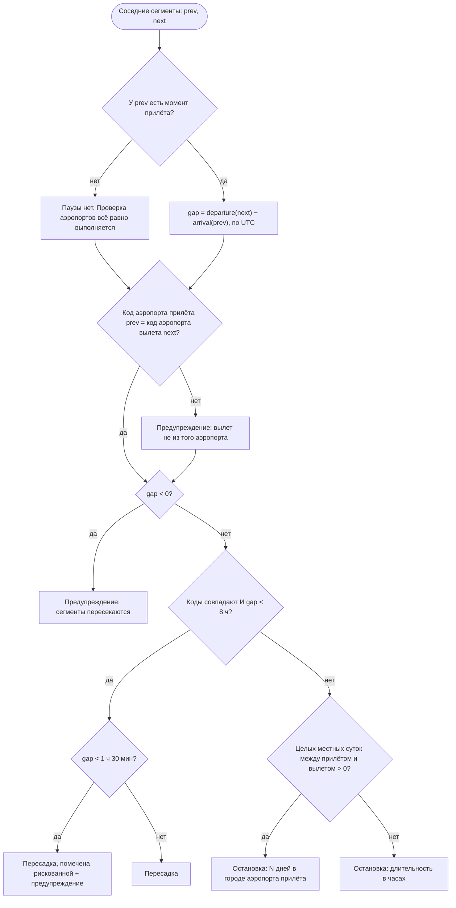

# Spec: Транспорт — сегменты маршрута, мультигород и предупреждения  |  Spec ID: SPEC-04  |  Status: draft
Supersedes: — (SPEC-01…SPEC-03 остаются в силе; перечень их AC, которые этот спек заменяет, — в разделе «Что заменяется в SPEC-01…SPEC-03»)
Implementation Plan: specs/plans/PLAN-04-flights.md (ещё не создан — этот спек его вход)

## Проблема й навіщо

SPEC-03 сделал поездку настоящей: таблица `trips` с RLS, создание, правка, архив, удаление. Но внутри
поездки по-прежнему пусто. Блоки «Рейс», «Отель», «Аренда авто» на экране деталей — пунктирные рамки
(SPEC-03 AC-45), а форма `/trips/[tripId]/flights/new` — неинтерактивная заглушка из статичного набора
полей (`mobile/src/features/booking-form/fields.ts`): восемь полей, ничего не валидируется, ничего
не сохраняется, «Готово» просто закрывает модалку, а число пассажиров зашито константой. То есть
приложение обещает «кошелёк бронирований», а хранит только название города и две даты.

Одновременно набор полей заглушки уже **разошёлся** с дизайном: `design/screens/add-flight.md` ставит
номер рейса первым полем, распознаёт авиакомпанию по его коду из офлайн-справочника, делает прилёт
необязательным, предзаполняет «Откуда» из прилёта предыдущего сегмента и добавляет кнопку «Сохранить
и добавить следующий». А `design/screens/route.md` вводит целый экран, которого в приложении нет:
маршрут цепочкой, паузы между сегментами и четыре предупреждения, которые **вычисляются** из уже
введённых данных.

Именно предупреждения — причина, по которой этот срез нельзя свести к «ещё одна CRUD-таблица».
Ценность продукта здесь не в том, что рейс сохранён, а в том, что приложение замечает то, что человек
пропускает: стыковка 55 минут в Вене; следующий вылет из Жироны, хотя прилетели в Эль-Прат; рейс
на день позже конца поездки; обратного рейса нет вообще. Все четыре проверки требуют того, что до сих
пор было формальностью: моментов времени в UTC с отдельной таймзоной **аэропорта** (а не города
поездки — у мультигорода их несколько) и сравнения точек маршрута **по коду аэропорта**, а не по городу.

Поэтому этот спек делает три вещи и ровно три: (1) таблицу сегментов транспорта с RLS через поездку
и полным CRUD, включая удаление отдельного сегмента; (2) два новых офлайн-справочника в `shared/` —
аэропорты (с поддержкой мультиаэропортных городов) и авиакомпании — плюс чистую доменную логику
маршрута, которая одинаково считает паузы и предупреждения на любом клиенте; (3) экран «Маршрут»
и блок «Транспорт» на деталях поездки. Отель и аренда авто остаются заглушками — сознательно.

## Goals / Non-goals

**Goals**

1. Сегменты транспорта хранятся на сервере в таблице `trip_segments` с RLS: доступ выводится через
   `trip_id` → `trips.user_id`, то есть ровно так же, как владение поездкой.
2. Полный CRUD **одного** сегмента: создание, открытие существующего на правку, сохранение правки
   и **удаление** — три операции равноправны, удаление не отложено на будущий спек.
3. Мультигород — это цепочка сегментов, а не отдельная фича. Обратный рейс вводится кнопкой
   «Сохранить и добавить следующий» с предзаполнением «Откуда» из «Куда» предыдущего сегмента.
   **Чекбокса «туда-обратно» нет и не будет**: он ломается на мультигороде
   (`design/screens/add-flight.md`, «Поведение»).
4. Модель сегмента с самого начала несёт `mode` (`flight` | `train` | `car` | `bus`). В первой фазе
   интерфейс умеет только `flight`, но поле заводится сразу: миграция данных потом дороже одного поля
   сейчас (`design/screens/route.md`, «Модель»).
5. Справочник аэропортов в `shared/` поддерживает **мультиаэропортные города**: аэропорт — отдельная
   запись с собственным IATA-кодом, собственной таймзоной и ссылкой на город; у города может быть
   несколько аэропортов, один из которых основной. Барселона Эль-Прат и Жирона — две разные записи.
6. Справочник авиакомпаний в `shared/` (IATA-код → название) — статичный, офлайновый, курируемый
   вручную, максимально полный по действующим перевозчикам; распознавание названия по коду из номера
   рейса работает без сети.
7. Паузы и все четыре предупреждения — чистая доменная логика в `shared/`, вычисляемая из уже
   введённых данных, без отдельного ввода и без дублирования в клиенте: пороги 8 ч (пересадка против
   остановки) и 1 ч 30 мин (риск), сравнение точек **по коду аэропорта**, замкнутость маршрута —
   **по городу**.
8. Время сегмента — момент в UTC плюс отдельная IANA-таймзона **своего аэропорта**; длительности
   считаются по UTC-моментам, показываются как местное время каждого аэропорта.
9. Экран «Маршрут» (`design/screens/route.md`): плоская цепочка сегментов, отсортированная по времени
   вылета, паузы на линии, предупреждения, карточка «Маршрут не замкнут» с кнопкой «Добавить рейс
   из \<города\>».
10. Блок «Транспорт» на деталях поездки (`design/screens/trip-detail.md`): карточка ближайшего
    сегмента, строка-сводка всего маршрута и переход на «Маршрут». Вся цепочка на S7 не показывается.
11. Форма сегмента заполняется **целиком руками** и работает офлайн в части подсказок: аэропорты
    и авиакомпании — из локальных справочников, ни одного сетевого вызова ради подсказки.

**Non-goals** (явно НЕ делаем в этом спеке)

- **Автозаполнение по номеру рейса через внешний API.** В этой фазе номер рейса даёт **только**
  название авиакомпании из офлайн-справочника (`design/screens/add-flight.md`, «Автозаполнение»).
  Интеграция внешнего источника — будущая фаза, и два её требования фиксируются здесь заранее, чтобы
  их не пришлось выдумывать потом: ключ живёт на сервере в Edge Function, а не в приложении, и форма
  обязана остаться **полностью заполняемой руками при любом отказе** (нет сети, рейса нет в базе,
  чартер). Ни ключей, ни Edge Functions, ни сетевых вызовов ради данных рейса этот спек не вводит.
- **Отель, аренда авто, страховка, документы.** Их блоки и формы остаются ровно в текущем виде
  (пустое состояние + неинтерактивная заглушка формы). Ни таблиц, ни схем, ни валидации для них здесь
  нет; это отдельные будущие спеки.
- **Отличные от `flight` виды транспорта в интерфейсе.** Поле `mode` завести — да; выбор типа
  транспорта, иконки поезда и автобуса, их специфические поля (вагон, место в вагоне, номер брони
  проката) — нет.
- **Деньги.** У сегмента нет ни цены, ни валюты, ни поля сборов. Правило проекта «валюта — на уровне
  записи» вступит в силу, когда появится первое денежное поле; в этом спеке его нет вовсе, поэтому
  и валютного поля нет (пустое поле валюты хуже отсутствующего).
- **Попутчики и пассажиры как сущности.** «Пассажиры» — счётчик (сколько человек летит), а не список
  людей с именами; один `seat` и один `ticket_number` на сегмент, а не по одному на пассажира
  (`design/screens/add-flight.md`: поля одиночные). Разбивка по пассажирам — будущий спек.
- **Импорт брони** (письма, PDF, Booking) и `source` ≠ `manual`. Значения `imported_pending` /
  `imported_confirmed` **зарезервированы схемой**, но записать их в этой фазе нечем: клиент всегда
  пишет `manual`.
- **Ручная сортировка цепочки.** Порядок задаётся временем вылета; drag-and-drop нет
  (`design/screens/route.md`, «Модель»).
- **Настраиваемые пороги пауз.** 8 ч и 1 ч 30 мин — эвристика в коде, а не настройка; пользователя
  не спрашивают, пересадка это или остановка.
- **Минимальное время стыковки конкретного аэропорта (MCT).** Порог один для всех аэропортов; реальные
  MCT — это данные, которых у нас офлайн нет.
- **Автоматическое определение авиакомпании-оператора, код-шеринг, терминалы, гейты, тип самолёта.**
- **Блокировка сохранения из-за предупреждения.** Предупреждение — информация, а не валидация:
  приложение не запрещает сохранить рискованную стыковку и не «исправляет» её за пользователя.
- **Уведомления и напоминания** о вылете и о короткой стыковке (это следующий шаг ценности, но он
  требует разрешения на уведомления и планировщика — отдельный спек).
- **Свободный текст вместо аэропорта.** Точки маршрута выбираются из справочника; почему — см. «Модель
  данных», врезка «Почему аэропорт обязан быть из справочника», и Q1.
- **Офлайн-запись.** Как и в SPEC-03: очереди отложенных операций нет, создание/правка/удаление
  сегмента требуют сети.
- **Шаринг маршрута, экспорт в Apple Wallet, Live Activity, календарь устройства.**
- **Подключение хостингового проекта Supabase** — всё на локальном стенде (root `AGENTS.md`,
  «Do NOT touch»).

## User stories

- **US-1.** Как пользователь, я открываю поездку, нажимаю «+» у блока «Транспорт», пишу номер рейса
  «LO 1234» — и вижу под полем «LOT Polish Airlines», не имея сети.
- **US-2.** Как пользователь, я сохраняю рейс туда и сразу нажимаю «Сохранить и добавить следующий»:
  «Откуда» уже заполнено аэропортом, куда я прилетел, а «Куда» — городом, откуда я начал поездку.
  Обратный рейс вводится в три касания.
- **US-3.** Как пользователь, летящий Краков → Порту → Барселона → Вена → Краков, я вижу весь маршрут
  одной цепочкой и понимаю, где пересадка на час, а где пять дней в Порту.
- **US-4.** Как пользователь, я вижу «рискованно» на стыковке 55 минут — до того, как окажусь в очереди
  на контроль, а не после.
- **US-5.** Как пользователь, прилетевший в Эль-Прат и купивший вылет из Жироны, я получаю
  предупреждение, что это **другой аэропорт**, хотя город на билетах написан один.
- **US-6.** Как пользователь, я вижу, что мой обратный рейс на день позже, чем кончается поездка, —
  и решаю, что чинить: рейс или даты поездки.
- **US-7.** Как пользователь, купивший только рейс туда, я вижу внизу карточку «Маршрут не замкнут»
  с кнопкой «Добавить рейс из Вены» и не забываю про обратный билет.
- **US-8.** Как пользователь, я ещё не купил билет и не знаю номера рейса: я всё равно сохраняю
  сегмент (даты и аэропорты я знаю) и дописываю номер позже.
- **US-9.** Как пользователь, я не знаю времени прилёта: я оставляю его пустым, сегмент сохраняется,
  и приложение просто не считает паузу после него — вместо того чтобы требовать выдуманное время.
- **US-10.** Как пользователь, я ошибся аэропортом — открываю сегмент из цепочки, правлю и сохраняю;
  а отменённый рейс удаляю целиком.
- **US-11.** Как владелец продукта, я хочу быть уверен, что чужой пользователь не прочитает мои
  номера билетов и места, даже зная идентификатор сегмента.
- **US-12.** Как разработчик следующих спеков (отель, авто), я хочу готовый образец «запись внутри
  поездки»: RLS через `trip_id`, `source`, UTC + таймзона места, форма со схемой в `shared/`.

## Инвентарь экранов

Изменения относительно SPEC-01…SPEC-03. Экраны S1–S6, S8, S8b, S10–S12 не меняются.

| # | Экран / маршрут | Что меняется |
|---|---|---|
| S7 | Детали `/trips/[tripId]` | Блок «Рейс» становится блоком **«Транспорт»**: карточка ближайшего сегмента, строка-сводка маршрута с переходом на «Маршрут», плашка «Маршрут не замкнут». Пустое состояние (пунктирная рамка «Добавить рейс») сохраняется, когда сегментов нет. Блоки «Отель» и «Аренда авто» не меняются |
| S9 | Форма рейса `/trips/[tripId]/flights/new` | Заглушка становится рабочей формой сегмента: номер рейса первым полем с распознаванием авиакомпании, «Откуда»/«Куда» с подсказками аэропортов, дата и время вылета, необязательные дата и время прилёта, багаж, пассажиры, место, номер билета; внизу «Сохранить и добавить следующий» |
| S9b | Правка сегмента `/trips/[tripId]/flights/[flightId]` | Существующий файл-заглушка становится той же формой в режиме правки: предзаполненные поля, заголовок, «Сохранить», деструктивное «Удалить рейс» с подтверждением; состояние «Сегмент не найден» |
| S13 | **Маршрут** `/trips/[tripId]/route` (**новый маршрут**) | Новый экран: цепочка сегментов, паузы, предупреждения, карточка «Маршрут не замкнут», кнопка «+» в шапке. Состояния: загрузка, пусто, ошибка, «Поездка не найдена» |
| S9c | Формы отеля и авто `/trips/[tripId]/hotels/new`, `/cars/new` | **Не меняются** — остаются заглушками. В наборе полей заглушки исчезает только вариант `flight` |

## Карта маршрутов (дополнение)

| Маршрут | Экран | Параметры | Презентация | Доступ |
|---|---|---|---|---|
| `/trips/[tripId]/route` | S13 | `tripId: string` | push (без таб-бара) | только с сессией |
| `/trips/[tripId]/flights/new` | S9 | `tripId: string` | modal | только с сессией (уже объявлен) |
| `/trips/[tripId]/flights/[flightId]` | S9b | `tripId: string`, `flightId: string` | modal | только с сессией (уже объявлен) |

Остальные маршруты SPEC-01…SPEC-03 сохраняются без изменений.

## Модель данных (контракт, не SQL)

Одна новая таблица — `trip_segments`. Описано как контракт: имена и смысл полей, инварианты. Точный
DDL, типы и индексы — дело Implementation Plan.

| Поле | Смысл | Обязательность |
|---|---|---|
| `id` | Идентификатор сегмента (UUID, генерируется сервером) | PK |
| `trip_id` | Поездка-владелец; FK на `trips` с `ON DELETE CASCADE`. Через него выводится владение | not null |
| `mode` | `flight` \| `train` \| `car` \| `bus` — вид транспорта. Клиент этой фазы пишет только `flight` | not null |
| `source` | `manual` \| `imported_pending` \| `imported_confirmed`; по умолчанию `manual` | not null |
| `flight_number` | Номер рейса, нормализованный (верхний регистр, без пробелов), как его ввёл пользователь | nullable |
| `carrier_code` | IATA-код перевозчика, **выведенный** из номера рейса при сохранении; `NULL`, если номер не введён или не разобран | nullable |
| `from_airport_code` | IATA-код аэропорта вылета | not null |
| `from_time_zone` | IANA-таймзона аэропорта вылета (снимок из справочника на момент сохранения) | not null |
| `to_airport_code` | IATA-код аэропорта прилёта | not null |
| `to_time_zone` | IANA-таймзона аэропорта прилёта | not null |
| `departure_at` | Момент вылета, UTC | not null |
| `arrival_at` | Момент прилёта, UTC; `NULL` — время прилёта неизвестно | nullable |
| `baggage_included` | Багаж включён | not null, по умолчанию `false` |
| `passengers` | Число пассажиров | not null, по умолчанию 1, 1…9 |
| `seat` | Место (билетные данные) | nullable, ≤ 16 символов |
| `ticket_number` | Номер билета | nullable, ≤ 32 символов |
| `created_at` / `updated_at` | Служебные отметки времени | not null |

Инварианты, которые обязаны быть выражены ограничениями БД (не только в клиенте):

- `mode` ∈ {`flight`,`train`,`car`,`bus`}; `source` ∈ {`manual`,`imported_pending`,`imported_confirmed`};
- `from_airport_code` и `to_airport_code` — ровно три заглавные латинские буквы;
- `from_airport_code <> to_airport_code` (рейс из аэропорта в себя же — опечатка, а не маршрут);
- `from_time_zone` и `to_time_zone` непусты и имеют форму `Область/Место` (полная проверка IANA —
  в `shared/`, Postgres не знает списка зон);
- `arrival_at IS NULL OR arrival_at > departure_at`;
- `arrival_at IS NULL OR arrival_at - departure_at <= 48 часов` (самый длинный регулярный рейс — около
  19 ч; 48 ч ловит опечатку в дате прилёта, не мешая ни одному реальному рейсу);
- `passengers BETWEEN 1 AND 9`;
- `flight_number` — либо `NULL`, либо непустая строка ≤ 10 символов без пробелов;
- `carrier_code IS NULL OR` ровно два символа из заглавных латинских букв и цифр;
- `carrier_code IS NOT NULL ⟹ flight_number IS NOT NULL` (код выводится из номера, не вводится сам);
- `seat` / `ticket_number` — либо `NULL`, либо непустые после обрезки пробелов.

Чего в `trip_segments` сознательно **нет**: денежных полей и валюты (Non-goals); порядкового номера
в цепочке (порядок выводится из `departure_at`); `user_id` (единственный источник владения —
`trips.user_id`, дубль рассинхронизируется); названия авиакомпании (выводится из справочника по
`carrier_code`); идентификаторов городов (выводятся из справочника по коду аэропорта); полей
«пересадка/остановка» и «предупреждение» (вычисляются, см. AC-47…AC-62).

**Почему момент времени, а не «дата + время» текстом.** Мультигород означает разные часовые пояса:
без UTC-момента длительность стыковки Вена → Краков считается неверно, а сортировка цепочки
по «времени вылета» перестаёт быть сортировкой (`design/screens/route.md`, «Часовые пояса»). Поэтому
правило проекта «время — UTC + отдельное поле IANA-таймзоны места» здесь впервые становится
обязательным по существу, а не формально. Таймзона берётся у **аэропорта**, а не у города поездки:
у поездки один `iana_timezone` (SPEC-03), а у маршрута их столько, сколько аэропортов.

**Почему аэропорт обязан быть из справочника.** Свободный текст в «Куда» сделал бы невозможными
и UTC-момент (нет таймзоны), и три из четырёх предупреждений (нет кода аэропорта и города). Поэтому,
в отличие от места поездки (SPEC-03 AC-14, где свободный текст принимается), точки маршрута —
только записи справочника. Цена решения: аэропорта, которого нет в справочнике, пользователь ввести
не может; смягчается размером набора (AC-11) и тем, что добавление аэропорта — правка данных
в `shared/`, то есть обновление приложения. Это осознанный компромисс, а не недосмотр (Q1).

### Справочники в `shared/` (контракт данных)

**Аэропорт** — новая запись справочника мест, рядом с городами и странами:

| Поле | Смысл |
|---|---|
| `id` | Стабильный навсегда идентификатор вида `airport-<iata lower>` (например `airport-bcn`) |
| `kind` | `airport` — третий вид записи рядом с `city` и `country` |
| `iata` | IATA-код аэропорта, три заглавные латинские буквы, уникален по всему набору |
| `ru` / `en` | Название аэропорта на русском и английском («Эль-Прат» / «El Prat») |
| `cityId` | Ссылка на запись города (`city-…`) — город, которому аэропорт служит |
| `countryCode` | ISO alpha-2 страны аэропорта |
| `timeZone` | IANA-таймзона **аэропорта**: у каждого аэропорта своя, даже если она совпадает с зоной города (см. Edge cases — почему поле живёт у аэропорта, а не берётся у города) |
| `isPrimary` | Основной аэропорт своего города; у города ровно один основной |

Города остаются как есть. Существующее поле `city.airportCode` (SPEC-03) **сохраняется** и обязано
совпадать с `iata` основного аэропорта этого города — это проверяется тестом целостности (AC-14),
чтобы подсказки места на S8 и `trips.airport_code` продолжали работать без изменений. Новых полей
у города не появляется: связь «город → аэропорты» выводится из `cityId` аэропортов.

**Авиакомпания** — новый набор:

| Поле | Смысл |
|---|---|
| `iata` | IATA-designator перевозчика, два символа (заглавные латинские буквы и/или цифры), уникален |
| `name` | Название перевозчика как бренд («LOT Polish Airlines») — одно на все локали |
| `countryCode` | ISO alpha-2 страны регистрации (для уточняющей строки и для разрешения спорных кодов) |

Названия авиакомпаний **не локализуются**: это торговые марки, а не географические имена; «LOT Polish
Airlines» показывается одинаково в русском и английском интерфейсе (Q4).

**Проверенные внешние факты, на которых стоят форматы** (проверено `researcher`-агентом; источники —
в Inputs):

- IATA-код аэропорта — **ровно три заглавные латинские буквы** (26³ = 17 576 комбинаций), цифр
  не бывает. Назначено порядка 11 000 кодов; аэропортов с регулярным пассажирским сообщением —
  порядка 4 000 (оценки вторичных источников расходятся на ~10 %, поэтому числа в этом спеке —
  порядок величины, а не точная цель).
- IATA-designator перевозчика — **два алфавитно-цифровых символа**; цифра может стоять и на первом
  месте (`9W` — Jet Airways). Формально стандарт допускает необязательный третий символ, но IATA
  **ни одного такого кода не назначила**, поэтому `^[A-Z0-9]{2}$` — практическое правило.
- Номер рейса — designator + **1…4 цифры** + необязательная буква-суффикс (`BA667A`), то есть
  `^[A-Z0-9]{2}[0-9]{1,4}[A-Z]?$`.
- IATA **сознательно выдаёт один и тот же designator нескольким перевозчикам** («controlled
  duplicates», например `7Y` — Mid Airlines и Med Airways). Это прямое следствие для модели: карта
  «код → один перевозчик» местами неоднозначна, поэтому распознанное название — **подсказка**,
  которая не сохраняется в БД (см. Edge cases).
- IATA-коды **переиспользуются во времени**: `BKK` перешёл от Дон Муанга к Суварнабхуми (старый стал
  `DMK`), `IST` — от Ататюрка к новому аэропорту Истанбула. Для курируемого офлайн-набора это значит,
  что содержимое стареет, и сверка кодов — периодическая работа, а не разовая.

**Метро-коды IATA (LON, PAR, NYC, MOW, TYO, MIL) в этом спеке не используются вовсе.** Они живут
в том же трёхбуквенном пространстве, что коды аэропортов, и принадлежность аэропорта городу у нас
выражается ссылкой `cityId` на справочник мест, а не трёхбуквенным кодом города. Это снимает целый
класс двусмысленности («это код аэропорта или агломерации?») до того, как он появится.

## Acceptance criteria (EARS)

### Хранение, владение и RLS

- **AC-1.** The system **shall** хранить сегменты транспорта в таблице `trip_segments`, созданной
  миграцией в `supabase/migrations/`; изменение схемы через дашборд или ручной SQL на стенде
  не является реализацией этого спека.
  *Verify: manual (`supabase db reset` на чистом стенде применяет миграцию без ошибок) + db.*
- **AC-2.** The system **shall** держать RLS включённым на `trip_segments` с политиками `select`,
  `insert`, `update` и `delete`, каждая из которых допускает строку **только** когда её `trip_id`
  указывает на поездку текущего пользователя; отдельной колонки-владельца в таблице нет.
  *Verify: db (pgTAP: владелец читает/вставляет/правит/удаляет сегмент своей поездки).*
- **AC-3.** IF пользователь пытается прочитать, изменить или удалить сегмент поездки другого
  пользователя, THEN the system **shall** вести себя так, будто строки не существует: чтение
  возвращает пустой результат, изменение и удаление затрагивают ноль строк, и в ответе нет ни номера
  билета, ни места, ни любых других данных чужого сегмента.
  *Verify: db (pgTAP: второй пользователь получает 0 строк на select/update/delete).*
- **AC-4.** IF пользователь пытается вставить сегмент с `trip_id` чужой (или несуществующей) поездки,
  THEN the system **shall** отклонить вставку, а не записать сегмент в чужую поездку.
  *Verify: db (pgTAP: insert с чужим `trip_id` падает; с несуществующим — падает на FK).*
- **AC-5.** IF пользователь меняет `trip_id` своего сегмента на идентификатор чужой поездки, THEN
  the system **shall** отклонить изменение (политика проверяет и старую, и новую строку).
  *Verify: db (pgTAP: update, переносящий сегмент в чужую поездку, затрагивает ноль строк или падает).*
- **AC-6.** IF запрос выполняется без аутентификации (анонимная роль), THEN the system **shall**
  не возвращать ни одной строки `trip_segments` и не позволять вставку.
  *Verify: db (pgTAP: anon — 0 строк на select/update/delete, ошибка на insert).*
- **AC-7.** WHEN поездка удаляется (навсегда, SPEC-03 AC-55), the system **shall** удалить все её
  сегменты каскадом; WHEN пользователь удаляется из `auth.users`, the system **shall** не оставить
  ни одного его сегмента (каскад через `trips`).
  *Verify: db (pgTAP: удаление поездки → 0 сегментов; удаление пользователя → 0 сегментов).*
- **AC-8.** The system **shall** отвергать на уровне БД строку, нарушающую любой инвариант из раздела
  «Модель данных»: неизвестный `mode` или `source`, код аэропорта не из трёх заглавных букв,
  совпадающие аэропорты вылета и прилёта, пустая или бесформенная таймзона, прилёт раньше или равный
  вылету, длительность больше 48 часов, `passengers` вне 1…9, `carrier_code` без `flight_number`,
  пустые после обрезки `seat` / `ticket_number`.
  *Verify: db (pgTAP: по одной падающей вставке на каждое ограничение).*
- **AC-9.** WHEN миграция применена, the system **shall** иметь перегенерированный
  `shared/src/db/database.types.ts`, соответствующий фактической схеме; рукописных типов строки
  `trip_segments` в проекте не появляется.
  *Verify: unit (типы импортируются схемами `shared/`) + manual (повторная генерация не даёт диффа).*
- **AC-10.** The system **shall** обращаться к `trip_segments` из клиента только с ключом анонимной
  роли через RLS; ключ `service_role` не используется ни для одной операции этого спека и в клиенте
  отсутствует.
  *Verify: unit (существующие guardrail-правила `no-service-role`, `backend-only-behind-the-boundary`).*

### Справочник аэропортов (`shared/`)

- **AC-11.** The system **shall** содержать в `shared/` статичный справочник аэропортов, покрывающий
  **все** коммерческие аэропорты каждого города существующего справочника мест (включая все аэропорты
  мультиаэропортных городов) плюс крупные пересадочные хабы — не менее 300 записей.
  *Verify: unit (размер набора; у каждого города справочника есть минимум один аэропорт, если у него
  заполнен `airportCode`).*
- **AC-12.** The system **shall** описывать аэропорт записью с полями `id`, `kind: "airport"`, `iata`,
  `ru`, `en`, `cityId`, `countryCode`, `timeZone`, `isPrimary`, где `id` стабилен навсегда и никогда
  не переиспользуется (он попадает в подсказки и в сохранённые сегменты через `iata`).
  *Verify: unit (Zod-схема записи; тест на уникальность `id` и `iata`).*
- **AC-13.** The system **shall** допускать у города несколько аэропортов и **ровно один** основной:
  для каждого `cityId`, упомянутого хотя бы одним аэропортом, число записей с `isPrimary` равно
  единице.
  *Verify: unit (тест целостности справочника; набор обязан содержать минимум один
  мультиаэропортный город).*
- **AC-14.** The system **shall** проверять тестом, что существующее поле `city.airportCode` (SPEC-03)
  равно `iata` основного аэропорта того же города, а город без `airportCode` не имеет ни одного
  аэропорта в наборе; расхождение — дефект данных, а не допустимое состояние.
  *Verify: unit (тест целостности: перекрёстная сверка двух наборов).*
- **AC-15.** The system **shall** проверять целостность справочника аэропортов тестом: каждый `iata` —
  ровно три заглавные латинские буквы и уникален; каждый `cityId` существует в справочнике мест;
  каждый `countryCode` известен; каждая `timeZone` принимается `Intl.DateTimeFormat` как валидный
  IANA-идентификатор; у каждой записи непустые ru- и en-названия.
  *Verify: unit (тест справочника в `shared/`).*
- **AC-15a.** WHERE аэропорт служит городу, которого нет в справочнике мест (Жирона при Барселоне,
  Хан при Франкфурте, Бове при Париже, Бергамо при Милане), the system **shall** содержать для него
  **новую запись города** в справочнике мест — с собственным идентификатором, названиями, страной
  и таймзоной; правило AC-15 («каждый `cityId` существует») не обходится ни ссылкой на город
  «настоящего» аэропорта, ни пустым значением. Существующие идентификаторы городов при этом
  не перенумеровываются (они хранятся в `trips.place_id`, SPEC-03).
  *Verify: unit (тест целостности: нет аэропорта с неизвестным `cityId`; ни один существующий id
  города не изменился по сравнению с зафиксированным списком).*
- **AC-16.** WHEN пользователь вводит текст в поле «Откуда» или «Куда», the system **shall** возвращать
  не более четырёх подсказок аэропортов, отбирая их по совпадению **с начала** названия аэропорта,
  названия его города (ru и en, без учёта регистра и диакритики, как `searchPlaces`) **или** по точному
  совпадению трёхбуквенного IATA-кода.
  *Verify: unit («Жир» → GRO; «Barcel» → BCN (первым) и другие аэропорты Барселоны; «GRO» → GRO;
  «rcel» не даёт совпадений в середине слова).*
- **AC-17.** The system **shall** упорядочивать подсказки аэропортов так, что основной аэропорт города
  идёт раньше неосновных при равном качестве совпадения, а порядок детерминирован при любых равенствах.
  *Verify: unit (запрос по мультиаэропортному городу: первым основной; повторный вызов — тот же список).*
- **AC-18.** The system **shall** выполнять поиск аэропортов и авиакомпаний полностью локально
  и синхронно: ни сетевого вызова, ни асинхронного API, ни ключей; функции остаются чистыми
  и runtime-нейтральными (Hermes, браузер, Deno, Node).
  *Verify: unit (в `shared/` нет импортов `supabase-js`/`react-native`/Node-API — существующее правило
  `shared/AGENTS.md`) + unit (функции синхронные и детерминированные).*

### Справочник авиакомпаний (`shared/`)

- **AC-19.** The system **shall** содержать в `shared/` статичный справочник авиакомпаний — не менее
  400 записей, покрывающих действующих перевозчиков регулярных пассажирских рейсов (для ориентира:
  в IATA более 370 авиакомпаний-членов, а её собственная кодовая база — свыше 1100 записей, включая
  грузовых перевозчиков и небилетные сущности, которые нам не нужны), — где у записи есть
  IATA-designator, название-бренд и код страны.
  *Verify: unit (размер набора; у каждой записи заполнены все три поля).*
- **AC-20.** The system **shall** проверять целостность справочника авиакомпаний тестом: каждый
  designator — ровно два алфавитно-цифровых символа (заглавные латинские буквы и/или цифры, цифра
  допустима и на первом месте) и **уникален** по набору — на один код приходится ровно одна запись,
  даже если в реальности IATA выдала этот код нескольким перевозчикам; каждый `countryCode` известен
  справочнику мест; название непусто и не совпадает у двух записей дословно.
  *Verify: unit (тест справочника в `shared/`; отдельный кейс на designator с цифрой, например `9W`).*
- **AC-21.** WHEN пользователь вводит номер рейса, the system **shall** нормализовать ввод (верхний
  регистр, удаление пробелов и дефисов), выделить из него IATA-designator перевозчика и, если он есть
  в справочнике, вернуть название перевозчика.
  *Verify: unit («lo 1234», «LO-1234», «LO1234» → один и тот же designator `LO` и «LOT Polish Airlines»).*
- **AC-22.** IF введённый номер рейса не соответствует формату «два алфавитно-цифровых символа
  designator + от одной до четырёх цифр + необязательная буква-суффикс» (`^[A-Z0-9]{2}[0-9]{1,4}[A-Z]?$`
  после нормализации), THEN the system **shall** сообщить об этом ошибкой поля и **не** отправлять
  запрос; при этом пустой номер рейса ошибкой не является.
  *Verify: unit (валидны: `LO1`, `LO1234`, `BA667A`, `9W123` (цифра в designator), `U2101`; ошибка:
  `LO` (нет цифр), `LO12345` (пять цифр), `LOT400` (трёхбуквенный префикс ICAO), `L`, `LO12AB`;
  пустая строка — валидна).*
- **AC-23.** IF номер рейса имеет верный формат, но его designator отсутствует в справочнике, THEN
  the system **shall** сохранить сегмент с введённым номером и **без** кода и названия перевозчика,
  показав нейтральную строку «авиакомпания не распознана» вместо ошибки.
  *Verify: unit (схема формы: номер сохранён, `carrier_code` пуст, ошибки поля нет) + unit (компонент
  показывает нейтральную строку).*
- **AC-24.** WHEN designator распознан, the system **shall** показывать под полем номера рейса строку
  с названием перевозчика и пометкой источника («из справочника, офлайн») и подсвечивать границу поля
  цветом `accent`; ни один сетевой запрос при этом не выполняется.
  *Verify: unit (компонентный тест: строка и граница; api не вызывается) + manual (авиарежим).*

### Форма сегмента: поля и валидация

- **AC-25.** The system **shall** показывать в форме сегмента поля в порядке: номер рейса, «Откуда»,
  «Куда», дата вылета, время вылета, дата прилёта, время прилёта, «Багаж включён», «Пассажиры»,
  «Место», «Номер билета» — и ни одного поля, которого нет в `design/screens/add-flight.md`.
  *Verify: unit (состав и порядок полей) + manual.*
- **AC-26.** The system **shall** требовать для сохранения сегмента ровно четыре значения: аэропорт
  вылета, аэропорт прилёта, дату вылета и время вылета; WHILE любое из них не заполнено, кнопка
  сохранения остаётся неактивной.
  *Verify: unit (схема формы в `shared/`: по одному падающему случаю на каждое) + unit (состояние кнопки).*
- **AC-27.** The system **shall** принимать сегмент **без** даты и времени прилёта и показывать под
  полями прилёта пояснение, что они необязательны и нужны только для расчёта стыковок.
  *Verify: unit (схема: сегмент без прилёта валиден) + unit (пояснение отрисовано) + e2e.*
- **AC-28.** IF заполнена только одна из двух частей прилёта (дата без времени или время без даты),
  THEN the system **shall** показать сообщение у блока прилёта и не отправлять запрос: прилёт задаётся
  целиком или не задаётся вовсе.
  *Verify: unit (схема формы: оба неполных случая).*
- **AC-29.** The system **shall** собирать момент вылета из введённых пользователем календарной даты
  и времени, трактуя их как **местное время аэропорта вылета**, и передавать на сервер UTC-момент плюс
  таймзону этого аэропорта; то же — для прилёта и аэропорта прилёта.
  *Verify: unit (пары «локальные дата+время+зона» → UTC-момент, включая зону с положительным
  и отрицательным смещением).*
- **AC-30.** IF введённое местное время попадает в несуществующий час перехода на летнее время
  в таймзоне аэропорта, THEN the system **shall** сохранить сегмент, сдвинув момент на ближайшее
  существующее местное время вперёд, и не показывать пользователю ошибку и не молчать об этом
  в тестах (поведение зафиксировано тестом, а не случайно).
  *Verify: unit (таблица случаев: несуществующее и дважды существующее местное время).*
- **AC-31.** IF момент прилёта не позже момента вылета, THEN the system **shall** показать сообщение
  у блока прилёта и не отправлять запрос; IF длительность больше 48 часов, THEN сообщение отличается
  от предыдущего («проверьте дату прилёта»).
  *Verify: unit (схема формы: границы 48 ч / 48 ч 1 мин; прилёт равный вылету).*
- **AC-32.** IF аэропорт прилёта совпадает с аэропортом вылета, THEN the system **shall** показать
  сообщение у поля «Куда» и не отправлять запрос.
  *Verify: unit (схема формы) + db (ограничение AC-8).*
- **AC-33.** The system **shall** принимать в поля «Откуда» и «Куда** только записи справочника
  аэропортов: свободный текст, не выбранный из подсказок, не считается заполненным значением, а поле
  сохраняет выбранный аэропорт до явной замены.
  *Verify: unit (схема формы: текст без выбора → ошибка «выберите аэропорт») + unit (компонент).*
- **AC-34.** WHILE введённому тексту не соответствует ни один аэропорт, the system **shall** показывать
  под полем строку, объясняющую, что нужно выбрать аэропорт из списка и что можно искать по IATA-коду,
  и **не** предлагать сохранить свободный текст.
  *Verify: unit (ввод «Козятин» → сообщение, кнопка сохранения неактивна) + manual.*
- **AC-35.** The system **shall** нормализовать текстовые поля сегмента перед отправкой: обрезка
  пробелов по краям, схлопывание внутренних пробелов, верхний регистр и удаление пробелов и дефисов
  для номера рейса, ограничения длин `seat` ≤ 16 и `ticket_number` ≤ 32 (счёт в кодовых точках, как
  в `shared/src/auth`); строка из одних пробелов считается пустой.
  *Verify: unit (схема `shared/`).*
- **AC-36.** The system **shall** держать счётчик пассажиров в диапазоне 1…9 с начальным значением 1,
  отключая кнопку уменьшения на 1 и увеличения на 9; статичного зашитого значения в форме
  не остаётся.
  *Verify: unit (границы счётчика; в коде нет константы вида «статичное число пассажиров»).*
- **AC-37.** The system **shall** отдавать ошибки формы сегмента как стабильные идентификаторы
  (по образцу `shared/src/trips/errorCodes.ts`), без готовых текстов; тексты подставляет клиент
  из своих локализованных строк.
  *Verify: unit (список идентификаторов зафиксирован тестом; в `shared/` нет пользовательских строк).*
- **AC-38.** The system **shall** предзаполнять при создании первого сегмента поездки: «Куда» —
  основным аэропортом города поездки, дату вылета — датой начала поездки; IF у поездки нет дат, места
  из справочника или основного аэропорта, THEN соответствующие поля остаются пустыми, и это не ошибка.
  *Verify: unit (четыре случая: город с аэропортом, страна, свободный текст, поездка без дат) + e2e.*
- **AC-39.** The system **shall** записывать каждый созданный в этой фазе сегмент с `mode = 'flight'`
  и `source = 'manual'`; выбора вида транспорта и источника в интерфейсе нет.
  *Verify: unit (тело запроса) + db.*
- **AC-40.** WHEN пользователь закрывает форму, the system **shall** спросить подтверждение только
  если в форме что-то изменено; нетронутая форма закрывается сразу.
  *Verify: unit (два случая) + e2e.*

### Цепочка: «Сохранить и добавить следующий»

- **AC-41.** WHEN пользователь нажимает «Сохранить и добавить следующий», the system **shall** сохранить
  текущий сегмент и открыть **пустую** форму следующего, в которой «Откуда» предзаполнено аэропортом
  прилёта только что сохранённого сегмента.
  *Verify: unit (второй сегмент получает from = to предыдущего) + e2e.*
- **AC-42.** WHEN открывается форма следующего сегмента после сохранения, the system **shall**
  предзаполнить дату вылета датой прилёта предыдущего сегмента (в таймзоне его аэропорта прилёта),
  а если время прилёта не было введено — датой вылета предыдущего сегмента.
  *Verify: unit (оба случая, включая прилёт после полуночи по местному времени).*
- **AC-43.** WHERE сохранённый сегмент оставляет пользователя не в городе начала маршрута, the system
  **shall** предзаполнить «Куда» следующей формы основным аэропортом города, из которого начался
  маршрут (аэропорт вылета первого сегмента); WHERE маршрут уже замкнут, «Куда» остаётся пустым.
  *Verify: unit (не замкнут → «Куда» заполнено; замкнут → пусто).*
- **AC-44.** IF сохранение при «Сохранить и добавить следующий» не удалось, THEN the system **shall**
  оставить пользователя в той же форме с введёнными значениями и сообщением об ошибке, и **не**
  открывать форму следующего сегмента.
  *Verify: unit (мок ошибки: форма на месте, переход не произошёл).*
- **AC-45.** WHEN пользователь нажимает «Готово» (а не «Сохранить и добавить следующий»), the system
  **shall** сохранить сегмент и вернуть пользователя на экран, с которого он пришёл (детали поездки
  или «Маршрут»), с уже обновлённой цепочкой.
  *Verify: unit (оба источника перехода) + e2e.*
- **AC-46.** WHILE запрос сохранения выполняется, the system **shall** блокировать обе кнопки
  сохранения и показывать индикатор; повторные нажатия не создают второго сегмента.
  *Verify: unit (двойное нажатие → ровно один вызов api).*

### Доменная логика маршрута (`shared/`)

- **AC-47.** The system **shall** строить цепочку маршрута чистой функцией в `shared/`, упорядочивая
  сегменты по моменту вылета по возрастанию, а при равных моментах — детерминированно
  (по идентификатору); ручной сортировки и поля порядка нет.
  *Verify: unit (набор сегментов в перемешанном порядке → стабильная цепочка).*
- **AC-48.** The system **shall** вычислять паузу между двумя соседними сегментами как разность
  **UTC-моментов** (прилёт предыдущего → вылет следующего); IF у предыдущего сегмента нет момента
  прилёта, THEN пауза не вычисляется и не показывается.
  *Verify: unit (пауза между разными таймзонами равна разнице моментов, а не разнице настенных часов;
  сегмент без прилёта → паузы нет).*
- **AC-49.** WHERE аэропорт прилёта предыдущего сегмента и аэропорт вылета следующего **совпадают
  по коду** и пауза меньше 8 часов, the system **shall** классифицировать паузу как пересадку
  и показать её длительность в часах и минутах.
  *Verify: unit (границы: 7 ч 59 мин — пересадка; ровно 8 ч — не пересадка).*
- **AC-50.** IF пауза классифицирована как пересадка и её длительность меньше 1 часа 30 минут, THEN
  the system **shall** пометить её как рискованную и выдать предупреждение «короткая стыковка».
  *Verify: unit (границы: 1 ч 29 мин — рискованно; ровно 1 ч 30 мин — нет).*
- **AC-51.** The system **shall** сравнивать «тот же аэропорт» **только по коду аэропорта** и никогда
  по городу: два аэропорта одного города (JFK и LGA в Нью-Йорке, Мальпенса и Линате в Милане) —
  разные точки маршрута, а не одна.
  *Verify: unit (прилёт в JFK, вылет из LGA с разрывом 3 ч → несовпадение аэропортов, а не пересадка;
  тот же случай для BCN → GRO, где вдобавок различаются и города).*
- **AC-52.** IF аэропорт вылета следующего сегмента не совпадает по коду с аэропортом прилёта
  предыдущего, THEN the system **shall** выдать предупреждение «вылет не из того аэропорта, куда
  прилетели», независимо от длительности паузы и **независимо от того, известен ли момент прилёта**.
  *Verify: unit (с прилётом и без; одинаковый город, разные коды → предупреждение).*
- **AC-53.** WHERE аэропорты совпадают по коду и пауза не меньше 8 часов, the system **shall** показать
  остановку, выраженную в целых сутках между локальной датой прилёта и локальной датой следующего
  вылета, обе посчитанные в таймзоне **аэропорта прилёта**, с названием его города; IF эта разница
  равна нулю, THEN остановка показывается в часах, а не «0 дней».
  *Verify: unit (пауза 30 ч через полночь → «1 день»; пауза 11 ч внутри одних местных суток → часы).*
- **AC-54.** IF момент вылета следующего сегмента раньше момента прилёта предыдущего, THEN the system
  **shall** выдать предупреждение о пересечении сегментов и **не** показывать отрицательную паузу.
  *Verify: unit (отрицательная разность → предупреждение, поле длительности не отрицательное).*
- **AC-55.** IF локальная календарная дата вылета или прилёта сегмента (каждая в таймзоне своего
  аэропорта) выходит за диапазон дат поездки, THEN the system **shall** выдать предупреждение
  «сегмент вне дат поездки» для этого сегмента; WHERE у поездки нет дат, это предупреждение
  не выдаётся никогда.
  *Verify: unit (вылет за день до начала; прилёт на день позже конца; границы «ровно в день начала»
  и «ровно в день конца» — без предупреждения; поездка без дат — без предупреждения).*
- **AC-56.** The system **shall** считать маршрут замкнутым, когда **город** аэропорта прилёта
  последнего сегмента совпадает с **городом** аэропорта вылета первого; возврат в другой аэропорт того
  же города замыкает маршрут, возврат в другой город — нет.
  *Verify: unit (JFK→LHR, LHR→LGA — замкнут: оба аэропорта — Нью-Йорк; BCN→VIE, VIE→GRO — **не**
  замкнут: Жирона — отдельный город, а не второй аэропорт Барселоны; BCN→VIE, VIE→BCN — замкнут).*
- **AC-57.** IF маршрут не замкнут, THEN the system **shall** выдать предупреждение «маршрут
  не замкнут», несущее город и основной аэропорт точки, в которой человек остался, — чтобы клиент мог
  предложить «Добавить рейс из \<города\>» без собственных вычислений.
  *Verify: unit (данные предупреждения содержат город последнего прилёта).*
- **AC-58.** WHERE в маршруте ровно один сегмент, the system **shall** выдавать только предупреждение
  «маршрут не замкнут» (и, при необходимости, «вне дат поездки»); WHERE сегментов нет, the system
  **shall** не выдавать ни одного предупреждения.
  *Verify: unit (один сегмент; пустой маршрут).*
- **AC-59.** The system **shall** отдавать предупреждения как **стабильные идентификаторы** с данными
  (длительность, коды аэропортов, город), а не как готовые тексты; порядок предупреждений детерминирован.
  *Verify: unit (список идентификаторов зафиксирован тестом; в `shared/` нет пользовательских строк).*
- **AC-60.** The system **shall** вычислять сводку маршрута: цепочку кодов аэропортов (аэропорт вылета
  первого сегмента, затем аэропорт прилёта каждого по порядку, со склейкой подряд идущих одинаковых
  кодов), число сегментов и число пересадок.
  *Verify: unit (KRK · OPO · BCN · VIE для четырёх сегментов; склейка дубля при совпадающих кодах).*
- **AC-61.** The system **shall** выбирать «ближайший сегмент» как первый по времени вылета сегмент,
  вылет которого не раньше текущего момента; IF таких сегментов нет, THEN ближайшим считается
  последний по времени вылета.
  *Verify: unit (маршрут целиком в будущем, целиком в прошлом, наполовину; момент берётся
  инжектируемым источником времени).*
- **AC-62.** The system **shall** держать всю эту логику в `shared/` и не дублировать ни один порог,
  ни одно правило сравнения в клиенте: клиент получает готовую цепочку, паузы и предупреждения
  и только рисует их.
  *Verify: unit (в `mobile/` нет литералов порогов 8 ч / 1 ч 30 мин и нет сравнений кодов аэропортов —
  guardrail-правило) + unit (экран рендерит из результата функции).*

### Экран «Маршрут» (S13)

- **AC-63.** WHILE открыт `/trips/[tripId]/route` существующей поездки текущего пользователя,
  the system **shall** показывать сегменты плоской цепочкой в порядке вылета, с вертикальной линией,
  узлами сегментов и строками пауз между ними.
  *Verify: unit (порядок и состав элементов) + manual (обе темы).*
- **AC-64.** The system **shall** отрисовывать карточку сегмента в компактном виде: коды аэропортов
  вылета и прилёта с иконкой-стрелкой между ними и шевроном, ниже дата и время моношрифтом
  (местное время **своего** аэропорта), справа номер рейса; тап открывает форму этого сегмента.
  *Verify: unit (состав карточки, типографические роли, переход) + e2e.*
- **AC-65.** The system **shall** отрисовывать рискованную стыковку чипом на фоне `warnBg` с припиской
  «рискованно» и полым узлом с обводкой `warnBorder`, а обычную пересадку и остановку — строкой цветом
  `textSecondary` с соответствующей иконкой; цвет никогда не является единственным признаком риска.
  *Verify: unit (три вида паузы) + manual (обе темы, Accessibility Inspector).*
- **AC-66.** The system **shall** показывать каждое предупреждение рядом с тем элементом, к которому
  оно относится: «короткая стыковка» и «вылет не из того аэропорта» — на паузе между сегментами,
  «вне дат поездки» — на карточке сегмента, «маршрут не замкнут» — карточкой внизу экрана.
  *Verify: unit (по одному случаю на предупреждение) + manual.*
- **AC-67.** IF маршрут не замкнут, THEN the system **shall** показать внизу карточку на фоне `warnBg`
  с пунктирной границей, заголовком «Маршрут не замкнут», пояснением и кнопкой «Добавить рейс
  из \<города\>», которая открывает форму сегмента с предзаполненным «Откуда».
  *Verify: unit (карточка и переход с предзаполнением) + e2e.*
- **AC-68.** IF у поездки нет ни одного сегмента, THEN the system **shall** показать на «Маршруте»
  короткое пустое состояние с призывом добавить рейс и **не** показывать ни одного предупреждения
  (в том числе «маршрут не замкнут»).
  *Verify: unit (пустое состояние, ноль предупреждений) + e2e.*
- **AC-69.** WHILE цепочка загружается впервые, the system **shall** показывать скелетоны карточек
  сегментов; IF загрузка не удалась, THEN показывается сообщение об ошибке с «Повторить», а не пустое
  состояние «рейсов нет».
  *Verify: unit (загрузка и ошибка — разные экраны).*
- **AC-70.** IF `tripId` не существует, принадлежит другому пользователю или некорректен, THEN
  «Маршрут» **shall** показать то же состояние «Поездка не найдена», что S7 (SPEC-03 AC-44),
  и не показывать чужую цепочку.
  *Verify: unit (чужой и несуществующий id) + e2e.*

### Блок «Транспорт» на деталях поездки (S7)

- **AC-71.** The system **shall** переименовать блок «Рейс» в «Транспорт» и показывать в нём при
  наличии сегментов: карточку ближайшего сегмента (коды аэропортов, дата и время, чипы «Багаж включён»
  и число пассажиров) и строку-сводку маршрута (цепочка кодов, «Весь маршрут · N рейсов, M пересадок»,
  шеврон), ведущую на «Маршрут».
  *Verify: unit (состав блока при 1 и при 4 сегментах) + manual.*
- **AC-72.** The system **shall** **не** показывать всю цепочку на S7: в блоке «Транспорт» отрисована
  ровно одна карточка сегмента независимо от их числа.
  *Verify: unit (при 4 сегментах карточка одна).*
- **AC-73.** IF маршрут не замкнут, THEN the system **shall** показать под сводкой плашку на фоне
  `warnBg` с иконкой предупреждения и текстом «Маршрут не замкнут — нет рейса из \<города\>», тап
  по которой ведёт на «Маршрут».
  *Verify: unit (плашка и переход) + e2e.*
- **AC-74.** IF у поездки нет сегментов, THEN блок «Транспорт» **shall** остаться пустым состоянием
  в текущем виде (пунктирная рамка, иконка плюса, «Добавить рейс») — SPEC-03 AC-45 в этой части
  сохраняется.
  *Verify: unit (пустое состояние) + e2e.*
- **AC-75.** WHEN сегмент создан, изменён или удалён, the system **shall** обновить блок «Транспорт»,
  экран «Маршрут» и все производные значения (ближайший сегмент, сводка, предупреждения) без ручного
  обновления пользователем и без перезапуска приложения.
  *Verify: unit (инвалидация кэша после каждой мутации) + e2e.*

### Правка и удаление сегмента (S9b)

- **AC-76.** WHEN пользователь открывает существующий сегмент (из цепочки или из карточки на S7),
  the system **shall** открыть ту же форму с предзаполненными значениями, показывая время в местном
  времени соответствующего аэропорта, а **не** пустую форму.
  *Verify: unit (предзаполнение всех полей, включая пустой прилёт) + e2e.*
- **AC-77.** The system **shall** использовать для создания и правки сегмента одну форму и одну схему
  валидации: правила AC-26…AC-36 действуют в режиме правки дословно.
  *Verify: unit (один модуль схемы покрывает оба режима; тесты параметризованы режимом).*
- **AC-78.** The system **shall** показывать в режиме правки деструктивное действие «Удалить рейс»
  (текст `danger`), которое **не** удаляет сразу: показывается подтверждение средствами приложения
  (не системный `Alert`), прямо называющее необратимость.
  *Verify: unit (без подтверждения api не вызывается) + e2e.*
- **AC-79.** WHEN удаление подтверждено и выполнено, the system **shall** удалить строку сегмента
  физически, закрыть форму и вернуть пользователя на экран, с которого он пришёл, с пересчитанной
  цепочкой и предупреждениями.
  *Verify: db (строки нет) + unit (пересчёт предупреждений после удаления) + e2e.*
- **AC-80.** IF `flightId` не существует, принадлежит другой поездке или другому пользователю, либо
  некорректен, THEN the system **shall** показать состояние «Сегмент не найден» с возвратом к поездке
  и **не** показывать вместо него какой-либо другой сегмент и не открывать пустую форму создания.
  *Verify: unit (несуществующий id, id сегмента чужой поездки, `../../etc`) + e2e.*
- **AC-81.** IF сегмент был удалён в этом же сеансе (жест «назад», устаревшая ссылка) или удалён
  на другом устройстве, THEN сохранение правки **shall** затронуть ноль строк, дать сообщение
  об ошибке и по закрытии привести к состоянию «Сегмент не найден», а не к молчаливому успеху.
  *Verify: unit (мок нуля затронутых строк).*

### Сеть, ошибки, устойчивость

- **AC-82.** The system **shall** требовать сети для создания, правки и удаления сегмента: очереди
  отложенных операций нет, и приложение не делает вид, что операция прошла, если она не прошла.
  *Verify: unit (при ошибке состояние не меняется) + manual (авиарежим).*
- **AC-83.** IF мутация не удалась (нет сети, тайм-аут, ошибка сервера), THEN the system **shall**
  показать сообщение внутри той же формы — не системным алертом, — сохранить всё введённое
  и позволить повторить отправку одним нажатием.
  *Verify: unit (мок ошибки: значения полей на месте, повтор вызывает api) + manual.*
- **AC-84.** The system **shall** ограничивать каждую операцию с сегментами тайм-аутом 15 секунд (как
  в SPEC-02 и SPEC-03), по истечении которого пользователь получает сообщение, а не бесконечный
  индикатор.
  *Verify: unit (мок зависшего запроса).*
- **AC-85.** The system **shall** обращаться к `trip_segments` только через `lib/supabase` и `api/`-модуль
  фичи транспорта и разбирать каждую полученную строку Zod-схемой из `@tripplanner/shared`; строка,
  не прошедшая разбор, трактуется как ошибка загрузки, а не подставляется в интерфейс частично.
  *Verify: unit (guardrail `backend-only-behind-the-boundary` + тест «повреждённая строка → ошибка»).*
- **AC-86.** IF в строке из БД пришли неизвестный `mode`, неизвестный код аэропорта или таймзона,
  которую не принимает `Intl`, THEN the system **shall** не падать: неизвестный `mode` рисуется
  нейтрально (коды, дата, время, без специфичных для рейса чипов), неизвестный код аэропорта
  показывается как код, невалидная таймзона трактуется как ошибка разбора строки.
  *Verify: unit (три случая).*

### Дизайн, доступность, локализация

- **AC-87.** The system **shall** брать все цвета, радиусы, отступы, размеры и шрифты новых
  и изменённых элементов из темы приложения; hex-литералов и «магических чисел» по месту
  не появляется, а недостающий токен добавляется в тему (и в `design/tokens.md`), а не пишется
  в компоненте.
  *Verify: unit (существующие guardrail-правила `no-hex-…`, `no-font-names-…`).*
- **AC-88.** The system **shall** оставлять моноширинный шрифт только за «билетными» данными: коды
  аэропортов, номер рейса, даты и время в карточках, место, номер билета. Названия аэропортов
  и городов, название авиакомпании, число пассажиров, подписи полей, тексты пауз и предупреждений —
  не моно.
  *Verify: unit (типографические роли) + manual (S7, S9, S9b, S13).*
- **AC-89.** The system **shall** использовать для всех новых иконок (часы, кровать, предупреждение,
  стрелка маршрута, шеврон) набор Feather из `@expo/vector-icons` через общий компонент иконки;
  текстовые символы (`→`, `+`, `·`) и эмодзи вместо иконок не используются. Символ-разделитель `·`
  в сводке маршрута — часть форматируемой строки, а не иконка, и допустим.
  *Verify: unit (существующий тест компонента иконки + guardrail на текстовые символы) + manual.*
- **AC-90.** The system **shall** давать каждому новому интерактивному элементу — подсказке аэропорта,
  счётчику пассажиров (обе кнопки), переключателю багажа, карточке сегмента, сводке маршрута, кнопке
  «Добавить рейс из \<города\>», «Удалить рейс», «Повторить» — непустую accessibility-подпись,
  корректную роль и область нажатия не меньше 44×44 pt.
  *Verify: unit (подписи и роли) + manual (Accessibility Inspector).*
- **AC-91.** The system **shall** озвучивать вспомогательным технологиям предупреждения и паузы как
  текст (включая «рискованно»), а карточку сегмента — одной подписью вида «маршрут, дата, время,
  номер рейса»; декоративные узлы и линия цепочки скрыты из дерева доступности.
  *Verify: unit (подписи элементов цепочки) + manual (VoiceOver).*
- **AC-92.** The system **shall** иметь для каждой новой видимой строки перевод на русский
  и английский, включая длительности («1 ч 05 мин»), «N дней в \<городе\>» с правильными формами
  множественного числа обеих локалей и тексты всех предупреждений; непереведённых ключей
  не остаётся.
  *Verify: unit (существующий тест паритета локалей + тест форм множественного числа).*
- **AC-93.** The system **shall** форматировать даты, время, длительности и числа средствами локали
  и показывать время каждого аэропорта в **его** таймзоне; склеенных вручную строк и времени
  в таймзоне устройства не появляется.
  *Verify: unit (обе локали; сегмент, показанный на устройстве в другой зоне, сохраняет местное время
  аэропорта) + manual.*

### Навигация, платформа и приёмка

- **AC-94.** The system **shall** объявлять маршрут `/trips/[tripId]/route` (и существующие маршруты
  форм рейса) внутри защищённой сессией группы корневого layout'а; необъявленный маршрут считается
  дефектом.
  *Verify: unit (существующий `navigation.test.tsx`: маршрут недостижим без сессии).*
- **AC-95.** The system **shall** передавать `tripId` и `flightId` в маршруты только как параметры
  (объектный href), а не склейкой строки пути, так что враждебный идентификатор остаётся одним
  сегментом пути.
  *Verify: unit (имя маршрута и `params` в состоянии роутера).*
- **AC-96.** The system **shall** выбирать дату и время нативным системным выбором через существующую
  границу `mobile/src/platform/`; новых нативных зависимостей этот спек не вводит, поэтому новая
  сборка dev-клиента для него не требуется.
  *Verify: unit (компонент выбора времени изолирован и подменяем) + manual (устройство).*
- **AC-97.** The system **shall** не содержать ветвлений по платформе в коде экранов и компонентов
  транспорта; всё платформенное — за границей `mobile/src/platform/`.
  *Verify: unit (существующее guardrail-правило `no-platform-os-outside-platform`).*
- **AC-98.** The system **shall** проходить `pnpm -r typecheck`, `pnpm -r test` и `supabase test db`
  без подавляющих директив, включая переписанные guardrail-, навигационные и e2e-ориентированные
  тесты (см. «Что заменяется…»).
  *Verify: unit (`pnpm -r typecheck`, `pnpm -r test`) + db (`supabase test db`).*
- **AC-99.** The system **shall** иметь Maestro-поток, проходящий путь: вход → создать поездку →
  добавить рейс туда → «Сохранить и добавить следующий» → сохранить обратный рейс → открыть «Маршрут»
  → увидеть цепочку из двух сегментов и отсутствие карточки «Маршрут не замкнут» → открыть сегмент →
  удалить его → увидеть карточку «Маршрут не замкнут». Поток не содержит литералов интерфейса
  (строки приходят из `scripts/e2e.sh`).
  *Verify: e2e.*
- **AC-100.** The system **shall** иметь Maestro-шаг или ручной пункт, подтверждающий предупреждение
  о коротком стыковочном времени и предупреждение «другой аэропорт» на реальном вводе (два сегмента
  с разрывом менее 1 ч 30 мин; два сегмента через разные аэропорты одного города).
  *Verify: e2e или manual (ручной чек-лист, если ввод времени в Maestro окажется ненадёжным).*

## Edge cases

- **Аэропорта нет в справочнике** («маленький региональный», новый аэропорт): пользователь не может
  ввести его вообще (AC-33). Это известная цена решения: сообщение под полем (AC-34) должно объяснять,
  что искать можно по IATA-коду, а не оставлять человека в тупике «ничего не нашли». Добавление
  аэропорта — правка данных `shared/` и обновление приложения; см. Q1 и Follow-up 5.
- **Мультиаэропортный город**: подсказка «Нью-Йорк» обязана показать **все** его аэропорты с разными
  кодами и названиями, а не один «главный» — иначе предупреждение AC-52 никогда не сработает
  на самой частой ловушке, ради которой оно и написано.
- **«Аэропорт Барселоны», который на самом деле в другом городе.** Жирона (GRO) — проверенный факт:
  аэропорт находится в ~74 км от центра Барселоны и обслуживает Жирону и Коста-Браву, но годами
  продавался как «Barcelona-Girona». То же — Хан (HHN, «Frankfurt-Hahn»), Бове (BVA, «Paris-Beauvais»),
  Бергамо (BGY, «Milan Bergamo»), Торп (TRF, «низкобюджетный Осло»). Следствия для нас **два, и они
  разные**: (1) `cityId` такого аэропорта указывает на **его собственный** город, который для этого
  придётся добавить в справочник мест (AC-15a); (2) поэтому возврат BCN → … → GRO маршрут
  **не замыкает** (AC-56) — и это правильно: человек остался в 74 км и часе езды от точки старта.
  Именно этот случай дизайн и называет «типичной ловушкой».
- **Аэропорт в другой таймзоне, чем «его» город.** Таймзона — свойство аэропорта
  (`airport.timeZone`), и логика обязана брать её, а не таймзону города или поездки. Проверка
  внешних источников **не нашла** подтверждённого примера двух аэропортов одной агломерации
  в разных IANA-зонах, так что модель «один аэропорт — одна зона» безопасна; поле у аэропорта всё
  равно нужно, потому что аэропорты разных городов маршрута заведомо в разных зонах. Настоящие
  подводные камни другие и зафиксированы как риск данных: аэропорты у самой границы зон и регионы,
  где гражданское время расходится с зоной tzdata (например `Asia/Urumqi` против фактического
  пекинского времени) — такие записи сверяются глазами при наполнении.
- **Код аэропорта, сменивший владельца.** IATA переиспользует коды: `BKK` перешёл от Дон Муанга
  к Суварнабхуми (старый стал `DMK`), `IST` — от Ататюрка к новому аэропорту. Сохранённый в сегменте
  код — снимок смысла на момент сохранения; при обновлении справочника старая бронь может начать
  показывать другой аэропорт. Переименовывать записи справочника задним числом нельзя без осознанного
  решения; расхождение — предмет ручной сверки, а не автоматической миграции.
- **Переход на летнее время между вылетом и прилётом**: длительность считается по UTC-моментам
  и не «прыгает» (AC-48); показ времени берёт смещение своей даты, а не текущее.
- **Несуществующее местное время** (02:30 в ночь перехода) и **дважды существующее** (02:30 при
  переводе назад): поведение зафиксировано AC-30, а не оставлено на усмотрение библиотеки.
- **Рейс через полночь и через линию перемены даты** (Токио → Лос-Анджелес с прилётом «раньше»
  по настенным часам): прилёт **позже** вылета по UTC — ограничение AC-31 не должно ложно срабатывать;
  тест обязан включать такой рейс.
- **Прилёт не введён у последнего сегмента**: паузы после него нет по определению — и это не дефект.
- **Прилёт не введён у среднего сегмента**: пауза вокруг него не считается, но предупреждение
  «другой аэропорт» всё равно выдаётся (AC-52), потому что для него нужны только коды.
- **Стыковка ровно 8 часов** — не пересадка, а остановка; **ровно 1 ч 30 мин** — не «рискованно».
  Границы принадлежат «безопасной» стороне.
- **Стыковка 20 минут** и **стыковка 10 минут**: предупреждение одно и то же; отдельной градации
  «невозможно» нет, и приложение не запрещает сохранить.
- **Два сегмента с одинаковым моментом вылета** (ошибка ввода или два варианта одного перелёта):
  порядок детерминирован (AC-47), приложение не «дрожит» между обновлениями и не падает.
- **Пересечение сегментов** (следующий вылетает до прилёта предыдущего): предупреждение AC-54,
  а не отрицательная пересадка «−45 мин».
- **Остановка 11 часов внутри одних местных суток**: «0 дней» показывать нельзя (AC-53) — часы.
- **Остановка 30 часов, пересекающая одну местную полночь**: «1 день», а не «2 дня».
- **Поездка без дат**: предупреждения «вне дат поездки» не существует (AC-55), остальные работают.
- **Поездка, у которой место — страна или свободный текст**: предзаполнить «Куда» нечем (AC-38),
  форма открывается с пустым полем; это не ошибка.
- **Один сегмент в одну сторону**: «Маршрут не замкнут» — ожидаемое и полезное предупреждение,
  а не ложное срабатывание (одно правило закрывает и туда-обратно, и мультигород).
- **Возврат в другой аэропорт того же города** (улетел из JFK, вернулся в LaGuardia): маршрут
  **замкнут** (сравнение по городу, AC-56), но переход между сегментами может дать предупреждение
  «другой аэропорт» (сравнение по коду, AC-52). Два правила сознательно смотрят на разные вещи, и это
  не противоречие: человек вернулся в свой город, но между двумя рейсами ему нужно переехать.
- **Маршрут, начинающийся не из «домашнего» города** (перелёт внутри поездки, купленный отдельно):
  «город начала маршрута» — это аэропорт вылета **первого сегмента**, а не место поездки; иначе
  внутренний перелёт всегда выглядел бы «не замкнутым».
- **Номер рейса в формате ICAO** (`DLH400` вместо `LH400`): формат AC-22 его отвергает как ошибку
  поля. Явно зафиксировано, что это ожидаемое поведение первой фазы (Q5).
- **Номер рейса с кодом, которого нет в справочнике** (новый перевозчик, чартер): сегмент сохраняется,
  название не показывается (AC-23) — форма не спорит.
- **Код авиакомпании, который в реальности носят несколько перевозчиков.** Проверенный факт: IATA
  сознательно выдаёт «controlled duplicates» — один designator двум перевозчикам, чьи маршруты
  не должны пересечься (например `7Y` — Mid Airlines и Med Airways). Справочник хранит **один**
  перевозчик на код (AC-20), поэтому показанное название может не совпасть с фактическим оператором.
  Это осознанная неточность **подсказки**, а не данные брони: распознанное название **не сохраняется**
  в БД — в строке лежит только код, и смена справочника не переписывает историю пользователя.
- **Пассажиров 9 и попытка 10**: кнопка увеличения отключена; ограничение дублировано в БД (AC-8).
- **Очень длинный номер билета / место в формате «12A-14B»**: длины ограничены (AC-35), текст
  усекается многоточием, вёрстка карточки не ломается.
- **20 сегментов в одной поездке** (сложный мультигород): цепочка прокручивается, а вычисление
  укладывается в бюджет Non-functional; виртуализация не требуется.
- **Двойное/тройное нажатие «Сохранить»** и «Сохранить и добавить следующий» — ровно один сегмент
  (AC-46). То же для «Удалить рейс».
- **Уход в фон во время мутации**: по возвращении форма показывает результат, а не вечный индикатор.
- **Удаление поездки с сегментами**: сегменты уходят каскадом (AC-7); открытая на другом экране
  цепочка приводит к состоянию «Поездка не найдена».
- **Правка сегмента на двух устройствах**: конфликт не разрешается — выигрывает последняя запись
  (как в SPEC-03).
- **Часы устройства сдвинуты**: «ближайший сегмент» (AC-61) считается по часам устройства, поэтому
  сдвиг влияет только на выбор карточки, но не на сами данные и не на предупреждения.
- **Пользователь в третьей таймзоне** (летит из Кракова, смотрит из Токио): время каждого сегмента
  показывается в таймзоне своего аэропорта (AC-93) — и не «съезжает» от местоположения устройства.
- **Повреждённая строка из БД** (неизвестный `mode`, битая таймзона): AC-86 — экран показывает
  ошибку загрузки, а не частично заполненную карточку.

## Mobile considerations

**Platforms: ios+android.** Проверяем на iOS. Список iOS-only поведений **пуст** и должен таким
остаться (SPEC-01 AC-27, AC-97): выбор даты и времени идёт через существующую границу
`mobile/src/platform/datePicker`, где платформенное различие уже изолировано (`mobile/insights.md`,
2026-09-22: на Android библиотека открывает диалог императивно, на iOS — компактный контрол).

- **Новых нативных зависимостей нет.** Время выбирается тем же модулем, что даты (режим выбора
  времени), поэтому **новая сборка dev-клиента не требуется** — в отличие от SPEC-03, где нативный
  выбор даты был новым модулем. Если при реализации выяснится, что для времени нужен новый нативный
  пакет, это изменение объёма: оно требует новой сборки dev-клиента и пересмотра
  `PrivacyInfo.xcprivacy` (`docs/release/privacy-manifest-audit.md`), и должно быть отмечено
  как риск расписания, а не «мелкая деталь».
- **Офлайн-поведение.** Справочники аэропортов и авиакомпаний, распознавание авиакомпании,
  все расчёты пауз и предупреждений работают полностью офлайн (AC-18, AC-62) — это заметная часть
  ценности: маршрут можно посмотреть в самолёте. Но **данные** сегментов без сети не загружаются
  (состояние ошибки с «Повторить», AC-69) и не сохраняются (AC-82). Обещать интерфейсом офлайн-запись
  нельзя; офлайн-кэш и очередь — Follow-up.
- **Локальное хранение.** Новых ключей в локальном хранилище **не появляется**: реестр
  `src/lib/storage/keys.ts` остаётся на трёх ключах, guardrail не ослабляется. Номера билетов
  и места на устройство не записываются.
- **Разрешения.** Ни одного системного разрешения спек не запрашивает: ни календаря (сегменты
  не добавляются в календарь устройства — это Follow-up), ни уведомлений (напоминаний о вылете нет),
  ни геолокации, ни камеры. Denied-путей, следовательно, нет. Появление любого запроса разрешения
  или новой `NS*UsageDescription` — отклонение от спека.
- **App Store влияние.**
  - Приложение начинает хранить **более чувствительный пользовательский контент**: номера билетов,
    места, маршруты перелётов с датами. Декларация сбора данных (категория «пользовательский
    контент», ставшая непустой в SPEC-03) должна быть перепроверена до первой подачи; номер билета —
    это идентификатор бронирования, и он не должен попадать ни в логи, ни в аналитику (её нет).
  - Новых permission-строк нет; новых нативных зависимостей нет, поэтому privacy manifest
    пересматривать не нужно (если предыдущий пункт не изменится).
  - Правила про UGC (Guideline 1.2) **не** активируются: маршрут виден только автору, публикации
    и обмена нет.
  - **Блокер релиза остаётся открытым**: удаление аккаунта в приложении (Guideline 5.1.1(v)).
    Этот спек его не закрывает, но не усложняет: каскад `trip_segments → trips → auth.users`
    гарантирует, что после удаления пользователя сегментов не останется (AC-7).
- **Тема.** Все новые элементы обязаны быть корректны в обеих темах. Токены `warnBg` / `warnBorder`
  / `danger` в теме уже определены, но до сих пор **не использовались ни одним экраном**
  (`mobile/insights.md`, 2026-09-20) — этот спек первый, кто их включает, поэтому их контраст
  в обеих темах проверяется впервые и может потребовать правки значений в `design/tokens.md`.
  Вероятно понадобятся новые токены для линии цепочки, узлов (8 px заполненный, 10 px полый)
  и пунктирной границы карточки предупреждения — их значения сначала фиксируются
  в `design/tokens.md`, потом в теме.
- **Ориентация:** только портрет, без изменений.

## Non-functional

- **Производительность.**
  - Подсказки аэропортов: линейный проход по набору 300–600 записей на каждое нажатие клавиши,
    бюджет — не более 5 мс на запрос на устройстве (как для мест в SPEC-03); построение индекса
    при старте приложения не выполняется.
  - Распознавание авиакомпании по коду — поиск по набору ≥400 записей на каждое нажатие в поле номера
    рейса; бюджет тот же 5 мс. Если линейный проход в него не укладывается, допустима **ленивая**
    (при первом обращении) карта код → запись, но не работа при старте приложения.
  - Построение цепочки, пауз и предупреждений — линейно по числу сегментов; бюджет — не более 2 мс
    для 20 сегментов, и функция вызывается не чаще, чем при изменении данных (результат не должен
    пересчитываться на каждый кадр прокрутки).
  - Загрузка сегментов поездки — один запрос на поездку; экран «Маршрут» не делает запроса за каждым
    сегментом.
  - Тайм-аут любой операции — 15 с (AC-84).
- **Безопасность** (консультация со skill `security`; категории A01 Broken Access Control,
  A03 Injection, A04 Insecure Design, A09 Logging):
  - Единственная настоящая защита — **RLS через `trip_id`** (AC-2…AC-6). Это первая таблица проекта,
    чьё владение **выводится**, а не хранится: политика обязана проверять принадлежность поездки
    и на `insert`/`update` (`with check`), иначе сегмент можно вложить в чужую поездку (AC-4, AC-5).
    Дублировать `user_id` в сегменте нельзя — рассинхронизированный дубль становится обходом политики.
  - Данные сегмента **чувствительнее** данных поездки: номер билета — это идентификатор брони.
    Он не попадает в логи, в сообщения об ошибках и в accessibility-подписи целиком; существующее
    правило `no-credentials-in-logs` распространяется на новый `api/`-модуль.
  - `flightId` и `tripId` из маршрута — недоверенный ввод: передаются параметрами (AC-95); ответ
    «не найдено» одинаков для несуществующего, чужого и принадлежащего другой поездке сегмента
    (AC-80) — различие текста выдавало бы факт существования чужой записи.
  - Таймзона из БД перед любым использованием в `Intl` проверяется на валидность: неизвестный
    идентификатор роняет `Intl` (правило зафиксировано ещё в SPEC-03 Untrusted inputs, здесь
    становится критичным — AC-86).
  - `service_role` в клиенте отсутствует, Edge Functions этот спек не вводит, внешних API нет
    (AC-10) — значит, нет ни ключей, ни новой границы доверия.
  - Удаление сегмента необратимо и одноступенчато (архива у сегмента нет): двухступенчатость SPEC-03
    защищала поездку с её содержимым, потеря одного рейса дешевле, а подтверждение (AC-78) —
    достаточная защита.
- **Доступность.** Подписи, роли и зоны нажатия ≥44 pt у всех новых элементов (AC-90); цвет никогда
  не единственный носитель смысла — «рискованно» произносится словом (AC-65, AC-91); цепочка
  и декоративные узлы скрыты от VoiceOver; Dynamic Type не ломает компактную карточку сегмента
  (две строки могут стать четырьмя — карточка обязана расти, а не обрезать код аэропорта); контраст
  ≥4.5:1 в обеих темах, включая текст на `warnBg` — самый рискованный новый элемент, поскольку эти
  токены до сих пор не использовались ни одним экраном.
- **Наблюдаемость.** Телеметрии нет. Минимум: каждая неуспешная операция с сегментами различима
  в логах dev-клиента по имени операции и коду ошибки — **без** номеров билетов, мест, кодов
  аэропортов и идентификаторов; ошибка разбора строки (AC-86) логируется отдельно от сетевой.
  Правила пауз и предупреждений наблюдаемы через юнит-тесты `shared/` (таблица случаев — это
  и спецификация, и единственный способ увидеть, почему предупреждение не сработало);
  на стороне БД наблюдаемость обеспечивают pgTAP-тесты политик.

## Workflow & Contracts

### Классификация паузы между двумя соседними сегментами



Пороги (8 ч, 1 ч 30 мин) — единственное место, где они существуют: `shared/` (AC-62).

### Ввод цепочки «Сохранить и добавить следующий»

```mermaid
sequenceDiagram
  participant U as Пользователь
  participant F as Форма сегмента S9
  participant DIR as shared (аэропорты + авиакомпании)
  participant V as shared (схема формы сегмента)
  participant A as api-модуль транспорта
  participant DB as Supabase (trip_segments + RLS)
  participant R as shared (логика маршрута)
  U->>F: вводит «LO 1234»
  F->>DIR: designator → перевозчик (локально, синхронно)
  DIR-->>F: «LOT Polish Airlines»
  U->>F: «Кра» → выбирает KRK; «Пор» → выбирает OPO; дата и время вылета
  F->>DIR: подсказки аэропортов (локально)
  DIR-->>F: до 4 записей (код, аэропорт, город)
  U->>F: «Сохранить и добавить следующий»
  F->>V: разобрать значения формы
  alt значения не проходят проверку
    V-->>F: идентификаторы ошибок по полям
    F-->>U: сообщения у полей (запроса не было)
  else значения корректны
    V-->>F: UTC-моменты + таймзоны аэропортов
    F->>A: createSegment(trip_id, нормализованные значения)
    A->>DB: вставка (RLS проверяет владение поездкой)
    alt успех
      DB-->>A: созданная строка
      A->>A: разобрать Zod-схемой
      A-->>F: сегмент
      F->>R: построить маршрут (для предзаполнения следующего)
      R-->>F: маршрут не замкнут, остались в OPO, начало в KRK
      F-->>U: новая форма: «Откуда» = OPO, «Куда» = KRK, дата = дата прилёта
    else ошибка / нет сети / тайм-аут
      DB-->>A: ошибка
      A-->>F: классифицированный вид ошибки
      F-->>U: сообщение в форме, значения сохранены, перехода нет
    end
  end
```

### Контракты между модулями

Описаны как границы, без раскладки по файлам.

1. **`shared/` → `mobile/` (и позже `web/`, Edge Functions).** Пакет `@tripplanner/shared`
   дополнительно предоставляет:
   - **справочник аэропортов** (Zod-схема записи + данные + поиск по названию, городу и IATA-коду +
     поиск по коду) и **справочник авиакомпаний** (схема + данные + разбор номера рейса
     в designator + поиск перевозчика по designator);
   - **схему формы сегмента** (создание и правка — одна схема), которая нормализует поля, собирает
     UTC-моменты из «локальная дата + локальное время + таймзона аэропорта» и возвращает для каждого
     невалидного поля **стабильный идентификатор** ошибки, а не текст;
   - **схему строки `trip_segments`** и её отображение в доменный объект сегмента — клиент никогда
     не потребляет сырую строку БД;
   - **чистую логику маршрута**: сортировка цепочки, классификация пауз, предупреждения (стабильные
     идентификаторы + данные), сводка маршрута, выбор ближайшего сегмента по инжектируемому «сейчас».
   Пакет остаётся runtime-нейтральным: ни `supabase-js`, ни `react-native`, ни Node-API.
2. **`mobile` → Supabase.** Единственная точка доступа — клиентский модуль Supabase плюс `api/`-модуль
   фичи транспорта (по образцу `src/features/trips/api/`). Наружу — «успех + данные» либо
   классифицированная ошибка из фиксированного набора (не найдено / нет соединения / тайм-аут /
   отказано / неизвестная); сырые ошибки бэкенда наружу не проходят. Набор операций: получить
   сегменты поездки, получить один сегмент, создать, изменить, удалить.
3. **`mobile` → состояние серверных данных.** Сегменты живут в том же клиенте кэширования
   (TanStack Query), ключом от `tripId`; каждая мутация инвалидирует выборки сегментов **и** те
   выборки поездки, которые показывают производные значения (AC-75). Оптимистичных обновлений нет.
4. **`supabase/` → `shared/`.** Миграция — источник истины схемы; `shared/src/db/database.types.ts`
   регенерируется после её применения (AC-9).
5. **Внешних контрактов нет.** Ни одного стороннего API, ни одной Edge Function, ни одного LLM-вызова
   этот спек не вводит. Будущая интеграция автозаполнения по номеру рейса встанет между формой
   и Edge Function, не меняя ни схему формы, ни таблицу: форма обязана остаться заполняемой руками
   (Non-goals).

## Inputs (provenance)

- Структура, поля, тексты и поведение экранов: [design: `design/screens/add-flight.md`,
  `design/screens/route.md`, `design/screens/trip-detail.md` (раздел «Блок „Транспорт“»),
  `design/screens/navigation.md`, `design/tokens.md`, `design/README.md`].
- Поездка, её таблица, RLS-образец, справочник мест, стабильные идентификаторы ошибок форм,
  инжектируемое «сейчас», пустые состояния блоков S7: [reused: SPEC-03].
- Сессия, гейтинг маршрутов, границы `lib/supabase` и `api/`, тайм-аут 15 с, «ошибка в форме,
  а не системным алертом»: [reused: SPEC-02].
- Навигационный контракт, правила заглушек, тема, локализация, «произвольный id не ломает экран»:
  [reused: SPEC-01].
- Текущее состояние кода (заглушка формы бронирования и её набор полей, отсутствие таблиц и схем
  сегментов, один аэропорт на город в справочнике мест, отсутствие справочника авиакомпаний,
  существующие маршруты-заглушки `flights/new` и `flights/[flightId]`): [repo:
  `mobile/src/features/booking-form/{BookingFormScreen.tsx,fields.ts}`, `mobile/app/trips/[tripId]/**`,
  `shared/src/places/{schema.ts,directory.ts,search.ts,timeZone.ts,fold.ts}`,
  `shared/src/trips/{schemas.ts,errorCodes.ts}`, `shared/src/forms/parse.ts`,
  `supabase/migrations/20260921193935_trips.sql`, `e2e/flows/*`] — прочитано этим спеком.
- Правила пакетов и известные гочи (Stack.Protected и незащищённые маршруты, `platform/datePicker`
  на двух платформах, `warn*`/`danger` токены без потребителей, поведение postgrest-js при обрыве
  сети, pgTAP-особенности `anon` и `now()`, отсутствие транслитерации в поиске, валидация IANA-зоны
  через `Intl`): [insights: root, `mobile/insights.md`, `supabase/insights.md`, `shared/insights.md`,
  `e2e/insights.md`; AGENTS: root, `mobile/`, `supabase/`, `shared/`, `e2e/`].
- Решение о бэкенде и границах: [ADR: `docs/decisions/ADR-001-backend-supabase.md`].
- Решения владельца по объёму этого спека (только транспорт; `mode` заводится сразу;
  мультиаэропортные города; полный справочник авиакомпаний; полный CRUD с удалением; внешний API —
  вне фазы; обратный рейс только цепочкой; предупреждения — в `shared/`): [owner decisions, 2026-09-22].
- **Данные справочников аэропортов и авиакомпаний — детерминированные, курируемые вручную**:
  [deterministic: `shared/` logic + вручную собранный набор]. Ни одного стороннего API, ни одного
  ключа, ни одного LLM-вызова. Соответствие кодов, таймзон и названий реальности — предмет тестов
  целостности (AC-15, AC-20) и ручной сверки при наполнении; ошибочная запись — дефект данных,
  а не кода.
- Форматы IATA (designator перевозчика `[A-Z0-9]{2}`, трёхбуквенный код аэропорта, номер рейса
  `designator + 1…4 цифры + необязательный буквенный суффикс`), «controlled duplicates»,
  переиспользование кодов аэропортов, метро-коды, ICAO-форма номера, порядки величин (≈11 000
  назначенных кодов аэропортов, ≈4 000 аэропортов с регулярным сообщением, >370 членов IATA,
  >1100 записей кодовой базы IATA), факты про Жирону/Хан/Бове/Бергамо/Торп и про отсутствие
  подтверждённых примеров двух аэропортов агломерации в разных IANA-зонах: [third-party standard:
  IATA SSIM / Resolution 762 / RP 1745 и ICAO Doc 8585 — **через вторичные источники**;
  проверено двумя `researcher`-агентами 2026-09-22 со ссылками: iata.org (Airline Coding Database,
  Code Search), Wikipedia «Airline codes» / «Flight number» / «IATA airport code» /
  «Girona–Costa Brava Airport» / «Hahn Airport» / «Beauvais–Tillé Airport» / «Sandefjord Airport, Torp»,
  Wikivoyage «Metropolitan area airport codes», OAG и airportroutes.com (оценки числа аэропортов)].
  Оговорка исследования: первичные нормативные тексты IATA (Resolution 762, RP 1745) прочитать
  не удалось (закрытые PDF), а количественные оценки вторичных источников расходятся на ~10 % —
  поэтому все числа в спеке сформулированы как порядок величины и как **нижние** границы размеров
  наборов, а не как точные значения.
- Требования стора: [third-party policy: App Store Review Guidelines 1.2, 5.1.1(v)] — через root
  `AGENTS.md`.

## Untrusted inputs

Спек добавляет к недоверенным входам SPEC-03 более чувствительные данные и новый источник —
идентификаторы, которые пойдут в форматирование времени.

- **`seat`, `ticket_number`, `flight_number`.** Пользователь вводит их сам, но обратно они приходят
  из БД и могут быть изменены в обход приложения (прямой запрос с тем же токеном, будущий
  web-клиент, будущий импорт). Трактуются как **данные, не команды**: показываются только как текст
  (ограничение длины, усечение), никогда не используются как ключ перевода, имя маршрута, часть URL,
  имя файла или что-либо исполняемое. Длина и состав проверяются при разборе строки, а не только
  при вводе. Номер билета дополнительно **не логируется** (Non-functional, безопасность).
- **`from_time_zone` / `to_time_zone` из БД.** Это снимок справочника на момент сохранения;
  справочник с тех пор мог измениться, а значение — нет. Перед любым использованием в `Intl`
  таймзона проверяется на валидность: неизвестный идентификатор роняет `Intl` и обрушил бы весь
  экран «Маршрут», а не одну карточку (AC-86).
- **`from_airport_code` / `to_airport_code` / `carrier_code` из БД.** Неизвестный код — нормальное
  состояние, а не ошибка: код показывается как есть, название аэропорта и перевозчика просто
  отсутствуют. Ни один неизвестный код не должен приводить к пустому экрану или исключению.
- **`mode` и `source` из БД.** Значения, которых интерфейс этой фазы не создаёт
  (`train`/`car`/`bus`, `imported_*`), могут появиться позже или из другого клиента: они рисуются
  нейтрально (AC-86), а не роняют экран и не трактуются как `flight`.
- **`tripId` и `flightId` из параметров маршрута.** Недоверенный ввод по определению: приходят
  из ссылки, из истории навигации, из чужого сообщения. Передаются параметрами, а не склейкой пути
  (AC-95); несуществующий / чужой / из другой поездки / некорректный — одинаковое состояние
  «не найдено» (AC-70, AC-80). Ссылка никогда не является основанием для доступа — им является RLS.
- **Строки из БД в целом.** Каждая разбирается Zod-схемой; не прошедшая разбор считается ошибкой
  загрузки, а не «почти данными» (AC-85).
- **Prompt-injection поверхности нет**: LLM-вызовов и внешних API этот спек не вводит. Отмечается
  на будущее: когда появится автозаполнение по номеру рейса и импорт броней из писем/PDF, ответ
  внешнего сервиса и разбираемый текст станут полноценно недоверенными — названия аэропортов
  и авиакомпаний начнут приходить **извне**, и правило «этот текст данные, а не инструкции» должно
  пережить этот спек. Уже сейчас справочники — единственный источник названий, и это упрощает
  ту будущую границу.

## Что заменяется в SPEC-01…SPEC-03

Этот спек не отменяет предыдущие. Заменяются (и должны быть переписаны вместе с их автоматическими
проверками) следующие критерии:

| Спек / AC | Было | Становится |
|---|---|---|
| SPEC-03 AC-45 (в части рейса) | Блок «Рейс» на S7 — всегда пустое состояние | Блок называется «Транспорт» и при наличии сегментов показывает карточку ближайшего, сводку маршрута и плашку «не замкнут» (AC-71…AC-74); пустое состояние сохраняется только при нуле сегментов; `TripDetailScreen` и его тесты переписываются |
| SPEC-03 Follow-up 1 и 2 | «Таблицы и формы рейсов, отелей, авто» и «блок „Транспорт“ вместо „Рейс“» — вне объёма | Выполнены **в части транспорта** этим спеком. Отель, авто, страховка, документы остаются Follow-up |
| SPEC-03 Q5 / AC-10 | У города справочника — один основной аэропорт; «полноценный выбор аэропорта — дело спека рейсов» | Аэропорты становятся отдельным набором записей, у города их может быть несколько (AC-11…AC-14). Поле `city.airportCode` сохраняется и означает «основной», а тест целостности связывает два набора |
| SPEC-01 AC-12 (в части S9) | «Отмена»/«Готово» на форме бронирования просто закрывают модалку | Форма рейса сохраняет, валидирует и предлагает «Сохранить и добавить следующий» (AC-26…AC-46); формы отеля и авто остаются заглушками, и их AC не меняется |
| SPEC-01 AC-7 / набор полей заглушки | `BOOKING_FORMS.flight` — восемь статичных полей, `STATIC_PASSENGERS = 2` | Вариант `flight` из набора полей заглушки исчезает вместе с константой числа пассажиров; заглушка остаётся для `hotel` и `car`; соответствующие тесты и ключи локализации `bookingForm.flight.*` переписываются под новую форму |
| SPEC-01 AC-34/AC-37 (локализация) | Ключи формы бронирования описывают поля-заглушки | Добавляются ключи полей, длительностей, «N дней в городе» с формами множественного числа и всех предупреждений; тест паритета локалей обновляется (AC-92) |
| SPEC-01 / SPEC-03 навигация | Маршруты `flights/new` и `flights/[flightId]` объявлены и ведут на заглушку; маршрута «Маршрут» нет | Добавляется `/trips/[tripId]/route` внутри защищённой группы; `navigation.test.tsx` и контракт маршрутов обновляются (AC-94) |
| SPEC-03 AC-80 / поток `skeleton-smoke` | Поток открывает S9 как заглушку (`ADD_FLIGHT` → форма, ничего не сохраняется) | Форма больше не заглушка: шаги потока, которые «просто открывают и закрывают» S9, пересматриваются; добавляется новый поток цепочки (AC-99) |
| SPEC-03 «Стратегия проверки»: `supabase/` | pgTAP покрывает одну таблицу `trips` | Добавляется второй набор тестов — политики и ограничения `trip_segments`, включая владение **через** поездку и каскад от поездки (AC-2…AC-8) |
| SPEC-03 Non-functional (производительность подсказок) | Бюджет 5 мс на набор 150–300 записей мест | Бюджет сохраняется, но действует и для двух новых наборов (аэропорты ≥300, авиакомпании ≥400); допускается ленивая карта кодов, но не работа при старте |

Дополнительно **расширяется** (не заменяется) карта маршрутов: добавляется
`/trips/[tripId]/route`; объявления в `Stack.Protected` и контрактный тест маршрутов обновляются.

Не затронуты: весь поток авторизации SPEC-02; CRUD и архив поездки SPEC-03; экраны S1–S6, S8, S8b,
S10–S12; правила темы, шрифтов, иконок, зон нажатия и локализации как таковые.

## Документы дизайна, которые нужно обновить

Спек их **не правит** (это вне границ спек-агента), но расхождения зафиксированы, и их закрытие —
часть работы по этому спеку:

1. `design/screens/add-flight.md` — не описывает: (а) удаление сегмента из формы правки
   (деструктивное действие + подтверждение, AC-78); (б) обязательность аэропорта из справочника
   и сообщение «выберите аэропорт из списка» (AC-33, AC-34); (в) правило «прилёт задаётся целиком
   или не задаётся» (AC-28); (г) границы счётчика пассажиров 1…9 (AC-36); (д) формат номера рейса
   и поведение при нераспознанном коде (AC-22, AC-23).
2. `design/screens/route.md` — не описывает: (а) что показывать, когда пауза ≥ 8 ч, но местных суток
   прошло ноль (AC-53 требует часы, документ предполагает «N дней»); (б) случай «аэропорты разные,
   пауза меньше 8 ч» — документ относит его к «иначе», то есть к остановке, что даёт бессмысленное
   «0 дней» (AC-52 + AC-53 решают это иначе); (в) пересечение сегментов (AC-54); (г) пустое состояние
   экрана; (д) состояния загрузки и ошибки.
3. `design/screens/trip-detail.md` — раздел «Блок „Транспорт“» описывает сводку как «коды всех
   городов», тогда как пример и логика — коды **аэропортов** (AC-60); нужно поправить формулировку.
   Также не описан выбор «ближайшего сегмента», когда все рейсы в прошлом (AC-61).
4. `design/screens/navigation.md` — нет маршрута «Маршрут» (`trips/[tripId]/route`); таблица
   по-прежнему перечисляет `flights/new` без префикса поездки, хотя файлы лежат под
   `trips/[tripId]/…` (документ сам это оговаривает — стоит закрыть).
5. `design/tokens.md` — новые токены: линия цепочки, узел сегмента (8 px), полый узел паузы (10 px),
   пунктирная граница карточки предупреждения. Плюс первая реальная проверка `warnBg` / `warnBorder`
   / `danger` на контраст в обеих темах: если значения не проходят 4.5:1, чинить их нужно здесь.
6. `design/screens/add-hotel.md` / `add-car.md` — не менялись, но стоит явно отметить, что они
   остаются заглушками, чтобы расхождение «форма рейса живая, остальные нет» не выглядело дефектом.

## Стратегия проверки по пакетам

- **`shared/` (vitest).** Справочники: целостность аэропортов (AC-12…AC-15, обязательно
  с мультиаэропортным городом), целостность авиакомпаний (AC-20), перекрёстная сверка
  `city.airportCode` с основным аэропортом (AC-14). Поиск: по названию аэропорта, по названию города,
  по IATA-коду, порядок «основной раньше» (AC-16, AC-17). Разбор номера рейса: границы формата,
  нормализация, нераспознанный код (AC-21…AC-23). Схема формы: все обязательные поля, неполный
  прилёт, прилёт ≤ вылет, 48 ч, одинаковые аэропорты, счётчик пассажиров, нормализация текста,
  сборка UTC-момента (включая переход DST и линию перемены даты). Логика маршрута: **таблица случаев**
  на каждое правило AC-47…AC-61 с обеих сторон каждой границы (8 ч, 1 ч 30 мин, 0 суток, даты
  поездки, замкнутость по городу против сравнения по коду).
- **`supabase/` (pgTAP, `supabase test db`).** По тесту на каждую политику (владелец / другой
  пользователь / анонимный), на вставку в чужую поездку, на перенос сегмента в чужую поездку,
  на каскад от поездки и от пользователя и по одному тесту на каждое ограничение целостности
  из «Модели данных». Помнить: под `anon` без политики `select`/`update`/`delete` дают 0 строк,
  а `insert` падает с `42501` (`supabase/insights.md`).
- **`mobile/` (jest-expo + RNTL, клиент Supabase замокан).** Форма сегмента (все ветки валидации,
  подсказки аэропортов, распознавание авиакомпании, «Сохранить и добавить следующий»
  с предзаполнением, двойное нажатие, ошибка сети с сохранением ввода, подтверждение удаления,
  «Сегмент не найден»); экран «Маршрут» (порядок, три вида паузы, четыре предупреждения, пусто,
  загрузка, ошибка, «Поездка не найдена»); блок «Транспорт» на S7 (одна карточка при многих
  сегментах, сводка, плашка «не замкнут», пустое состояние); навигация (новый маршрут под защитой,
  параметры вместо склейки пути); обновлённые guardrail-правила (включая новое: порогов и сравнений
  аэропортов нет в `mobile/`).
- **`e2e/` (Maestro).** Новый поток цепочки (AC-99) и, если ввод времени окажется воспроизводимым,
  проверка предупреждений (AC-100). Как и существующие потоки — без литералов интерфейса.
  **Запустить его сейчас, вероятно, нельзя** (Maestro не установлен — `e2e/AGENTS.md`), поэтому поток
  авторуется «вслепую», а его допущения фиксируются в `e2e/insights.md`. Особый риск: ввод даты
  и времени через нативный контрол из Maestro не проверялся ни разу — если он не поддаётся, шаги
  с временем уходят в ручной чек-лист, а поток ограничивается сегментами с предзаполненными датами.
- **Ручная проверка на устройстве** (то, что не проверяется автоматически): контраст `warnBg` /
  `warnBorder` / `danger` в обеих темах (первое их использование), VoiceOver на цепочке и паузах,
  Dynamic Type на компактной карточке сегмента, нативный выбор **времени** на устройстве, поведение
  в авиарежиме (справочники и расчёты работают, загрузка и запись — нет), читаемость кодов
  аэропортов моношрифтом.

## Follow-ups (не в этом спеке)

1. **Отель и аренда авто** — таблицы, формы, карточки; первые денежные поля и, вместе с ними, правило
   «валюта на уровне записи»; первые правила нестыковок «рейс против заселения» в `shared/`
   (сегменты — их вход).
2. **Автозаполнение по номеру рейса из внешнего API** — Edge Function с ключом, недоверенный ответ,
   раздел «Untrusted inputs» про внешние названия, деградация до ручного ввода.
3. **Остальные виды транспорта** (`train`, `car`, `bus`) в интерфейсе: выбор типа, свои поля
   и иконки, переосмысление «аэропорта» как «точки» (станция, адрес) — поле `mode` уже готово,
   а `from_airport_code` придётся обобщать.
4. **Уведомления и напоминания** о вылете и о короткой стыковке — первое системное разрешение
   в проекте.
5. **Расширение справочника аэропортов** (и механика «моего аэропорта нет»): либо рост набора, либо
   внешний источник с ключами и недоверенными ответами; сюда же — точные минимальные стыковочные
   времена (MCT) вместо одного порога.
6. **Разбивка по пассажирам**: имена, отдельные места и номера билетов на каждого.
7. **Импорт броней** (письма, PDF, Apple Wallet) — `source: imported_*` перестаёт быть
   зарезервированным значением.
8. **Экспорт в календарь устройства и в Apple Wallet**, Live Activity для ближайшего рейса.
9. **Офлайн-доступ**: read-кэш сегментов на устройстве и очередь записей (ADR-001 требует отдельного
   спека перед выбором sync-движка).
10. **Дополнение `design/tokens.md`** токенами цепочки и узлов и приведение `warn*` к контрасту
    ≥4.5:1 (см. «Документы дизайна»).

## Open questions [NEEDS CLARIFICATION]

Ни один пункт не блокирует планирование: для каждого указан вариант по умолчанию, который следует
считать принятым, если владелец не скажет иного.

- **Q1. Свободный текст вместо аэропорта.**
  *По умолчанию:* **запрещён** — точки маршрута только из справочника (AC-33). Причина: без кода
  и таймзоны аэропорта невозможны ни UTC-момент, ни три из четырёх предупреждений, то есть вся
  ценность спека. Альтернатива («сохранить как есть, пометить „непроверено“, исключить из расчётов»)
  честнее к пользователю, у которого аэропорта нет в справочнике, но удваивает число состояний
  каждого правила и требует спрашивать таймзону отдельно. Если владелец предпочтёт её — это
  заметное расширение объёма, а не правка формулировки.
- **Q2. Номер рейса — обязателен?**
  *По умолчанию:* **необязателен** (AC-22, US-8). Человек часто вносит рейс до покупки билета, и форма
  не должна с ним спорить; распознавание авиакомпании при пустом номере просто не показывается,
  а карточка в цепочке остаётся без номера справа. Аргумент за обязательность: номер — главный
  идентификатор сегмента в дизайне (первое поле, моно, показан в карточке).
- **Q3. Одно место и один номер билета на сегмент, а не на пассажира.**
  *По умолчанию:* **одно**, как в `design/screens/add-flight.md`. Для двух пассажиров человек
  напишет «12A, 12B» текстом. Разбивка по пассажирам — Follow-up 6; делать её сейчас означает
  вводить сущность «пассажир» и второй уровень формы.
- **Q4. Названия авиакомпаний не локализуются.**
  *По умолчанию:* одно поле `name` (бренд) на все локали. «Аэрофлот» и «Aeroflot» — заметное
  исключение из этого правила для русского интерфейса; если владелец захочет, добавить `ru` только
  для тех перевозчиков, у которых есть общепринятое русское написание, дешевле, чем переводить 400+
  записей.
- **Q5. Номер рейса в формате ICAO (`DLH400` вместо `LH400`).**
  *По умолчанию:* **не принимается** (ошибка формата, AC-22): на билете и в приложении авиакомпании
  человек видит IATA-номер, а поддержка трёхбуквенных префиксов создаёт неоднозначность разбора
  (`DLH400` — это ICAO `DLH` + 400 или IATA `DL` + `H400`?). Проверенный факт против этого решения:
  ICAO-форма — стандарт для планов полёта и УВД (Doc 8585) и встречается в трекерах рейсов
  (Flightradar и подобные), так что пользователь такого приложения может ввести её по привычке.
  Компромисс дешевле полной поддержки: принимать ввод трёхбуквенной формы как валидный номер,
  но перевозчика по нему не распознавать (справочника ICAO-кодов у нас нет).
- **Q6. Удаление сегмента — одноступенчатое.**
  *По умолчанию:* **да**, подтверждение и сразу физическое удаление (AC-78, AC-79). Архив, как
  у поездки, здесь был бы лишним состоянием: цена ошибки — один рейс, а не вся поездка. Обратная
  сторона: случайно удалённый сегмент придётся вводить заново.
- **Q7. Где живёт удаление сегмента в интерфейсе.**
  *По умолчанию:* **внизу формы правки** (деструктивная строка), а не свайпом по карточке в цепочке
  и не в меню «…». Это согласуется со SPEC-03 Q9 («на экране списка нет скрытых разрушительных
  действий») и не требует нового жеста.
- **Q8. Порог 48 часов на длительность сегмента.**
  *По умолчанию:* **48 ч** (AC-31). Самый длинный регулярный беспосадочный рейс — около 19 ч; 48 ч
  оставляет запас на рейсы с пересадкой, введённые одним сегментом, и всё же ловит опечатку в дате
  прилёта (типичная ошибка — месяц или год).
- **Q9. Размер справочника аэропортов.**
  *По умолчанию:* **≥300 записей**: все коммерческие аэропорты городов существующего справочника
  (70 городов, включая мультиаэропортные) плюс крупные хабы, плюс города-«ловушки» из Edge cases
  (Жирона, Хан, Бове, Бергамо, Торп) вместе с их городами (AC-15a). Для масштаба: в мире порядка
  4 000 аэропортов с регулярным пассажирским сообщением и порядка 11 000 назначенных IATA-кодов,
  то есть 300 — это сознательно **малое** курируемое подмножество: набор должен оставаться
  проверяемым глазами. Расширение — данные, не код (Follow-up 5). Альтернатива, если 300 окажется
  мало на практике: импортировать открытый набор (например OurAirports, где есть признак регулярного
  сообщения и IANA-зона на аэропорт) и проверять его тестами целостности — но это уже «данные
  из внешнего источника», а не курируемый вручную список, и решать это должен владелец.
- **Q10. Размер справочника авиакомпаний.**
  *По умолчанию:* **≥400 записей** — действующие перевозчики регулярных пассажирских рейсов
  с IATA-designator. Ориентиры: в IATA свыше 370 авиакомпаний-членов (≈85 % мирового трафика),
  а её кодовая база — свыше 1100 записей, но в неё входят грузовые перевозчики и небилетные сущности.
  «Максимально полный» здесь означает «все, кого реально можно встретить на билете», а не «все
  designator'ы, когда-либо выданные»: закрывшиеся перевозчики только добавят неверных подсказок
  на переиспользованных кодах.
- **Q11. Что показывать на месте паузы, если у предыдущего сегмента нет времени прилёта.**
  *По умолчанию:* **ничего** — узел паузы не рисуется вовсе (AC-48), но предупреждение «другой
  аэропорт» при необходимости показывается на самой карточке следующего сегмента. Альтернатива
  (рисовать пустой узел с подписью «прилёт не указан») подталкивала бы заполнить прилёт, но добавляет
  шум в самый частый случай — «я знаю только вылет».
- **Q12. Показывать ли в карточке сегмента название авиакомпании.**
  *По умолчанию:* **нет** — в цепочке справа только номер рейса (`design/screens/route.md`);
  название видно в форме. Компактная карточка на двух строках важнее, чем бренд.
- **Q13. Считать ли «ближайший сегмент» по прилёту, а не по вылету.**
  *По умолчанию:* **по вылету** (AC-61). Рейс, который уже в воздухе, остаётся «ближайшим»
  до вылета следующего — это то, что человек хочет видеть на S7, находясь в пути.
- **Q14. Локальный стенд против хостингового проекта.**
  *По умолчанию:* всё — на **локальном** Supabase (`supabase start -x vector`); хостинговый проект
  не трогается (root `AGENTS.md`, «Do NOT touch»). Помнить: `supabase db reset` из worktree бьёт
  по общему локальному стенду всех checkout'ов (`supabase/insights.md`).
