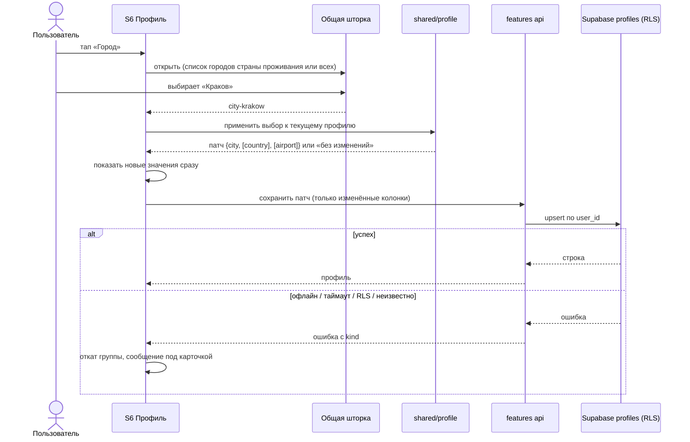
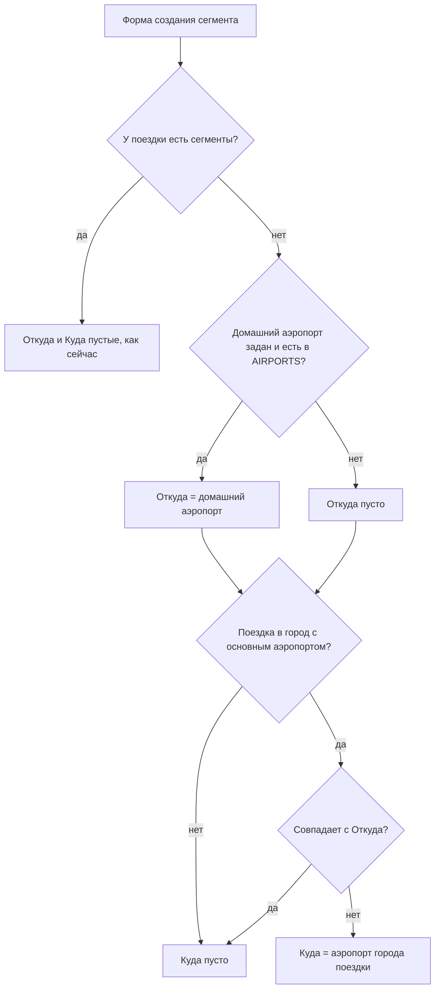

# Spec: Профиль — блок «О себе», домашняя валюта и общая шторка выбора  |  Spec ID: SPEC-06  |  Status: draft
Supersedes: — (SPEC-01…SPEC-05 остаются в силе; заменяемые пункты перечислены в разделе «Что заменяется»)
Implementation Plan: specs/plans/PLAN-06-profile-about-me.md

## Проблема и зачем

Сейчас таб «Профиль» (S6) показывает только имя, email, переключатель темы и три строки-заглушки
«скоро». Приложение ничего не знает о пользователе, поэтому каждый рейс начинается с пустого
«Откуда», а каждая стоимость отеля — с пустой валюты. Для жителя Кракова, который летает из KRK
и платит в злотых, это одни и те же нажатия каждый раз.

`design/screens/account.md` и `design/screens/picker.md` (обновлены владельцем из дизайн-кита)
описывают блок «О себе»: гражданство, страна проживания, город, домашний аэропорт. Все четыре
поля необязательные. К ним добавляется **домашняя валюта** в карточке настроек. Всё выбирается
в одной общей шторке с поиском. Польза в этом спеке одна и проверяемая: домашний аэропорт
подставляется в «Откуда» нового рейса, домашняя валюта — в валюту стоимости нового отеля.
Гражданство, страна и город пока только хранятся. На них потом опрутся визовые подсказки
(это отдельный спек), а города и страны нужны уже сейчас, чтобы подсказать домашний аэропорт.

Попутно спек закрывает три расхождения, которые нашлись при чтении кода:
- блок темы стоит **внутри** карточки настроек, а по `account.md` должен быть под ней;
- шторка валюты SPEC-05 (`CurrencySheet`) отличается от `picker.md` поиском, раскладкой строки
  и шапкой;
- предзаполнение первого рейса кладёт аэропорт города поездки в **«Откуда»**, хотя SPEC-04 AC-38
  требует класть его в **«Куда»**. Домашний аэропорт займёт «Откуда», поэтому этот дрейф
  исправляется здесь (AC-33).

## Goals / Non-goals

**Goals**
1. Таблица `profiles`: одна строка на пользователя, все поля nullable, RLS «только владелец»,
   каскадное удаление вместе с аккаунтом.
2. Блок «О себе» на S6: четыре строки, каждая открывает общую шторку выбора. Под блоком —
   «Все поля необязательные.».
3. Строка «Валюта» в карточке настроек становится рабочей: домашняя валюта, та же шторка.
4. Одна общая шторка выбора (`picker.md`) для пяти мест: гражданство, страна проживания, город,
   домашний аэропорт, валюта. Шторка валюты формы отеля переходит на неё же.
5. Связи между полями из `account.md`: город фильтруется по стране проживания; если страны нет,
   страна берётся из города; из города предлагается домашний аэропорт.
6. Домашний аэропорт подставляется в «Откуда» первого рейса поездки. Домашняя валюта
   подставляется в валюту стоимости **нового** отеля. Оба значения можно изменить; сохранённые
   записи не меняются.
7. Блок «Тема оформления» переезжает из карточки настроек под неё; положений по-прежнему три.

**Non-goals** (сознательно НЕ делаем)
- Конвертация валют, сумма поездки в домашней валюте, любые курсы (AGENTS.md «Чего не делать
  в первой фазе»). Валюта по-прежнему принадлежит записи. Домашняя валюта — только умолчание
  для новой записи.
- Визовые подсказки по гражданству, подписи о пользе у гражданства, страны, города и валюты,
  которые пока ничего не делают (правило `account.md`).
- Индикаторы заполненности, напоминания и «дозаполните профиль» (запрещено `account.md`).
- Свободный ввод города или аэропорта вне справочника, пополнение справочников и удаление
  синтетических аэропортов из `airports.ts` (отдельная задача данных, см. Q6).
- Определение города по геолокации: разрешение на геолокацию **не** запрашивается.
- Экран и строка «Удалить аккаунт», восстановление пароля и ссылки на условия и политику
  на S6 (`account.md` «Экран удаления аккаунта», «Поведение» п. 4). Это отдельный спек-блокер
  релиза. Здесь только гарантируется каскад (AC-5).
- Текст политики конфиденциальности: сейчас S12 — заглушка «Текст будет добавлен позже», менять
  нечего. Требование упомянуть поля переходит в чек-лист релиза (раздел «Mobile considerations»).
- Редактирование имени, email, аватара, пароля (SPEC-02 Follow-up 4).
- «Уведомления» и «Подключённые аккаунты» остаются заглушками «скоро».
- Выбор аэропортов в форме рейса через новую шторку. `picker.md` называет его «позже»: поле
  «Откуда»/«Куда» с подсказками остаётся как в SPEC-04.
- Стоимость рейса: у сегментов нет поля стоимости (SPEC-04 stop-list), так что подставлять
  домашнюю валюту в рейс некуда. Правило AC-39 распространится на рейс, когда поле появится.
- Жест «смахнуть шторку вниз». «Ручка» 36×4 — только визуальный элемент. Шторка закрывается
  через «Отмена», касание подложки и системный «назад».
- Ручной выбор языка названий. Названия идут по языку интерфейса (ru/en), как во всём приложении
  (SPEC-01 AC-40).

## User stories
- **US-1.** Я живу в Кракове. Выбираю «Страна проживания → Польша», потом «Город → Краков».
  Домашний аэропорт сам становится KRK.
- **US-2.** Я создаю поездку в Лиссабон и жму «+» у «Транспорт». «Откуда» уже KRK,
  «Куда» уже LIS.
- **US-3.** Я выбираю домашнюю валюту PLN. В новом отеле валюта стоимости уже PLN,
  я просто ввожу сумму.
- **US-4.** Я не хочу ничего о себе рассказывать. Ничего не заполняю, и приложение меня
  этим не донимает.
- **US-5.** Я переехал. Меняю страну проживания, и город старой страны сам очищается.
- **US-6.** Я ошибся гражданством. Открываю шторку, выбираю «Не указано», и поле очищается.

## Модель данных (контракт, не SQL)

Одна новая таблица `profiles`. Точный DDL, индексы и имена ограничений решает Implementation Plan.

| Поле | Смысл | Обязательность |
|---|---|---|
| `user_id` | PK и FK на `auth.users(id)` `ON DELETE CASCADE`; по умолчанию `auth.uid()` | not null |
| `citizenship_country_code` | Гражданство, ISO 3166-1 alpha-2 (`^[A-Z]{2}$`) | nullable |
| `residence_country_code` | Страна проживания, ISO alpha-2 | nullable |
| `home_city_place_id` | Id города из справочника мест (`city-…`, как `trips.place_id`), до 64 символов | nullable |
| `home_airport_code` | Домашний аэропорт, IATA (`^[A-Z]{3}$`) | nullable |
| `home_currency` | Домашняя валюта, ISO 4217 (`^[A-Z]{3}$`) | nullable |
| `created_at` / `updated_at` | Служебные; `updated_at` ставит существующий триггер `set_updated_at` | not null |

**Решение: ленивый upsert, а не автосоздание строки.** Строка появляется при первом сохранении
любого поля, запись делается как «вставить или обновить» по `user_id`. Отсутствие строки — это
нормальное состояние: все поля считаются пустыми. Почему не триггер на `auth.users`: он потребовал
бы `security definer`-функцию в чужой схеме `auth` и бэкфилл для уже созданных аккаунтов, а пустой
профиль ничего не даёт. У клиента нет политики `delete`. Очистка поля — это запись `null`, строка
удаляется только каскадом вместе с пользователем.

**Инварианты.** В БД проверяется только **формат**: CHECK на каждую колонку. Принадлежность
к справочникам и согласованность «город ↔ страна» проверяются при **записи** схемой из `shared/`,
одной на все клиенты. БД справочников не знает: они живут в `shared/`. При **чтении** значение
вне справочника — не ошибка (AC-27).

Согласованность, которую держит запись: если заданы и `home_city_place_id`, и
`residence_country_code`, страна города равна стране проживания. Город без страны проживания
не сохраняется: страна подставляется из города (AC-17).

## Acceptance criteria (EARS)

### Хранение, владение и RLS
- **AC-1.** The system **shall** хранить профиль в таблице `profiles`, созданной миграцией
  `supabase/migrations/` (не через дашборд), и регенерировать `shared/src/db/database.types.ts`.
  *Verify: manual (`supabase db reset` локально, с согласия владельца) + typecheck.*
- **AC-2.** The system **shall** держать RLS на `profiles` в той же миграции. Политики `select`,
  `insert`, `update` пропускают только строку с `user_id = auth.uid()`; у `update` проверка стоит
  и в `using`, и в `with check`. Политики `delete` для клиентов нет. `anon` не получает ничего.
  *Verify: db (pgTAP: владелец / другой пользователь / anon на каждую операцию; `anon`: 0 строк
  на select/update и `42501` на insert — `supabase/insights.md`; считать только свои фикстуры).*
- **AC-3.** IF пользователь читает или меняет строку чужого профиля, THEN the system **shall**
  вести себя так, будто строки нет: 0 строк, никаких чужих значений.
  *Verify: db.*
- **AC-4.** IF вставка или update ставит `user_id`, отличный от `auth.uid()`, THEN the system
  **shall** отклонить операцию.
  *Verify: db.*
- **AC-5.** WHEN удаляется пользователь из `auth.users`, the system **shall** удалить его строку
  `profiles` каскадом, без триггеров и дополнительных вызовов.
  *Verify: db (после `delete from auth.users` строк с этим `user_id` нет).*
- **AC-6.** The system **shall** проверять формат каждой колонки CHECK-ограничением: коды стран
  `^[A-Z]{2}$`, IATA и валюта `^[A-Z]{3}$`, id города с префиксом `city-` и не длиннее 64 символов.
  *Verify: db (по одному падающему insert на каждое ограничение; число ограничений закрепить
  в тесте через `pg_constraint`, как у `trip_hotels`).*
- **AC-7.** WHEN у пользователя ещё нет строки `profiles`, the system **shall** показывать все
  поля пустыми и не считать это ошибкой. Первое сохранение любого поля создаёт строку.
  *Verify: unit (api: отсутствующая строка → пустой профиль) + db (upsert владельцем проходит).*
- **AC-8.** WHEN пользователь сохраняет одно поле (или связанную группу из AC-17/AC-18),
  the system **shall** записать только эти колонки и не перезаписать остальные значениями
  из клиента. Правка разных полей с двух устройств не затирает друг друга.
  *Verify: unit (тело запроса содержит только изменённые колонки) + db.*

### Экран «Профиль» (S6): структура
- **AC-9.** The system **shall** показывать S6 в порядке `account.md`: заголовок «Профиль»;
  блок пользователя; подпись «О себе», карточка с четырьмя строками и строка «Все поля
  необязательные.»; карточка настроек («Уведомления», «Подключённые аккаунты», «Валюта»);
  блок «Тема оформления» **под** карточкой настроек; «Выйти». Строки «Удалить аккаунт» нет
  (SPEC-02 C6 в силе).
  *Verify: unit (порядок по testID) + manual против скриншота.*
- **AC-10.** The system **shall** показывать в каждой строке «О себе» название слева, значение
  справа перед шевроном: у гражданства и страны проживания — эмодзи-флаг и название страны,
  у города — название без флага, у аэропорта — IATA моношрифтом. У пустой строки — «Не указано».
  *Verify: unit.*
- **AC-11.** The system **shall** показывать под названием «Домашний аэропорт» вторую строку
  «Подставим в „Откуда" при добавлении рейса» и **не** показывать подписей у остальных строк
  «О себе». Подпись у «Валюты» — Q4.
  *Verify: unit.*
- **AC-12.** The system **shall not** показывать индикаторы заполненности, счётчики, бейджи
  или напоминания о пустых полях.
  *Verify: unit (при полностью пустом профиле на экране только «Не указано» и сноска).*
- **AC-13.** The system **shall** держать «Тема оформления» сегментированным переключателем
  на три положения («Системная», «Светлая», «Тёмная»), который применяется мгновенно и сохраняется
  как сейчас (SPEC-01 AC-15/AC-30). Изменилось только расположение.
  *Verify: unit (существующие тесты темы + ровно 3 `radio`).*
- **AC-14.** The system **shall** оставить «Уведомления» и «Подключённые аккаунты» заглушками
  по правилу Q7 SPEC-01: пометка «скоро», без перехода, без значения. Строка «Валюта» становится
  рабочей: значение — код моношрифтом справа или «Не указано», шеврон, без пометки «скоро».
  *Verify: unit.*

### Общая шторка выбора
- **AC-15.** WHEN пользователь нажимает строку «О себе» или «Валюта», the system **shall** открыть
  модальную шторку по `picker.md`. Верх шторки — на `layout.sheetTopInset` от верха окна, радиус
  `radius.sheet` сверху, «ручка» `sheetHandleW×sheetHandleH`, подложка `scrim`. Шторка и подложка
  перекрывают **весь** экран, включая таб-бар. Шапка: «Отмена» слева, название поля по центру,
  пустое место той же ширины справа. Ниже строка поиска: лупа, поле, крестик очистки при непустом
  тексте. Поле поиска получает автофокус. Под поиском — список одной карточкой с разделителями.
  Названия шторок: «Гражданство», «Страна проживания», «Город», «Домашний аэропорт», «Валюта».
  *Verify: unit + manual (светлая и тёмная тема, таб-бар закрыт подложкой).*
- **AC-16.** The system **shall** показывать строку списка так: слева знак (флаг для стран
  и городов, ничего для аэропортов и валют), затем название во всю ширину, справа код моношрифтом
  (alpha-2 у страны, alpha-2 страны у города, IATA у аэропорта, ISO у валюты). У выбранного значения
  справа галочка цветом `accent` и фон строки `surface`. WHEN у поля есть значение, the system
  **shall** показывать первой строкой «Не указано», которая очищает поле.
  *Verify: unit.*
- **AC-17.** The system **shall** искать без учёта регистра и диакритики по **началу** названия
  на ru или en (свёртка как у `searchPlaces`, без транслитерации) плюс по **точному** коду:
  alpha-2 для стран («PL» → Польша), IATA основного аэропорта для города («KRK» → Краков),
  IATA для аэропорта, ISO для валюты. Точное совпадение по коду стоит первым. Пустой запрос
  показывает весь список без ограничения в 4 результата.
  *Verify: unit (логика поиска в `shared/`: таблица запросов, включая «PL», «pl», «Пол», «Pol»,
  «KRK», «Ё/Е», пустой запрос).*
- **AC-18.** IF по запросу ничего не найдено, THEN the system **shall** показать «Ничего не нашли»
  и строку «Проверьте написание или оставьте поле пустым — оно необязательное.». Свой текст не
  принимается: значение выбирается только из справочника. WHERE поле в текущем контексте
  обязательное (валюта отеля при заполненной сумме), the system **shall** показать вторую строку
  без слов «оно необязательное» («Проверьте написание.»).
  *Verify: unit.*
- **AC-19.** The system **shall** упорядочивать список без запроса по отображаемому названию
  в языке интерфейса (алфавит локали). Исключения: в шторке аэропорта сначала аэропорты домашнего
  города (основной первым), затем остальные; в шторке валюты — порядок `CURRENCIES`.
  *Verify: unit.*
- **AC-20.** WHEN пользователь выбирает строку, the system **shall** закрыть шторку и применить
  значение. WHEN пользователь нажимает «Отмена», касается подложки или жмёт системный «назад»,
  the system **shall** закрыть шторку без изменений. Выбор текущего значения повторно запись
  не порождает.
  *Verify: unit.*
- **AC-21.** The system **shall** открывать и закрывать шторку анимацией (подложка — fade,
  панель — slide, токены `motion.*`/`easing.*`), а при «Уменьшить движение» — без анимации,
  как у `AnimatedSheetOverlay` (SPEC-05 AC-62/AC-64).
  *Verify: unit.*
- **AC-22.** The system **shall** рисовать флаг эмодзи из кода страны. Это оговорённое исключение
  из запрета эмодзи (раздел «Документы, которые нужно обновить»). WHERE платформа известна тем,
  что не рисует эмодзи-флаги, the system **shall** показывать вместо флага двухбуквенный код
  моношрифтом. Решение принимается **на уровне платформы**, а не угадыванием на устройстве:
  надёжного способа проверить отрисовку глифа в RN нет (см. Inputs). На iOS показывается эмодзи.
  *Verify: unit (обе ветки через платформенный модуль) + manual (iOS-устройство).*

### Связи между полями
- **AC-23.** WHILE страна проживания задана, the system **shall** показывать в шторке «Город»
  только города этой страны. WHILE страна не задана — все города. WHEN выбран город при пустой
  стране, the system **shall** одной записью сохранить город и его страну как страну проживания.
  *Verify: unit + shared.*
- **AC-24.** WHEN выбран город, у которого в справочнике есть основной аэропорт, AND домашний
  аэропорт пуст или относится к прежнему городу, the system **shall** той же записью подставить
  основной аэропорт нового города. IF домашний аэропорт был выбран вручную и относится к другому
  городу, THEN the system **shall** его не трогать.
  *Verify: unit + shared (пять случаев: пусто; прежний город; ручной «чужой» аэропорт; город без
  аэропорта; повторный выбор того же города).*
- **AC-25.** WHEN страна проживания меняется на другую или очищается, AND выбранный город
  относится к другой стране, the system **shall** той же записью очистить город. Домашний аэропорт
  не трогается: люди летают и из соседней страны.
  *Verify: unit + shared.*
- **AC-26.** IF у выбранной страны нет городов в справочнике, THEN the system **shall** показать
  в шторке «Город» при пустом запросе сообщение «Для этой страны городов в списке пока нет»
  и строку «Поле необязательное — можно оставить пустым.» вместо пустой карточки.
  *Verify: unit (страна без городов, например Андорра).*

### Значения вне справочника и загрузка
- **AC-27.** IF сохранённое значение отсутствует в справочнике этой сборки (например, значение
  записала более новая версия приложения), THEN the system **shall** загрузить профиль без ошибки
  и показать: страну — кодом моношрифтом без флага; город — «Нет в справочнике» цветом
  `textSecondary`; аэропорт и валюту — кодом как есть. Такое значение сохраняется, пока
  пользователь не сменит именно это поле. При чтении схема из `shared/` проверяет только формат,
  не принадлежность к справочнику.
  *Verify: shared (row-схема принимает `XK`/`city-unknown`/`ZZZ`) + unit.*
- **AC-28.** WHILE профиль загружается и в кэше нет данных, the system **shall** показывать
  в строках «О себе» и «Валюта» плейсхолдер загрузки (фон `divider`), а строки не нажимаются.
  Тема, заглушки и «Выйти» работают. IF загрузка не удалась, THEN the system **shall** показать
  в блоке ошибку с кнопкой «Повторить» (тексты `trips:errors.*`), без системного алерта.
  *Verify: unit.*
- **AC-29.** The system **shall** обращаться к `profiles` только из api-модуля фичи через
  `lib/supabase`, мапить строки Zod-схемой из `shared/`, бросать из query-хука ошибку с `kind`
  (чтобы работал retry офлайн и по таймауту, `mobile/insights.md`) и не писать значения профиля
  в логи и тексты ошибок (guardrail `no-credentials-in-logs`: логируются только `operation`/`errorCode`).
  *Verify: unit + guardrails.*
- **AC-30.** WHEN учётная запись в приложении меняется или сессия заканчивается, the system
  **shall** удалить профиль прежнего пользователя из кэша (`QueryCacheGuard`) и ни на миг
  не показывать его новому пользователю.
  *Verify: unit.*

### Сохранение
- **AC-31.** WHEN пользователь выбрал значение, the system **shall** сразу показать его в строке
  и отправить запись. IF запись не удалась (нет сети, таймаут 15 с, отказ RLS, неизвестная ошибка),
  THEN the system **shall** вернуть в строке(ах) прежнее значение и показать под карточкой
  встроенное сообщение об ошибке (тексты `trips:errors.*`), без системного алерта.
  *Verify: unit (успех; каждая категория ошибки; откат связанной группы из AC-23…AC-25).*
- **AC-32.** WHEN несколько выборов подряд пересекаются по времени, the system **shall** оставить
  в строке и в БД значение **последнего** выбора. Более ранний ответ сервера, пришедший позже,
  не откатывает строку к старому значению.
  *Verify: unit (два выбора, ответы в обратном порядке).*

### Предзаполнение: «Откуда» нового рейса
- **AC-33.** WHEN открывается форма создания **первого** сегмента поездки (сегментов ещё нет),
  the system **shall** предзаполнить: «Откуда» — домашним аэропортом, если он задан и есть
  в справочнике аэропортов; «Куда» — основным аэропортом города поездки (буквально SPEC-04 AC-38;
  текущий код кладёт его в «Откуда», это исправляется). Дату вылета — как сейчас. Любое пустое
  звено остаётся пустым, и это не ошибка.
  *Verify: unit + shared (матрица: дом есть/нет × поездка-город/страна/свободный текст).*
- **AC-34.** IF домашний аэропорт совпадает с основным аэропортом города поездки, THEN the system
  **shall** предзаполнить «Откуда» домашним аэропортом и оставить «Куда» пустым, а не ставить
  одинаковые аэропорты с обеих сторон.
  *Verify: unit + shared.*
- **AC-35.** The system **shall not** менять предзаполнение цепочки «Сохранить и добавить
  следующий» (SPEC-04 AC-41…AC-43): там «Откуда» — аэропорт прилёта предыдущего сегмента,
  а не дом. В форме создания при уже существующих сегментах «Откуда» остаётся пустым (Q2).
  *Verify: unit (существующие тесты цепочки зелёные).*
- **AC-36.** IF профиль недоступен в момент открытия формы (не загружен, ошибка, офлайн без кэша),
  THEN the system **shall** открыть форму без домашнего аэропорта и не ждать профиль дольше, чем
  форма и так ждёт поездку и сегменты. Значение, пришедшее позже, не подставляется в уже открытую
  форму.
  *Verify: unit.*
- **AC-37.** The system **shall** считать предзаполненные значения исходным состоянием формы:
  закрытие нетронутой формы не спрашивает «Закрыть без сохранения?» (SPEC-04 AC-40).
  *Verify: unit.*

### Предзаполнение: валюта нового отеля
- **AC-38.** WHEN открывается форма **создания** отеля AND домашняя валюта задана и входит
  в `CURRENCIES`, the system **shall** предзаполнить валюту стоимости домашней валютой.
  Пользователь может сменить или очистить её в общей шторке. При правке отеля валюта берётся
  только из записи. Профиль на существующие отели не влияет.
  *Verify: unit (create с валютой и без; edit отеля без стоимости остаётся без валюты).*
- **AC-39.** IF при сохранении сумма пуста, а валюта задана, THEN the system **shall** сохранить
  отель без стоимости (`cost_amount` и `cost_currency` оба `null`) и **не** показывать ошибку
  `cost.amountMissing`. Обратное правило SPEC-05 AC-68 не меняется: сумма без валюты даёт
  ошибку `cost.currencyMissing`.
  *Verify: shared (схема формы) + unit.*
- **AC-40.** WHILE валюта пуста, the system **shall** показывать плейсхолдер: домашнюю валюту,
  если она задана, иначе `EUR`, как в SPEC-05 AC-68. Плейсхолдер — подсказка, а не значение.
  *Verify: unit.*
- **AC-41.** The system **shall** заменить шторку валюты формы отеля общей шторкой (AC-15…AC-21):
  поиск по началу названия и точному коду вместо подстроки, галочка у выбранной, «Не указано»
  вместо «Не выбрана». Названия валют — один локализованный набор на форму отеля и профиль,
  без дублирования ключей.
  *Verify: unit (обновлённые тесты формы отеля).*
- **AC-42.** The system **shall not** конвертировать суммы и **shall not** менять `cost_currency`
  существующих отелей, когда меняется домашняя валюта.
  *Verify: unit + guardrail/grep (кода конвертации нет).*

### Доступность, дизайн, локализация, платформа
- **AC-43.** The system **shall** озвучивать строку «О себе» или «Валюта» как «<название>,
  <значение или «Не указано»>» с ролью кнопки. Строку шторки — как «<название>, <код>» плюс
  состояние `selected`. Флаг скрыт от скринридера. У аэропорта в подписи звучит название
  аэропорта, а не только код.
  *Verify: unit.*
- **AC-44.** WHEN шторка открыта, the system **shall** скрыть экран под ней от скринридера
  (`accessibilityViewIsModal` / `no-hide-descendants`) и перевести фокус в шторку. Зона нажатия
  у «Отмена», крестика очистки, каждой строки списка и каждой строки профиля — не меньше 44pt.
  *Verify: unit + manual (VoiceOver).*
- **AC-45.** The system **shall** брать цвета, шрифты, радиусы, отступы и размеры только из
  `lib/theme` и выглядеть корректно в светлой и тёмной теме. Шрифты: Manrope 500/700/800; IBM
  Plex Mono — для IATA, кодов стран и валют. Иконки Feather (`search`, `x`, `check`,
  `chevron-right`). Эмодзи допустимы только как флаг из AC-22. Текст «Не указано» и вторичные
  строки держат контраст не меньше 4.5:1 в обеих темах (Q3).
  *Verify: unit + guardrails + manual (контраст).*
- **AC-46.** WHILE крупный шрифт (Dynamic Type) не даёт уместить значение справа, the system
  **shall** переносить значение под название, а не обрезать название. Длинное значение
  («Босния и Герцеговина») переносится или получает многоточие, полное значение звучит в a11y-подписи.
  *Verify: manual.*
- **AC-47.** The system **shall** показывать названия стран, городов, аэропортов и валют на языке
  интерфейса (ru/en из справочника или i18n; для прочих языков — en) и добавить все новые строки
  интерфейса в `ru` и `en` с паритетом ключей.
  *Verify: unit (parity-тест).*
- **AC-48.** The system **shall not** использовать `Platform.OS` в коде фичи. Платформенное
  решение о флаге (AC-22) и хостинг шторки поверх таб-бара, если он платформенный, живут
  в `src/platform/`.
  *Verify: guardrail.*
- **AC-49.** The system **shall** пройти `pnpm -r typecheck`, `pnpm -r test`, `supabase test db`
  и `npx expo config --type public` без ошибок.
  *Verify: manual + CI.*

## Edge cases
- **Пустой профиль навсегда.** Строки нет, все поля «Не указано». Предзаполнений нет,
  формы ведут себя как до этого спека.
- **Город без страны.** Выбран «Краков» при пустой стране: страна становится «Польша» той же
  записью (AC-23). Если после этого очистить страну, город очищается тоже (AC-25).
- **Переезд.** Страна Польша → Германия: город Краков очищается, домашний аэропорт KRK остаётся
  и меняется руками (AC-25).
- **Смена города при ручном аэропорте.** Живу в Кракове, аэропорт выбрал WAW, меняю город
  на Варшаву: WAW уже относится к Варшаве и остаётся. Меняю город на Прагу: WAW «чужой»
  и выбран вручную, остаётся (AC-24). «Относится к прежнему городу» определяется по `cityId`
  аэропорта в справочнике.
- **Многоаэропортный город** (Барселона: BCN основной, GRO — отдельный «город» в справочнике):
  предлагается основной (`isPrimary`).
- **Город не в справочнике** (в нём 100 городов, у многих стран городов нет). Город выбрать
  нельзя, поле остаётся «Не указано». Шторка показывает AC-18 или AC-26. Домашний аэропорт
  выбирается напрямую, без города.
- **Город-государство** (Сингапур, Монако, Люксембург): в справочнике городов их нет, они только
  страны (`directory.ts`). Город пустой, аэропорт выбирается напрямую. Это ожидаемое поведение.
- **Синтетические аэропорты** («Lisbon Regional Airport», «… Airfield»; `shared/insights.md`
  2026-09-23) видны в шторке аэропорта, как и в подсказках формы рейса. Вопрос данных — Q6.
- **Гражданство и страна проживания разные** — обычный случай, никакой связи между ними нет.
- **Тайвань на iOS с регионом «Китай»**: эмодзи-флаг TW может рисоваться пустым квадратом
  (Emojipedia). Принимается. Код TW справа в строке шторки остаётся читаемым.
- **Значение из более новой версии** справочника: AC-27.
- **Двойное быстрое нажатие на строку.** Открывается одна шторка. Повторный выбор того же
  значения не порождает запись.
- **Офлайн-выбор.** Значение показывается, запись падает, строка откатывается, появляется
  ошибка (AC-31). Очереди офлайн-записей нет: полный офлайн-sync запрещён в первой фазе.
- **Домашний аэропорт = аэропорт поездки** (поездка в родной город): AC-34.
- **Домашняя валюта не из `CURRENCIES`** (записана более новой сборкой): в профиле показывается
  кодом, в форму отеля не подставляется.
- **Отель: пользователь очистил предзаполненную валюту и ввёл сумму** → `cost.currencyMissing`
  как раньше. Ввёл сумму при предзаполненной валюте → сохраняется пара.
- **Смена аккаунта при открытой шторке**: гейтинг выводит пользователя из табов, шторка
  размонтируется вместе с экраном, запись прежнего пользователя не уходит от имени нового
  (записи идут с его сессией, RLS отсекает чужое).
- **Удалённый с другого устройства аккаунт**: запись профиля упадёт с RLS или auth-ошибкой
  и отработает по AC-31.

## Mobile considerations
- **Platforms:** ios+android (Android-ready, как все спеки). Поведения только для iOS в коде фичи
  нет. Платформенно различается одно: знак флага (AC-22). На iOS — эмодзи. Для Android решение
  «эмодзи или код» принимается в платформенном модуле; исследование не нашло устройств Android
  с Noto Color Emoji, которые не рисуют флаги, так что по умолчанию эмодзи там тоже, а запасной
  вариант с кодом остаётся на случай конкретных прошивок (Android backlog).
- **Хостинг шторки:** S6 — таб-экран с прокруткой. Существующий приём in-tree overlay
  (`absoluteFill` внутри экрана) закрывает только содержимое прокрутки и не закрывает таб-бар
  (`mobile/insights.md`, 2026-09-24). AC-15 требует перекрыть весь экран, включая таб-бар.
  Как именно — решает план (корневой уровень, `Modal` без перехода по маршруту и т. п.). Шторка
  не должна пушить маршрут: `Modal` плохо уживается с одновременным модальным переходом
  (`mobile/insights.md`, 2026-09-22). В форме отеля шторка монтируется на уровне тела экрана,
  как `CurrencySheet` сейчас.
- **Клавиатура:** автофокус поиска поднимает клавиатуру; список должен прокручиваться
  и оставаться доступным над ней.
- **Офлайн:** чтение профиля идёт из кэша TanStack Query, если он есть; запись требует сети
  (AC-31). Офлайн-очереди нет.
- **Разрешения:** новых нет. Геолокация **не** запрашивается. Новых `NS*UsageDescription` нет.
- **Нативные зависимости:** не предполагаются. Эмодзи — системный шрифт; анимация на RN `Animated`
  (reanimated не зависимость). Новый нативный модуль означал бы новую сборку dev-клиента —
  если план его всё же потребует, это нужно явно отметить.
- **App Store impact:**
  - Данные, привязанные к аккаунту, для App Privacy (интерпретация researcher, не формулировка
    Apple): страна проживания и город — консервативно «Physical Address» (или «Coarse Location»,
    но Apple приводит в пример данные устройства); аэропорт, валюта, гражданство — «Other Data
    Types». Гражданства нет в списке Apple «Sensitive Info», но GDPR может считать его
    чувствительным. Цель — App Functionality, linked to user, не tracking. Это входит в чек-лист
    `release-manager`, а в этом спеке ничего не публикуется.
  - Нужно ли зеркалить эти типы в `NSPrivacyCollectedDataTypes` манифеста (`app.privacy.ts`),
    не проверено (страница Apple не открылась). Решение за `release-manager`.
  - Guideline 5.1.1(i): политика конфиденциальности должна назвать эти поля и цель их хранения.
    Текста политики пока нет (S12 — заглушка), поэтому требование уходит в спек юридических
    текстов и релиза. 5.1.1(v): поля необязательные, и приложение работает без них. Это
    соответствует правилу Apple «не требовать личных данных без нужды».
  - Удаление аккаунта (блокер релиза): после AC-5 профиль уходит каскадом, будущему спеку
    удаления делать для профиля ничего не нужно, кроме перечисления «данные о себе» на экране
    подтверждения (`account.md`).

## Non-functional
- **Производительность.** Поиск синхронный и чистый. Он идёт по 197 странам, 100 городам,
  391 аэропорту и 40 валютам на каждое нажатие клавиши, без индекса и без сети, и не даёт
  видимой задержки на iOS-устройстве. Список длиной до 391 строки прокручивается плавно
  (виртуализация — на усмотрение плана). Открытие S6 не ждёт профиль, чтобы показать тему
  и настройки.
- **Безопасность.** `service_role` нигде. RLS «только владелец», без `delete` для клиента
  (AC-2). `user_id` берётся на сервере из `auth.uid()`, клиент не может подставить чужой (AC-4).
  Значения профиля — персональные данные: они не попадают в логи, тексты ошибок и аналитику
  (AC-29). Гражданство — потенциально чувствительная категория, поэтому поле называется
  «Гражданство», а не «Национальность» (`account.md`).
- **Доступность.** AC-43…AC-46: подписи VoiceOver и TalkBack, модальность шторки, 44pt,
  Dynamic Type, контраст 4.5:1 (Q3).
- **Наблюдаемость.** Ошибки загрузки и записи профиля логируются только как `operation`
  (`profile.load` / `profile.save`) и `errorCode` (`kind`), без значений полей. Этого достаточно,
  чтобы отличить офлайн от RLS-отказа.

## Workflow & Contracts

### Выбор значения в профиле

### Предзаполнение формы первого сегмента

### Контракты между модулями
- **`supabase` ↔ `mobile`:** таблица `profiles` по модели данных выше. Чтение — одна строка
  владельца или ничего. Запись — upsert по `user_id` только с изменёнными колонками. Ошибки
  классифицируются тем же классификатором, что у trips, segments и hotels (`offline`, `timeout`,
  RLS/`forbidden`, `unknown`). Edge Functions не нужны.
- **`shared/` (новый модуль профиля, чистый TS + Zod):**
  - row-схема: из строки БД в `Profile` (`citizenship`, `residence`, `homeCityId`, `homeAirport`,
    `home currency`; всё `| null`). Проверяет **только формат** (AC-27).
  - write-проверка: принадлежность к справочникам (`PLACE_DIRECTORY` страны и города, `AIRPORTS`,
    `CURRENCIES`) и согласованность «город ↔ страна проживания». Отдаёт стабильные id ошибок,
    не тексты (как `shared/auth`, `shared/hotels`).
  - правило связей: «текущий профиль + выбор в поле X → патч». Это единственное место правил
    AC-23…AC-25, клиент их не дублирует.
  - поиск шторки для четырёх справочников: начало названия ru/en со свёрткой `foldForSearch` плюс
    точный код, без лимита (AC-17). Текущие `searchPlaces`, `searchCities`, `searchAirports`
    с лимитом 4 остаются для своих полей (S8, форма отеля, форма рейса).
  - предзаполнение первого сегмента: расширение `firstSegmentPrefill` так, чтобы оно принимало
    домашний аэропорт и возвращало и «Откуда», и «Куда» по AC-33/AC-34. Изменение контракта
    затрагивает всех потребителей в том же плане (`shared/AGENTS.md`).
  - правило формы отеля: «валюта без суммы → стоимость `null`» (AC-39) в той же схеме формы,
    где сейчас пары `cost.*`.
  - Ограничения репозитория: без кириллицы вне разрешённых файлов (`purity.test.ts`), без
    строкового литерала `"from"` вне `__tests__` (`shared/insights.md`).
- **`mobile/`:** профиль (api + query/mutation-хуки) и общая шторка — переиспользуемый UI-примитив,
  не копия внутри фичи. Форма отеля и форма сегмента получают домашнюю валюту и аэропорт через
  публичный `index.ts` фичи профиля, а не прямым запросом в `profiles`.

## Inputs (provenance)
- Решения владельца 1–6 из постановки задачи [user: 2026-09-24]: хранение в `profiles`, домашняя
  валюта с предзаполнением, тема на три положения под карточкой, домашний аэропорт → «Откуда»,
  общая шторка, приватность и каскад.
- Скриншоты владельца (описание в постановке): S6 с блоком «О себе» и шторка «Гражданство»
  с пустым поиском [user: 2026-09-24].
- `design/screens/account.md`, `design/screens/picker.md` (обновлены 2026-09-24), `design/tokens.md`
  (`sheetTopInset`, `sheetHandle*`, `radius.sheet`, `motion.*`) [design].
- Код: `mobile/src/features/profile/*`, `hotel-form/components/CurrencySheet.tsx`,
  `components/AnimatedSheetOverlay.tsx`, `segment-form` (`SegmentFormScreen`, `formState`),
  `shared/src/places/*` (197 стран, 100 городов, 391 аэропорт с `isPrimary`, `foldForSearch`),
  `shared/src/money/currencies.ts` (40 кодов), `shared/src/segments/prefill.ts`,
  `supabase/migrations/*_trips.sql` (образец RLS и `set_updated_at`) [reused: SPEC-02…SPEC-05].
- Отрисовка эмодзи-флагов [third-party: researcher, web, 2026-09-24]: iOS рисует флаги, но TW
  на устройствах с регионом «Китай» — пустым квадратом (emojipedia.org/flag-taiwan). Noto Color
  Emoji (Android) содержит все флаги; «две буквы» вместо флага — это Windows
  (prinsfrank.nl, 2021). Документированного способа в RN проверить, отрисовался ли глиф флага,
  не найдено.
- App Privacy и 5.1.1 [third-party: researcher, developer.apple.com/app-store/app-privacy-details/,
  /app-store/review/guidelines/, 2026-09-24]: определения Apple «Physical Address», «Coarse
  Location», «Sensitive Info» (гражданства в списке нет), «Other Data Types»; 5.1.1(i) — политика
  называет собираемые данные; 5.1.1(v) — удаление аккаунта и запрет обязательных личных данных
  без нужды. Требования к манифесту не проверены (страница не открылась).
- LLM-вызовов нет.

## Untrusted inputs
- Все значения профиля выбираются из встроенных справочников. Свободного текста пользователя
  нет, кроме поискового запроса. Поисковый запрос — только данные для сравнения префиксов:
  он не сохраняется, не логируется и не уходит в сеть.
- Строка `profiles` из БД недоверенная: её могла записать другая версия клиента или сам
  пользователь через API своим JWT. Row-схема проверяет формат, неизвестные значения
  показываются как данные (код или «Нет в справочнике»), а не как разметка. Перед
  предзаполнением значение проверяется по справочнику (`AIRPORTS`, `CURRENCIES`), и в форму
  не попадает то, чего форма не приняла бы от пользователя.
- Эмодзи флага строится только из кода, который прошёл `^[A-Z]{2}$`. Произвольная строка
  из БД в знак флага не превращается.
- Внешних API, deep-link-параметров и вывода LLM в этом спеке нет.

## Что заменяется
| Где | Было | Становится |
|---|---|---|
| `AGENTS.md`, «Non-default rules» (строка про `source`) | «Валюта — на уровне записи, не пользователя.» | **Предлагаемая формулировка:** «Валюта — на уровне записи. Домашняя валюта профиля — только умолчание для НОВОЙ записи; конвертации нет.» |
| `AGENTS.md`, раздел «Данные» | «Валюта — на уровне записи, не пользователя.» | Та же формулировка, что выше |
| `AGENTS.md`, «Дизайн и стили», иконки | «Эмодзи как иконки запрещены.» | Добавить: «Исключение — флаг страны эмодзи в общей шторке выбора и в строках страны профиля (`design/screens/picker.md`): это данные, а не иконка. Где флаги не рисуются — двухбуквенный код моно.» |
| `AGENTS.md`, «Дизайн и стили», IBM Plex Mono | «только „билетные“ данные: коды аэропортов, даты…» | Добавить в перечень: «коды стран (ISO alpha-2) и валют (ISO 4217)» |
| `supabase/AGENTS.md`, Rules | «currency per record» | «currency per record; `profiles.home_currency` is only a default for new records» |
| SPEC-01, таблица экранов, S6 | Тема — строка внутри карточки; «Валюта (EUR)» — заглушка | Порядок AC-9; тема под карточкой; «Валюта» рабочая (AC-14) |
| SPEC-03 AC-65 | «Подключённые аккаунты» и «Валюта» без значений, только «скоро» | Для «Валюты» заменён AC-14. Для «Подключённых аккаунтов» в силе (Q1) |
| SPEC-04 AC-38 **и текущий код** `firstSegmentPrefill` / `segmentFormFromFirstPrefill` | Спек: «Куда» = аэропорт города поездки. Код: кладёт его в «Откуда» (дрейф от спека) | AC-33/AC-34: «Откуда» = дом, «Куда» = город поездки. Тест `SegmentFormScreen` «prefills the departure airport … for a city trip» меняется |
| SPEC-05 AC-19 | «Валюта по умолчанию не предзаполняется и не берётся из профиля» | Заменён AC-38 (только при создании) |
| SPEC-05 AC-55 | Своя шторка валюты: поиск по подстроке кода/названия, строка «Не выбрана», «валюта не предзаполняется» | Заменён AC-38 и AC-41 (общая шторка `picker.md`) |
| SPEC-05 AC-19/AC-68, направление «валюта без суммы → `cost.amountMissing`» | Ошибка | Заменено AC-39: стоимость сохраняется `null`, ошибки нет. Направление «сумма без валюты» не меняется |
| SPEC-05 AC-68, плейсхолдер `EUR` | Всегда `EUR` | AC-40: домашняя валюта, иначе `EUR` |
| Тесты `ProfileScreen.test.tsx` | 3 строки «скоро»; «EUR» нигде нет; тема внутри карточки | 2 строки «скоро»; строка «Валюта» со значением; новые тесты блока «О себе». Тесты «нет строки языка», «нет строки удаления», «3 radio» остаются |

## Документы, которые нужно обновить (этот спек их не правит)
- `AGENTS.md` — четыре правки из таблицы выше (две про валюту, эмодзи-флаг, моно для кодов).
  Файл близок к лимиту 100 строк: правки должны заменять строки, а не добавлять абзацы.
- `design/screens/account.md`:
  - «Подписи о пользе»: фразу «Гражданство и валюта пока только сохраняются» заменить:
    валюта теперь подставляется в стоимость нового отеля (итог — по Q4);
  - «Подключённые аккаунты»: зафиксировать итог Q1;
  - «Не указано»: токен цвета по итогу Q3;
  - «Состояние»: заполнить после реализации.
- `design/screens/picker.md`:
  - строка «Не указано» первой в списке, когда значение задано (AC-16);
  - код справа у города — alpha-2 страны; точный код для города — IATA основного аэропорта (AC-17);
  - пустое состояние «у страны нет городов» (AC-26) и вариант без слов «необязательное» для
    обязательного контекста (AC-18);
  - порядок списка без запроса (AC-19);
  - закрытие: «Отмена», подложка, системный «назад»; «ручка» только визуальная;
  - «Состояние».
- `design/screens/add-hotel.md` — валюта предзаполняется домашней при создании; валюта без суммы
  не ошибка (AC-38…AC-41).
- `design/screens/add-flight.md` (если описывает предзаполнение) — «Откуда» = домашний аэропорт,
  «Куда» = город поездки для первого сегмента.
- `mobile/AGENTS.md`, `shared/AGENTS.md`, `supabase/AGENTS.md` — статус после реализации.

## Стратегия проверки по пакетам
- **`shared/` (vitest):** row-схема (формат, неизвестные значения принимаются); write-проверка
  (справочники, согласованность); правило связей AC-23…AC-25 (таблица случаев); поиск шторки
  (префикс ru/en, свёртка, точный код, пустой запрос, отсутствие лимита); предзаполнение первого
  сегмента (матрица AC-33/AC-34); схема формы отеля (AC-39).
- **`supabase/` (pgTAP):** политики × {владелец, другой, anon}; вставка и update с чужим `user_id`;
  отсутствие `delete` у клиента; каскад от `auth.users`; одно падающее ограничение на каждый CHECK
  и их число через `pg_constraint`; RLS-файл считает только свои фикстуры (`supabase/insights.md`).
- **`mobile/` (jest + RNTL):** S6 (порядок, «Не указано», сноска, подпись аэропорта, тема под
  карточкой, заглушки); шторка (шапка, поиск, пустые состояния, «Не указано», галочка, отмена,
  a11y, анимация с «Уменьшить движение»); оптимистичная запись и откат; гонка выборов; загрузка
  и ошибка; очистка кэша при смене аккаунта; формы рейса и отеля с профилем и без;
  i18n-паритет; guardrails. Мокать api фичи профиля с залогиненной сессией; учитывать
  `includeHiddenElements` при открытой шторке (`mobile/insights.md`).
- **e2e (Maestro):** один флоу «выбрать домашний аэропорт → новый рейс с „Откуда“ = KRK» —
  когда e2e запускаем.

## Follow-ups (не в этом спеке)
- Удаление аккаунта, восстановление пароля и ссылки на условия и политику на S6 (блокер релиза).
  Экран удаления перечисляет «данные о себе».
- Тексты юридических экранов: политика называет поля профиля (5.1.1(i)). App Privacy label
  и, при необходимости, `NSPrivacyCollectedDataTypes` — `release-manager`.
- Визовые подсказки по гражданству; сумма поездки в домашней валюте (нужна конвертация — после MVP).
- Выбор аэропортов в форме рейса через общую шторку (`picker.md` «позже»).
- Справочник: больше городов, города-государства как города, чистка синтетических аэропортов (Q6).
- Замеченное расхождение вне объёма: аватар S6 рисуется константой 72 в `ProfileHeader`, а токен
  `layout.avatarProfile` = 56. Это «магическое число» против правила темы; чинить отдельно или
  попутно, если план это позволит.

## Открытые вопросы [NEEDS CLARIFICATION]
Ни один пункт не блокирует планирование. Для каждого указан вариант по умолчанию.
- **Q1. «Подключённые аккаунты»: «Booking.com — скоро» (скриншот) или только «скоро»
  (`account.md`, SPEC-03 AC-65)?** Упоминание Booking.com обещает импорт, а он запрещён в первой
  фазе. *По умолчанию:* только «скоро», как сейчас; скриншот считается неточным макетом (как
  тема на два положения).
- **Q2. Домашний аэропорт — только для первого рейса поездки?** Подпись обещает «при добавлении
  рейса». Для обратного и внутреннего рейса дом в «Откуда» был бы неверен.
  *По умолчанию:* только первый сегмент (AC-33). Цепочка «Сохранить и добавить следующий»
  не меняется. Подпись остаётся, как в `account.md`.
- **Q3. Цвет «Не указано».** `account.md` требует `textTertiary`. По расчёту из `tokens.md`
  это около 2.5:1 на светлом `bg` и около 3.5:1 на тёмном — ниже правила AGENTS.md 4.5:1.
  *По умолчанию:* `textSecondary` плюс ручная проверка контраста на стеклянной карточке
  в обеих темах; `account.md` правится.
- **Q4. Подпись у «Валюты».** По правилу `account.md` подпись пишется там, где приложение
  что-то делает с полем, а валюта теперь подставляется в отель. *По умолчанию:* добавить
  «Подставим в стоимость нового отеля» / «Prefilled in a new hotel's cost».
- **Q5. Валюта без суммы в отеле (AC-39).** Альтернатива — оставить ошибку `cost.amountMissing`,
  но тогда предзаполненная валюта блокирует сохранение каждого отеля без цены.
  *По умолчанию:* как в AC-39 — сохранять без стоимости, без ошибки.
- **Q6. Синтетические аэропорты в шторке домашнего аэропорта.** *По умолчанию:* показывать весь
  `AIRPORTS` как есть (то же, что форма рейса). Чистка данных — отдельная задача, уже открытая
  в `shared/insights.md`.
